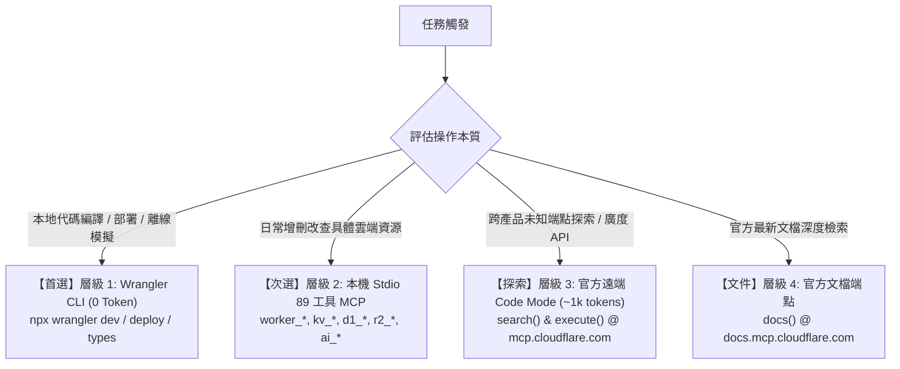

# Cloudflare Edge & Wrangler Master Skill

> **定位守則 (Master Doctrine)**: 
> 本技能為 Tabidachi 與通用全端專案的 Cloudflare 邊緣運算與 MCP 調度總中樞。
> 嚴格遵循**「Token 效益優先 (Zero-Waste)」**與**「延遲載入 (On-Demand References)」**原則，禁止預先載入龐大 OpenAPI 或展開全量端點。

---

## 1. 核心定位與官方架構體系

Cloudflare 官方（2025~2026）維護兩大核心倉庫，搭配本地命令列形成「三態雙軌」體系：

1. **官方 Code Mode 伺服器 ([`cloudflare/mcp`](https://github.com/cloudflare/mcp))**:
   - 端點：`https://mcp.cloudflare.com/mcp`
   - 特性：僅用 **3 個工具** (`docs`, `search`, `execute`) 與 **~1,100 tokens (0.5%)**，透過邊緣動態 Worker 沙盒操作全域 2,594 個 API 端點。
   - **防護鐵律**：嚴禁附加 `?codemode=false`（會灌入 244,000+ tokens 導致上下文崩潰）。
2. **官方領域特定與本地 Stdio 伺服器 ([`cloudflare/mcp-server-cloudflare`](https://github.com/cloudflare/mcp-server-cloudflare))**:
   - 包含 15 個領域特定遠端 MCP（`docs`, `bindings`, `browser`, `ai-gateway`, `observability` 等）。
   - 提供本機 Stdio 模式（註冊 89 個原生 Typed Tools：Workers, D1, KV, R2, Queue, Workflows, AI）。
   - **啟動參數不變性**：在 `mcp_config.json` 啟動時必須傳入 `["-y", "@cloudflare/mcp-server-cloudflare", "run", "<account_id>"]`，防止套件內部將 `accountId` 覆寫為 `undefined`。
3. **本地執行手臂 (Wrangler v3+ CLI)**:
   - 指令：`npx wrangler`，走本地命令列（**0 Token 開銷**）。
   - 負責代碼構建、Miniflare 本地 V8 隔離測試、TypeScript 類型生成與全自動化部署。

---

## 2. 四級調用架構與決策樹 (Dispatch Decision Tree)

當 Agent 接收到 Cloudflare 相關任務時，嚴格依循以下優先級進行分流：



- **情境 1（本地開發與發布）**：優先使用 `npx wrangler`，杜絕浪費 Token 透過 MCP 發起多餘對話。
- **情境 2（雲端資料庫/儲存微調）**：使用 IDE 已掛載的本機 `cloudflare` 工具（如 `d1_query`, `kv_put`），享受完整型別提示。
- **情境 3（未註冊之邊緣 API 或特殊端點）**：呼叫 `mcp.cloudflare.com/mcp` 之 `search` 與 `execute`。

---

## 3. Wrangler v3+ (`wrangler.jsonc`) 本地常用指令速查

```bash
# 1. 身分與帳戶檢驗
npx wrangler whoami

# 2. 依據 wrangler.jsonc 自動產生 TypeScript 綁定型別 (生成 worker-configuration.d.ts)
npx wrangler types

# 3. 啟動本地 Miniflare 隔離沙盒除錯 (零延遲、純記憶體/本地 SQLite 模擬)
npx wrangler dev --port 8787

# 4. 直連雲端真實資源進行即時調試 (謹慎使用)
npx wrangler dev --remote

# 5. 即時串流線上即時日誌 (Live Tail Telemetry)
npx wrangler tail

# 6. 配置安全 Secret (環境變數不入庫，如防爬密鑰、後端 Token)
echo "your_secret_value" | npx wrangler secret put PROXY_SECRET

# 7. 編譯並部署至 Cloudflare 全球 300+ 邊緣節點
npx wrangler deploy
```

> **設定檔標準**：專案全面優先採用 `wrangler.jsonc`（頂部必須宣告 `$schema: "https://unpkg.com/wrangler/config-schema.json"`），支援原生註解與靜態語法檢查。

---

## 4. 延遲載入參考手冊索引 (On-Demand References)

當任務涉及深入架構設計、生產級範式實作或遇到異常錯誤時，**請按需使用 `view_file` 讀取以下參考檔案**：

1. **MCP 深入語法與官方端點矩陣**:
   - 檔案路徑：[`references/mcp-ecosystem.md`](file:///d:/Project/Tabidachi/travel-pwa/.agents/skills/cloudflare-wrangler/references/mcp-ecosystem.md)
   - 涵蓋：Code Mode `search`/`execute` 代碼撰寫規範、GraphQL Analytics 範例、15 大領域特定 MCP URL 總表、Stdio 參數不變性底層剖析。
2. **四大邊緣生產架構範式與代碼模板**:
   - 檔案路徑：[`references/edge-patterns.md`](file:///d:/Project/Tabidachi/travel-pwa/.agents/skills/cloudflare-wrangler/references/edge-patterns.md)
   - 涵蓋：
     * **Pattern 1**: Tabidachi 現役 4-Tier 雙通道抗阻斷搜尋代理（Promise.all 競速 + Wikipedia 全文 + AbortSignal 熔斷）。
     * **Pattern 2**: R2 景點圖床 CORS 洗白與快取代理（解決 Safari 7~10MB Opaque 配額超限）。
     * **Pattern 3**: Workers KV 邊緣滑動窗口頻率限制器（以 IP 為維度保護後端 Cloud Run）。
     * **Pattern 4**: Workers AI / AI Gateway 邊緣彈性備援（Gemini 429 時 0ms 切換開源模型）。
3. **故障排查與實戰踩坑矩陣 (10 大避坑指南)**:
   - 檔案路徑：[`references/troubleshooting.md`](file:///d:/Project/Tabidachi/travel-pwa/.agents/skills/cloudflare-wrangler/references/troubleshooting.md)
   - 涵蓋：R2 S3 HMAC vs REST Token 混淆、DuckDuckGo Tarpit 慢連線逾時、CI/CD 未 Mock 邊緣檢索、Stdio Account ID 覆寫為 undefined、Safari Opaque 快取配額爆炸等 10 項真實場景解決方案。
