# 🛡️ Cloudflare 邊緣防護罩與 Vercel / Cloud Run 流量降壓深潛考證 (2026)

> **研究定位**: 本文為 Tabidachi 專案針對 **Cloudflare 邊緣保護罩（Proxy / 橙色雲朵 / Workers Gateway）**、**Vercel 前端保護** 與 **Google Cloud Run 後端流量吸震** 之全方位技術考證。  
> 堅決摒棄網路行話與行銷宣傳，堅持以 Cloudflare 官方 2026 最新規格（Changelog / Release Notes）、GitHub 開源代碼庫實證（`triangle-shows#84` 等）、Reddit/HackerNews 社群大神踩坑血淚，以及 NotebookLM 知識庫多方交叉審計為依據。

---

## 一、 核心技術流程與底層架構 (Execution Flow & Architecture)

### 1.1 流量降壓與「1 萬人造訪變個位數」的數學與物理真相

使用者常聽聞：「開啟 Cloudflare 之後，一萬個人點進來，真正到達伺服器的只有個位數」。這在技術上並非誇大，而是基於 **Edge Anycast CDN + 邊緣層吸震 (Edge Cache Absorption)** 的具體實作：

```mermaid
sequenceDiagram
    autonumber
    actor Users as 10,000 名全體造訪者
    participant CF as Cloudflare Anycast Edge (全球 330+ 節點)
    participant Vercel as Vercel Frontend (Next.js PWA)
    participant CloudRun as Google Cloud Run (FastAPI Backend)

    Note over Users,CF: 1. 流量分散至全球最近節點 (DDoS 自動洗淨)
    Users->>CF: 發送 HTTP/HTTPS 請求 (靜態資源 + API)
    
    rect rgb(20, 40, 20)
    Note over CF: 2. 邊緣快取命中 (Cache Hit ~99.9%)
    CF-->>Users: 9,990+ 個請求直接由 Edge 快取極速回應 (0ms 回源)
    end

    rect rgb(40, 20, 20)
    Note over CF,Vercel: 3. 冷啟動或 ISR 重新驗證 (僅 1~2 次回源)
    CF->>Vercel: 穿透請求 (Cache Miss / Revalidate)
    Vercel-->>CF: 回傳最新 HTML / Chunks (帶 Cache-Control)
    CF-->>Users: 回應首位造訪者並寫入邊緣快取
    end

    rect rgb(20, 20, 40)
    Note over CF,CloudRun: 4. 後端 API 查詢 (Origin Rule 覆寫 Host Header)
    CF->>CloudRun: 唯讀 API 回源 (注入 X-Origin-Shield-Secret)
    CloudRun-->>CF: 回應 POI/景點/天氣資料 (s-maxage=3600)
    CF-->>Users: 邊緣快取 1 小時，後續 9,999 次查詢 0 次回源
    end
```



#### 降壓關鍵機制：
1. **Anycast BGP 路由防禦 (L3/L4 DDoS)**:
   - 流量在全網 330+ 城市的邊緣節點就近阻斷，SYN Flood、UDP 反彈攻擊在 Cloudflare 網路架構層直接被洗淨丟棄，**完全不會佔用任何伺服器頻寬**。
2. **靜態資源 99.9% 邊緣快取 (L7 Web Shield)**:
   - Next.js 打包出的靜態檔案（`/_next/static/*`、CSS、WebP 圖片、字型、manifest.json）具有唯一的 Hash。Cloudflare 邊緣節點命中率極高（95%~99.9%），10,000 次造訪對 Vercel 的請求數可降至個位數。
3. **唯讀 API 邊緣吸震 (API Edge Caching)**:
   - 後端高頻唯讀端點（如 `/api/poi`、`/api/geocode/search`、天氣查詢、範例行程）若配置 Cloudflare **Cache Rules**（例如 Edge TTL = 1 小時），在 1 小時內重複的搜尋查詢，Cloud Run 的 Python 容器**僅被喚醒 1 次**，徹底防止 Cloud Run 併發數暴衝計費。

---

### 1.2 Google Cloud Run 直連 404 致命陷阱與修復真理

在將 Cloudflare Proxy 指向 Google Cloud Run 時，新手 99% 會踩中**「Google 404 陷阱」**：

#### 陷阱本質：
Google Cloud Run 依靠 HTTP 請求中的 **`Host` Header** 來識別與分發流量至具體容器。
- 當造訪者瀏覽 `api.yourdomain.com`，Cloudflare 預設會將 `Host: api.yourdomain.com` 透傳至 Google。
- Google 邊緣入口找不到名為 `api.yourdomain.com` 的服務，因此直接由 Google 基礎架構拋出 **HTTP 404 Not Found**（**連 FastAPI 容器代碼都沒有執行**）。

#### 業界終極解法 (GitHub 開源驗證：`triangle-shows#84`)：
過去許多工程師額外撰寫 Cloudflare Worker 來重寫 Host Header：
```javascript
// 舊時代消耗配額的 Host-rewriting Worker (每天限 10 萬次)
url.hostname = 'antigravity-backend-589255638719.us-central1.run.app';
return fetch(new Request(url.toString(), request));
```
**2026 最新官方標準解法**：全面改用 Cloudflare **Origin Rules (來源規則)**！
- Cloudflare 免費方案提供 **10 條免費 Origin Rules**。
- 在「Rules > Origin Rules」建立規則：
  - **條件**: `Hostname equals api.yourdomain.com`
  - **動作**: 勾選 **Host Header Override (覆寫主機標頭)**，填入 `antigravity-backend-589255638719.us-central1.run.app`。
- **效益**：
  - **0 成本**（不計入 Worker 10 萬次/日免費額度）。
  - **0 毫秒額外冷啟動延遲**（底層硬體網絡直接重寫標頭）。
  - 徹底解決 Google Cloud Run 404 問題。

---

### 1.3 閉鎖源站防護 (Closing the Origin Bypass)：防盜刷密鑰

若攻擊者直接掃描出 `antigravity-backend-589255638719.us-central1.run.app` 或 `travel-pwa-five.vercel.app` 的原始網址，便能繞過 Cloudflare 進行攻擊。

#### 防禦機制：
1. **Cloudflare Transform Rules (轉換規則 -> 修改請求標頭)**：
   - 設定規則：所有流向 Cloud Run 的流量，自動注入內部密鑰標頭：
     ```http
     X-Origin-Shield-Secret: <極高熵值隨機 Token>
     ```
2. **FastAPI (`backend/main.py`) 守門驗證**：
   - 在 FastAPI 中介軟體或依賴中強制檢查：
     ```python
     if request.headers.get("X-Origin-Shield-Secret") != EXPECTED_ORIGIN_SECRET:
         return Response(content="Direct origin access forbidden", status_code=403)
     ```
   - 任何未經 Cloudflare 代理的直接存取，一律阻絕於門外。

---

## 二、 網路大神爭議點與避坑指南 (Field Pitfalls & Hard Truths)

### 2.1 Vercel + Cloudflare 「雙重 CDN (Double CDN)」的愛恨情仇

社群（Reddit r/nextjs、Hacker News、Vercel 官方論壇）對於「Cloudflare + Vercel」架構有大量深度交鋒：

| 爭議面向 | 官方宣稱 / 表面看法 | 深度實測真相 (Ground Truth) | 最佳工程解法 |
| :--- | :--- | :--- | :--- |
| **Vercel 官方立場** | Vercel 強烈建議**不要**在 Vercel 前面放反向代理。 | 官方反對的主因是：用戶容易在 Cloudflare 誤開全域快取（Cache Everything），導致 Next.js 的 ISR (增量靜態生成) 與動態 Cookie/Session 錯亂；且會遮蔽真實 Client IP，弱化 Vercel 內建防火牆。 | **精確配置快取**：嚴禁開啟 "Cache Everything"。僅針對靜態路由 `/_next/static/*` 啟用 Edge 快取，動態 API 一律 `Bypass Cache`。 |
| **SSL 憑證死鎖 (525 / 526 錯誤)** | Cloudflare 設為 Flexible 即可通。 | **大錯特錯！** 設定 Flexible 會引發死循環（Cloudflare 走 HTTP 連 Vercel，Vercel 強制跳轉 HTTPS，無窮重定向）。 | Cloudflare SSL/TLS 必須強制設定為 **`Full (Strict)`**。放行 `/.well-known/acme-challenge/*` 不被 WAF 攔截，確保 Vercel 能正常續簽 Let's Encrypt 憑證。 |
| **真實客戶端 IP 遺失** | 伺服器記錄到的全都是 Cloudflare 的節點 IP。 | Cloudflare 會在標頭中附加 `CF-Connecting-IP` 與 `X-Forwarded-For`。 | 在後端日誌與 Rate Limiter 中，優先讀取 `CF-Connecting-IP`。 |

---

### 2.2 「純免費免買網域 (Workers 代理)」vs「購買自訂頂級網域 (橙色雲朵)」大比拼

使用者目前使用的是 Vercel 免費網址 (`travel-pwa-five.vercel.app`) 與 Cloud Run 預設網址 (`*.run.app`)。面對保護罩需求，兩種路徑的真實代價如下：

| 評估維度 | 路徑 A：純免費 Workers 網關 (`*.workers.dev`) | 路徑 B：購買自訂網域 + 橙色雲朵 Proxy (`yourdomain.com`) |
| :--- | :--- | :--- |
| **金錢成本** | **$0 / 月** | 每年約 $3 ~ $10 美元（Cloudflare Registrar 原價購網域） |
| **流量額度** | 限制 **100,000 次請求 / 天**。<br>（超過會收到 HTTP 1015 或 503 錯誤） | **無限制 (Unlimited Requests & Bandwidth)**<br>Cloudflare 免費方案的 CDN 與 DDoS 流量完全不限量。 |
| **功能支援度** | 需透過 JS 代碼手寫反向代理、處理 Streaming/SSE、處理 CORS。 | 原生 GUI 介面設定，具備 10 條免費 Cache Rules、10 條免費 Origin Rules、5 條免費 WAF Rules。 |
| **品牌與 Cookie** | 網址為 `xxxx.workers.dev`，缺乏自訂品牌感。 | 享有完整自訂網域（如 `app.domain.com` 與 `api.domain.com`），Cookie 與 LocalStorage 完全獨立。 |
| **建議適用場景** | **概念驗證 (PoC)、本地/個人極低流量測試** | **正式生產環境 (Production)、真正想抵禦大規模流量爆炸** |

---

## 三、 Cloudflare 帳戶 API 權杖 (Account API Token) 體系與命名規範 (2026)

### 3.1 核心本質差異 (NotebookLM 交叉檢索驗證)
依據 Cloudflare 官方文件與 NotebookLM 實時驗證：
1. **身分主體 (Identity)**:
   - **User Token**: 代表個人使用者，若個人離職或密碼變更，Token 立即失效。
   - **Account Token**: 作為獨立的**服務主體 (Service Principal)** 運作，歸屬於帳戶本身，專門為 CI/CD、自動化 Agent 與生產環境打造。
2. **安全可掃描前綴**:
   - Account Token 統一採用 **`cfat_`** 前綴，GitHub Secret Scanning 能即時自動告警。
3. **🚨 官方相容性矩陣 (Compatibility Matrix) 致命限制**:
   以下產品**明確不支援** Account API Token（必須在儀表板手動或使用 User Token）：
   - ❌ **Page Rules**（已被 Rulesets / Cache Rules 取代）
   - ❌ **Registrar**（網域購買/移轉）
   - ❌ **Super Bot Fight Mode**
   - ❌ **Turnstile**
   - ❌ **Intel Data Platform**
   - ❌ **Zero Trust Client Platform**

---

### 3.2 多權杖分類與命名標準 (Token Taxonomy)

在同一個 Cloudflare 帳戶中，若需要建立多個 Token，請嚴格遵守 **`tabidachi-<角色/模組>-<環境>-token`** 的命名規範，杜絕權限過度蔓延（Overprivileged）：

| Token 建議命名 | 選擇範本 (Template) | 核心必要權限 (Permissions) | 用途與存放位置 |
| :--- | :--- | :--- | :--- |
| **`tabidachi-mcp-agent-prod-token`** | `Edit Cloudflare Workers` | • Workers Scripts: `Edit`<br>• Workers KV: `Edit`<br>• Workers AI: `Edit`<br>• **Account Resources: `Read`** *(必選，供 MCP 識別 Account ID)* | 本機開發環境、Antigravity IDE、Cline 設定檔中 |
| **`tabidachi-dns-gateway-prod-token`** | `Edit zone DNS` | • Zone DNS: `Edit`<br>• Zone Cache Purge: `Purge`<br>• Zone Rulesets / Cache Rules: `Edit` | 邊緣防護罩運維腳本、自動清除快取工具 |
| **`tabidachi-cicd-deploy-prod-token`** | `Edit Cloudflare Workers` | • Workers Scripts: `Edit`<br>• Workers KV: `Edit`<br>*(嚴格限定於指定 Worker 名稱)* | GitHub Actions Secrets (`CLOUDFLARE_API_TOKEN`) |
| **`tabidachi-sec-audit-prod-token`** | `Read analytics` | • Read analytics: `Read`<br>• Security Events: `Read` | 唯讀監控儀表板、資安稽核腳本（絕無寫入破壞風險） |

---

## 四、 GitHub 原始碼層級驗證 (GitHub Proof)

### 4.1 案例證物：`triangle-shows/triangle-shows#84`
在開源專案中，開發者明確指出了 Google Cloud Run 與 Cloudflare 的整合痛點：
- **原始碼實況**：該專案起初利用 Worker 攔截所有請求修改 `url.hostname`，以解決 Cloud Run 識別 Host header 失敗回傳 404 的問題。
- **痛點記錄**：Worker 請求被計量（免費 10 萬次/日），且增加了一個無錯誤處理的單點故障點。
- **終極解法**：在 Cloudflare 推出 **Origin Rules (來源規則)** 後，全面棄用 Worker，改用 Origin Rules 的 **Host Header Override**，達成零代碼、零配額消耗、純聲明式的邊緣轉發。

---

## 五、 Tabidachi 防護罩落地實施路徑 (Actionable Blueprint)

### 階段一：零成本驗證期 (Immediate - Workers Edge Gateway)
- 若暫不購買網域，可先透過 `wrangler` 部署一個精簡的 `tabidachi-gateway` Worker 至 `*.workers.dev`。
- Worker 內部設定路由：
  - `/api/*` 轉發至 `antigravity-backend-589255638719.us-central1.run.app`，並附加 `X-Origin-Shield-Secret`。
  - 其他靜態資源轉發至 `travel-pwa-five.vercel.app`，並套用 `cacheEverything: true`。

### 階段二：長青生產期 (Production - Custom Domain + Orange Cloud)
1. 購買一個平價頂級網域（如 `tabidachi.xyz` 或 `tabidachi-app.com`，約 3~10 USD/年）。
2. 將 NS 託管至 Cloudflare，配置 DNS 記錄：
   - `app.yourdomain.com` ➔ CNAME 指向 `cname.vercel-dns.com`（開橙色雲朵 Proxy，SSL Full Strict）。
   - `api.yourdomain.com` ➔ CNAME 指向 `antigravity-backend-589255638719.us-central1.run.app`（開橙色雲朵 Proxy）。
3. 建立 1 條 **Origin Rule**：
   - 條件：`Hostname eq "api.yourdomain.com"`
   - 動作：`Host Header Override` ➔ `antigravity-backend-589255638719.us-central1.run.app`。
4. 建立 1 條 **Cache Rule**：
   - 條件：`URI Path starts_with "/_next/static/"`
   - 動作：Edge TTL 設為 30 天，瀏覽器快取設為 30 天。
5. 建立 1 條 **Transform Rule**：
   - 自動為所有流向後端的請求注入 `X-Origin-Shield-Secret`。
6. 修改 `backend/main.py`：
   - 將 `api.yourdomain.com` 加入 `ALLOWED_ORIGINS` 與 `ALLOWED_HOSTS`。
   - 啟用 `X-Origin-Shield-Secret` 防盜刷檢查。
