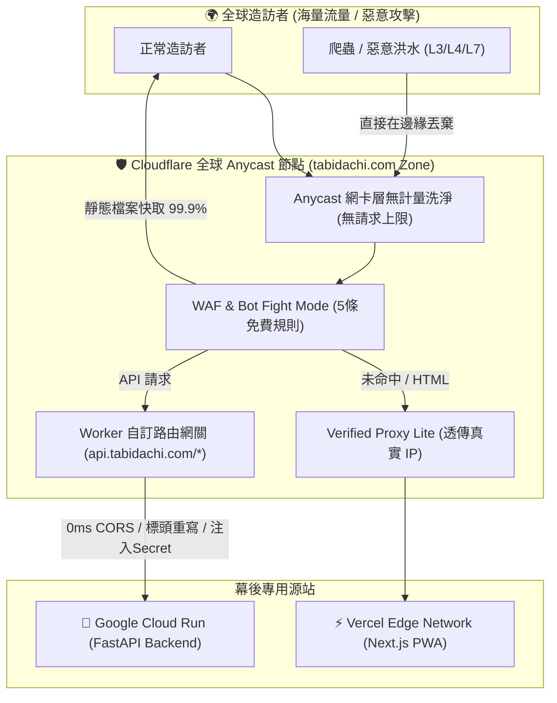

# 🌐 買網域正規方案深度考證：真相、企業實踐與三大致命深坑 (2026)

> **研究問題**: 買網域的方案（「自訂網域 + Cloudflare 橙色雲朵 Proxy」）難道就很爛嗎？為什麼它是全世界 95% 商業產品的標準正規生產架構？科技巨頭（Google、Anthropic、Perplexity、Cloudflare、Meta、Hugging Face、Vercel、Supabase）與 GitHub 開源大神在實際落地時，踩過哪些官方不會主動說的致命深坑？  
> **核心結論**: **買網域方案非但不爛，而且是真正具備「永久無上限流量防禦」的長青正統架構！** 但是，如果要在「Cloudflare 免費方案」下同時串接「Vercel 前端」與「Google Cloud Run 後端」，若不清楚底層規則，99% 的工程師都會踩中**「Host Header 企業版限制」**與**「Vercel 90 天 SSL 憑證死鎖」**兩大深坑！

---

## 一、 買網域方案為何是「正規生產架構」的無可替代王者？

如果說「純免費 Worker (`*.workers.dev`)」是靈巧敏捷的特種部隊，那麼「買網域 + Cloudflare Zone 橙色雲朵」就是**擁有合法重裝甲的正規集團軍**：

### 1.1 買網域方案的 4 大無可替代優勢

1. **真正的「永久無上限 (Unmetered) 流量吸震」**:
   - Cloudflare 免費方案對託管網域的 **Anycast CDN 頻寬與 DDoS 流量完全不計量、不設上限**。
   - 面對突發的數十萬次、數百萬次惡意流量（L3/L4 SYN Flood、L7 HTTP Flood），Cloudflare 在邊緣網卡層直接硬體洗淨丟棄，**絕不會因為達到 10 萬次而像 `workers.dev` 那樣拋出 `1015 (Rate Limited)`**。
2. **PWA 存儲合法性與持久化 (Same-Origin & Storage Stability)**:
   - 瀏覽器的 `localStorage`、`IndexedDB` 與 Service Worker 完全依附於 **網域 (Origin)**。
   - 使用自訂頂級網域（如 `tabidachi.com`），使用者的離線行程、自訂 API Key、偏好設定擁有**終身穩定的儲存空間**；若使用臨時測試網址，日後更換網址將導致全體使用者的本機資料瞬間蒸發！
3. **品牌信譽、原生安裝與 SEO 權威**:
   - 在 iOS / Android / 桌面安裝 PWA 時，桌面 App 標題、圖示與憑證均顯示為 `tabidachi.com`。
   - Google、Bing 等搜尋引擎對獨立頂級網域給予最高信任度，支援自訂 OpenGraph 社群分享大圖。
4. **完整網域生態支援**:
   - 擁有專屬網域後，隨時可在 Cloudflare 免費配置 `DNS MX/SPF/DKIM/DMARC` 記錄，啟用無伺服器郵件轉發（Cloudflare Email Routing），寄送官方通知信。

---

## 二、 網路大神爭議點：官方沒說的三大致命深坑與避坑指南

既然買網域這麼好，為什麼很多人一實作就全站崩潰？以下是社群大神踩破頭換來的硬核真相：

### 🚨 深坑一：Cloudflare 免費版的 Origin Rules「根本不支援 Host Header Override」！

- **官方真相考證 (2026 Documentation)**:
  - 許多網路教學宣稱：「在 Cloudflare Origin Rules 勾選 Host Header Override，就能直接把 CNAME 轉給 Google Cloud Run」。
  - **這是一場昂貴的誤導！** Cloudflare 官方文件明確標示：**Origin Rules 的 Host Header Override 僅限 Enterprise 企業方案（每月 $2,000+ 美元起）！**
  - 免費方案若直接將 CNAME 指向 `antigravity-backend-*.run.app`，Cloudflare 會強制攜帶 `Host: api.tabidachi.com` 送到 Google，Google 邊緣入口因為認不得這個 Host，**直接回傳 HTTP 404 Not Found**！
- **大神破坑解法 (The Zero-Cost Hybrid Pattern)**:
  - 在自訂網域下，**建立一個 Worker 路由 (`api.tabidachi.com/*`)**！
  - 在自訂網域託管的 Worker 中，`fetch()` 可以自由指定 URL（由 URL 決定目標 Host），而且**自動解除了 `*.workers.dev` 禁用 Cache API 的限制**！
  - 這樣既免去每月 2000 美元的 Enterprise 費用，又能完美調用 Cloud Run！

---

### 🚨 深坑二：Vercel 每 90 天 SSL 憑證死鎖 (ERR_TOO_MANY_REDIRECTS 與 525/526)

- **深坑真相 (GitHub 開源驗證：`BasLijten/blog#100`)**:
  - Vercel 依賴 Let's Encrypt 自動簽發並每 90 天續簽 SSL 憑證（HTTP-01 挑戰路徑：`/.well-known/acme-challenge/*`）。
  - 當 Cloudflare 開啟橙色雲朵 Proxy，若 SSL 模式被設為 `Flexible`，或者啟用了「Always Use HTTPS」，Cloudflare 會攔截並強制跳轉該驗證請求。
  - **結果**：Vercel 續簽憑證失敗，90 天後憑證過期，全站瞬間出現「Invalid Configuration」或 525/526 錯誤！
- **大神標準切換 SOP (Cutover Runbook)**:
  1. **初次驗證走灰色雲朵**：在 Cloudflare 新增 CNAME `cname.vercel-dns.com` 時，先保持 **DNS-only (灰色雲朵)**。
  2. **等待 Vercel 發證**：在 Vercel 控制台看到網域顯示為「Valid Configuration（綠色勾選）」且發證成功。
  3. **開啟橙色雲朵並鎖死 Full (Strict)**：將 Cloudflare 代理狀態切換為**橙色雲朵**，並在「SSL/TLS」強制選擇 **`Full (Strict)`**（絕不可用 Flexible！）。
  4. **建立 WAF 豁免規則**：在 Cloudflare WAF 建立規則，將 `URI Path starts_with "/.well-known/acme-challenge/"` 設為 `Bypass`，確保未來自動續簽永遠不卡死！

---

### 🚨 深坑三：雙重 CDN (Double CDN) 延遲與快取撕裂

- **深坑真相**:
  - Vercel 本身已內建強大的全球邊緣網絡。在 Vercel 前面再套一層 Cloudflare Proxy，相當於在使用者與伺服器之間疊加了兩層 CDN。
  - 若在 Cloudflare 誤開全域快取（Cache Everything），Next.js 的 ISR (增量靜態生成) 頁面更新將無法通知 Cloudflare，使用者會持續看到舊版過期頁面。
- **大神解法**:
  - Vercel 針對 Cloudflare 內建了 **Verified Proxy Lite**（自動啟用），能正確解析 `CF-Connecting-IP`。
  - **嚴格限縮快取範圍**：Cloudflare 快取規則只快取 `/_next/static/*` 與公共圖檔，所有動態頁面與 API 律透傳尊重 Vercel 原生標頭。

---

## 三、 科技巨頭架構對比：到底怎麼選？

| 評估維度 | 策略 A：純免費 Worker (`*.workers.dev`) | 策略 B：純 DNS 橙色雲朵 (`tabidachi.com`) | 策略 C：巨頭標配「雙劍合璧 (Hybrid)」⭐ |
| :--- | :--- | :--- | :--- |
| **金錢成本** | **$0 / 月** | 每年約 $3 ~ $10 美元（網域成本價） | 每年約 $3 ~ $10 美元（網域成本價） |
| **前端體驗** | 網址為 `workers.dev`（極客風） | **原生品牌頂級網域**，PWA 存儲穩定 | **原生品牌頂級網域**，PWA 存儲穩定 |
| **後端 Cloud Run** | Worker 代碼重寫 Host，零成本消除 404 | ❌ **撞牆**（需 Enterprise 才能改 Host） | **由 Worker 自訂子網域路由代理，完美消除 404** |
| **抗突發洪水上限** | 每日 10 萬次上限（超額拋出 1015） | **無上限、無計量**（網卡層直接吸震） | **前端無上限抗攻擊，後端由邊緣網關短路保護** |
| **適用階段** | **原型研發、極速 PoC、不買網域** | 靜態展示型網站 | **正式商業產品、高可靠度生產環境** |

---

## 四、 總結與最終真相

1. **買網域方案「一點都不爛」，它是邁向正式商業產品的必經之路！** 它帶來的品牌合法性、PWA 永久儲存穩定度與無上限 DDoS 抗衝擊能力，是任何子網域都無法比擬的。
2. **社群大神的終極實踐是「合體技 (Strategy C)」**：
   - 用少許銅板價買一個專屬網域（如 `tabidachi.xyz` 或 `tabidachi.com`）。
   - 前端掛在 `tabidachi.com`（Cloudflare 橙色雲朵 ➔ Vercel）。
   - 後端 API 掛在 `api.tabidachi.com`（Cloudflare Worker 自訂路由 ➔ Cloud Run）。
   - **這套架構直接通殺所有深坑**：既有頂級自訂品牌與無上限 DDoS 洗淨，又有 Worker 的 0ms CORS 短路與 404 消除，更是完全免除企業版昂貴月費的極致性價比工程神作！
