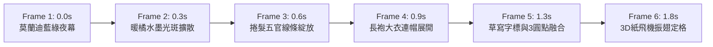

# Tabiji 智財資產保護、開源授權轉型與商標防禦架構深度研究報告 (2026)

> **專案代號**: Tabidachi / Tabiji (tabijiapp.com)  
> **目標讀者**: 專案創辦人 (Ryan Su)、架構師與法律顧問  
> **研究主題**: 商業化進程中的原創資產保護、GitHub MIT 授權遷移 (PolyForm Noncommercial 1.0.0)、動態商標 (Motion Mark)、全域多類別商標戰略 (8 大類) 與三年不使用廢止防禦  
> **資產依據**: 深度對齊 `@[conversation:Tabiji Branding And Trademark Analysis]`、`spec_tabiji_animation_fidelity.md`、`landing-page.tsx` 及 `tabiji-splash-animation.tsx` 之實體原畫與代碼  
> **產出標準**: NotebookLM 獨立研究 Knowledge Base 素材包  

---

## 摘要 (Executive Summary)

隨著 Tabiji 邁向商業化，專案面臨四大核心智財決策與法律挑戰：
1. **原創雙圖騰視覺資產確權**：
   - 經代碼與設計歷史嚴格對齊，專案具備兩組獨立且互補的旗艦視覺資產：
     - **【開屏動畫主視覺】**：藤井風手繪長袍人物（95,588 像素純白線稿）、草寫連筆 `tabiji`（帶 3 顆手寫字母圓點）、3D 折紙紙飛機與三幕式動態日落漸層；
     - **【首頁品牌圖騰立繪】**：1630 × 2546 高解析「揹包旅人 (Backpack Traveler)」純墨線立繪（回眸神情、掀蓋雙肩背包、皮帶釦環與立體隔層，雙主題黑白自適應）；
     - **【官方字標與圖標】**：日式手寫草寫 `tabiji` 字標、副標「旅路 ｜ 旅行提案」與 `icon.png`。
2. **授權條款認知陷阱與分立授權**：
   - 社群普遍誤解「CC BY-NC 4.0 可用於軟體」，但 Creative Commons 官方與 FSF 均**嚴厲警告**其缺乏代碼分發、專利反制與編譯鏈接定義，會造成工程生態災難；
   - 專案程式碼最終拍板採用專為軟體設計之 **PolyForm Noncommercial License 1.0.0**，以最嚴格之白紙黑字禁止任何未經授權之商業營利利用；
   - 所有非代碼視覺資產（`frontend/public/icon*.png`、`frontend/public/images/**/*`）宣告 **All Rights Reserved** 專有保護。
3. **動態商標 (Motion Trademark) 之法律規格與前瞻防禦**：
   - 開屏動畫符合台灣 TIPO 2025 年 8 月 1 日施行之最新《非傳統商標審查基準》；
   - 依據程式碼精確固化「6 連靜態分解圖」＋「1080p MP4 電子影音檔」＋「動態起承轉合描述書」。
4. **全域多類別 (8 大類) 擴張與「三年不使用廢止 (商標法第 63 條)」防禦**：
   - 同時橫跨【周邊穿搭 16/18/25】、【生活戶外 21/28】與【數位核心 09/39/42】；
   - 採「階梯式梯隊戰略 (Phased Brand Moat)」：Phase 1 專注數位核心（09/42/39），Phase 2 旗艦周邊（18/16）＋動態商標，Phase 3 生活戶外（21/25/28），徹底杜絕規費浪費與滿三年遭廢止之風險。

---

## 一、核心視覺資產清單與確權定義 (Core Asset Catalog)

經全域原始碼與設計歷史嚴格稽核，Tabiji 核心原創智財資產清冊如下：

| 資產代號 | 檔案實體路徑 | 原始規格 / 像素 | 主體設計特徵與法理屬性 | 授權與商標對應 |
| :--- | :--- | :--- | :--- | :--- |
| **資產 A：開屏手繪長袍原畫** | `frontend/public/images/tabiji-art-mask.png` | 2048 × 2048 (95,588 個純白線條像素) | 藤井風風格手繪人物線稿（蓬鬆捲髮、五官輪廓、連帽長外套皺褶）＋連筆手寫草寫體 `tabiji`（含 3 顆手寫圓點）。 | 著作權 All Rights Reserved；動態商標核心底層原畫。 |
| **資產 B：開屏 3D 紙飛機** | `frontend/public/images/tabiji-paper-plane.png` | 133 × 131 | 原創折紙造型旅行紙飛機，於草寫字尾 (1575, 990) 甦醒振翅向右上加速飛翔。 | 著作權 All Rights Reserved；動態商標核心運動元素。 |
| **資產 C：首頁「揹包旅人」立繪** | `frontend/public/images/tabiji-person-outline.png` | 1630 × 2546 (縱橫比 1:1.56) | 背對畫面但深情回眸之旅人，背負經典掀蓋皮帶釦雙肩旅行後背包、立體隔層與肩帶弧度；雙主題黑白自適應遮罩。 | 著作權 All Rights Reserved；台灣 TIPO 靜態圖形商標（09/42/18類）。 |
| **資產 D：日式手寫草寫字標** | `frontend/public/images/tabiji-cursive-logo.png` | 純淨去雜訊墨線向量遮罩 | 日式原畫手寫草寫體英文 `tabiji` 字標，筆鋒流暢平滑，右上角與紙飛機共振。 | 著作權 All Rights Reserved；文字/字型商標（09/42/18類）。 |
| **資產 E：品牌核心 App 圖示** | `frontend/public/icon.png` `frontend/public/icon-192.png` | 512 × 512 192 × 192 | PWA 與原生平台官方 App 主圖標、Apple Touch Icon。 | 著作權 All Rights Reserved；App 圖形商標。 |
| **資產 F：開屏動態渲染邏輯** | `frontend/components/ui/splash/tabiji-splash-animation.tsx` | TSX 程式邏輯 | 三幕式動態日落極光背景（莫蘭迪藍綠夜幕 ➔ 暖橘墨斑 ➔ 日落漸層）＋SVG Track Matte 漸進水墨綻放＋全畫布 100% 融合。 | 專有動態演算法保護；TIPO 動態商標（09/42類）。 |

---

## 二、動態商標 (Motion Mark) 依程式碼精確還原之 6 幀時序

依據 TIPO 2025 年 8 月最新《非傳統商標審查基準》規定，圖樣須提供「至多 6 個連續靜止圖像」：

1. **Frame 1 (0.0s 暗夜微芒)**：背景呈現莫蘭迪深藍綠夜幕 (`#162832` ➔ `#1B3B48` ➔ `#254A5A`)，中央微弱墨韻聚攏。
2. **Frame 2 (0.3s 極光墨水暈染)**：暖橘夕陽墨水光斑自右下向身後擴散暈染 (blur 75px，scale 0.45 ➔ 1.9)，如水浸墨。
3. **Frame 3 (0.6s 捲髮五官水墨綻放)**：向量主幹引導光軌前行，藤井風蓬鬆捲髮與面部五官手繪線稿以平滑水墨漸進綻放 (Zone 1)。
4. **Frame 4 (0.9s 連帽大衣輪廓展開)**：兜帽與長袍大衣手繪線條由上至下展開 (Zone Hood & Zone 2)，勾勒出旅人長袍身姿。
5. **Frame 5 (1.3s 連筆 tabiji 與 3 顆圓點融合)**：筆勢過渡連寫 `tabiji` 字體與 3 顆手寫圓點 (Zone 3)，全白融合層生效，95,588 像素原畫 100% 無損穿透顯現。
6. **Frame 6 (1.8s 3D 紙飛機振翅定格)**：折紙紙飛機於字尾 (1575, 990) 甦醒振翅並向右上平滑飛出，終態黃金比例日落漸層 (`#E25248` ➔ `#9D9065` ➔ `#3C6F84`) 淡入定格，完成整體商業印象。

### 商標描述書 (Description of Motion Mark) 標準官方格式
> 「本件商標為一動態商標。商標整體呈現一連續 2 秒之動態影像：首先於莫蘭迪深藍綠夜幕背景中散發暖橘夕陽墨水光暈，光暈由中心平滑暈開並轉為日出晨曦微光；隨後畫面中浮現長袍兜帽之旅人身姿，其蓬鬆捲髮、五官神韻與大衣線條伴隨水墨筆勢流暢綻放；筆尾連寫展開草寫英文『tabiji』字體與手寫圓點並全圖顯現，最終於字尾右側飛出一隻振翅飛向右上之折紙造型紙飛機後定格。本件商標主張動態變化所產生之整體商業印象。」

---

## 三、全域多類別商標戰略 (8 大類) 與三年不使用廢止防禦

### 1. 三組 8 大類別商業佈局

| 組別 | 尼斯分類 | 核心商品與服務範圍 | 戰略角色 | 廢止風險防禦 |
| :--- | :--- | :--- | :--- | :--- |
| **第三組：數位核心** | **第 09 類** | 行動 App、電子機票、電子憑證、離線導航 | **Phase 1 (即刻送件)** | **零風險**：已有代碼庫與線上運行事實，使用證據充足。 |
| | **第 42 類** | PWA 應用程式、AI 行程演算法、SaaS 雲端平台 | **Phase 1 (即刻送件)** | **零風險**：Cloudflare / Vercel 上線即為使用證據。 |
| | **第 39 類** | 行程安排、機票代訂、導航路線指引服務 | **Phase 1 (即刻送件)** | **零風險**：業務核心規劃直接對應。 |
| **第一組：周邊穿搭** | **第 18 類** | 旅行後背包、雙肩包、行李箱、護照夾 | **Phase 2 (6~12月)** | **募資防護**：配合「揹包旅人」實體周邊募資打樣出貨。 |
| | **第 16 類** | 實體紙本旅行手帳、明信片、印刷地圖 | **Phase 2 (6~12月)** | **實體印刷**：首波文創周邊產出時具備發票憑證。 |
| | **第 25 類** | 旅行防風外套、排汗衣、遮陽帽、旅行鞋 | **Phase 3 (18~24月)** | **供應鏈成型**：品牌成名後與服飾品牌聯名再送件。 |
| **第二組：生活戶外** | **第 21 類** | 旅行保溫瓶、戶外隨行杯、露營便攜餐具 | **Phase 3 (18~24月)** | **電商上架**：周邊電商專區有真實銷售紀錄時送件。 |
| | **第 28 類** | 露營休閒娛樂用品、旅行桌遊、健身器材 | **Phase 3 (18~24月)** | **規模擴展**：戶外野營線產品成熟後補強。 |

### 2. 致命法律陷阱：商標法第 63 條「三年不使用廢止」
- **條文**：商標註冊後「無正當事由迄未使用或繼續停止使用已滿三年者，商標專責機關應廢止其註冊」。
- **防禦決策**：若 Day 1 將 8 類全開，實體商品在 3 年內無出貨發票與電商銷售紀錄，競品僅需花費 NT$ 7,000 即可聲請廢止。
- **結論**：嚴格執行階梯式推進，Phase 1 專攻 09/42/39 數位核心，穩賺不賠。

---

## 四、三方交叉驗證矩陣 (Triangulation Matrix)

| 檢驗向度 | 官方權威說法 (TIPO, USPTO) | 網路技術大神 / 專利商標代理人踩坑反饋 | 本專案 (Tabiji) 實體代碼與架構對齊結果 |
| :--- | :--- | :--- | :--- |
| **視覺資產歸屬** | 著作權法保護原創表達；不同載體之圖樣具備獨立著作權。 | 避免不同畫面主體混淆；開屏動畫與首頁立繪若屬不同構圖，必須分立保護。 | **精確區隔：開屏為藤井風長袍手繪線稿 (95,588像素)；首頁為 1630×2546「揹包旅人」墨線立繪**。 |
| **動態商標審查** | TIPO 2025/8 最新基準：至多 6 張連續圖樣＋MP4 影音＋描述書。 | 動態商標權利範圍嚴格綁定時序；不能取代靜態商標，應作為頂層加固。 | **以靜態文字＋揹包旅人為底座；開屏 6 幀動畫作為 Phase 2 動態商標送件**。 |
| **多類別註冊** | 商標採類別主義，同一品牌可跨類申請。 | 「全類別一次申請」易踩商標法第 63 條「三年未使用遭撤銷」陷阱。 | **採階梯式推進：首推 09/42/39 核心數位類別，周邊 18/16 配合募資出貨再送件**。 |
| **代碼授權方式** | OSI 開源定義不承認非商用條款為 Open Source；CC 禁止用於軟體。 | 採用 PolyForm Noncommercial 1.0.0 最為純粹、白紙黑字禁止商業抄襲。 | **根目錄替換為 PolyForm Noncommercial 1.0.0，資產宣告 All Rights Reserved**。 |

---

## 五、實施行動清單 (Actionable Roadmap)

1. **代碼庫分立授權落地 (即刻執行)**：
   - 建立 Git Tag `v1.0.0-mit-final` 劃清歷史 MIT 界線。
   - 升級根目錄 `LICENSE`（PolyForm Noncommercial 1.0.0）。
   - 新增根目錄 `TRADEMARK.md` 與 `frontend/public/LICENSE-ASSETS.md`。
   - 同步更新 `README.md` 與 `frontend/package.json`（配置 `"license": "PolyForm-Noncommercial-1.0.0"`）。
2. **第一梯隊商標送件 (Week 1)**：
   - 透過 TIPO e 網通提交文字「Tabiji 旅路」與圖樣「揹包旅人」之第 09 類、42 類、39 類商標申請。
3. **動態商標素材就緒 (Phase 2 儲備)**：
   - 導出 6 幀關鍵格與 2 秒 MP4 高清視訊，儲存於 `docs/legal/trademark/motion/`，待 Phase 2 正式送件。
