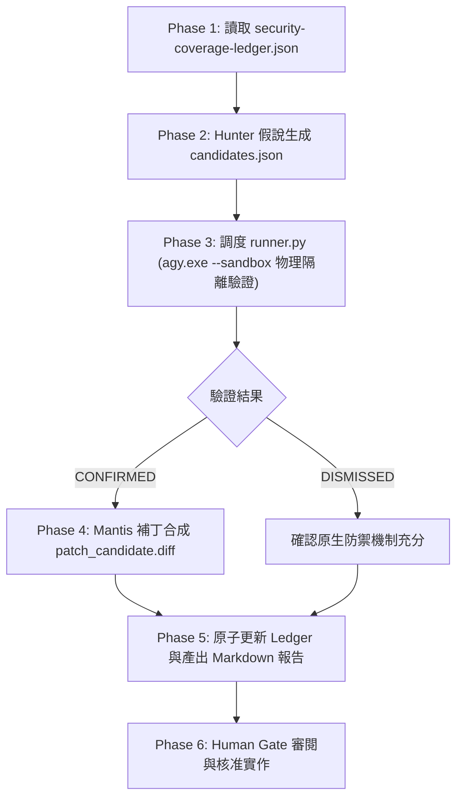

# 🛡️ Tabiji 資安治理與 Sentinel 審查全景庫 (Security & Sentinel Governance)

> **核心準則**: 無罪推定直到實證證偽 (Presumption of Innocence until Empirically Proven)  
> **隔離機制**: 調度背景 `agy.exe -p --sandbox` 獨立子行程進行物理隔離對抗驗證。

---

## 1. 目錄拓撲與資產劃分 (Directory Topology)

```text
docs/security/
├── README.md                          # 📖 本文件：資安架構指引與目錄治理規範
├── security-coverage-ledger.json      # 🛡️ 權威資安覆蓋帳本 (全站核心防禦邊界台帳)
├── reports/                           # 📑 正式 Markdown 審查報告 (歷次 Sentinel 報告存檔)
└── history/                           # 🗄️ 歷史對抗審查執行產物 (合規審查存證庫)
    ├── candidates/                    # 歷次假說輸入 JSON (24 個)
    ├── findings/                      # 歷次物理沙盒驗證結果 JSON (29 個)
    └── patches/                       # 歷次候選補丁 RFC diff 檔案
```

---

## 2. 核心檔案職責 (Core Artifacts)

### 1. 權威安全台帳 (`security-coverage-ledger.json`)
- **定位**: 全專案攻擊面與防禦狀態之唯一事實來源 (Single Source of Truth)。
- **記錄指標**:
  - `total_targets`: 納管防禦標的總數。
  - `audited_targets`: 已完成驗證目標數。
  - `verified_vulnerabilities`: 經實證確認之漏洞數。
  - `dismissed_hypotheses`: 經沙盒實證反駁之無效假說數。
- **維護原則**: 任何安全性架構變更或 Sentinel 審查通過後，必須原子化登錄審查時間、狀態（`SECURE`）與 Commit Hash。

### 2. 正式審查報告 (`reports/`)
- 收錄依日期命名的 Markdown 報告（如 `security_sentinel_report_YYYY-MM-DD_*.md`）。
- 報告包含執行總結、假說對抗明細、驗證證據鏈以及通過簽核 (Sign-Off)。

### 3. 歷史存證庫 (`history/`)
- `candidates/`: 記錄 Hunter 階段產生的攻擊假說輸入檔。
- `findings/`: 記錄 Validator 物理沙盒輸出的判定結構檔。
- `patches/`: 記錄 Mantis 補丁合成階段產生的 `patch_candidate_*.diff`。

---

## 3. Security Sentinel 執行流程 (SOP)



### 常用審查指令
```bash
# 執行整組候選假說驗證
python .agents/skills/security-sentinel/scripts/runner.py \
  --candidates scratch/candidates.json \
  --output scratch/findings.json \
  --timeout 120

# 單一檔案快速對抗檢驗
python .agents/skills/security-sentinel/scripts/runner.py \
  --target-file "backend/services/intent_router.py" \
  --vector "prompt_injection" \
  --hypothesis "Sanitizer allows bypassing system instructions via unicode control characters" \
  --output "scratch/findings.json"
```
