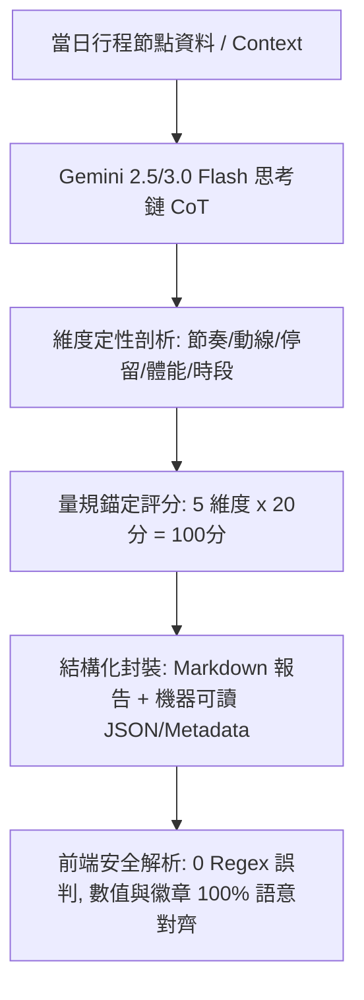

# 🧠 Tabidachi LLM 行程深度審核與五維量規評分架構研究報告 (2025–2026)

> **版本**: v1.0.0 (Production Candidate)  
> **研究目標**: 徹底根除「時間單位誤判為評分 (如 20 分鐘誤判為 20 分)」與「低分卻標註健康之語意衝突」，建立 2026 現代化 LLM-as-a-Judge 結構化量規評分體系。

---

## 一、 核心技術流程 (Execution Flow & Architecture)

### 1.1 「先論後評」(Reason-First / CoT Before Score) 核心架構
在 2025–2026 年大語言模型評估（LLM-as-a-Judge）的最佳實踐中，**嚴禁讓模型先輸出數值分數**：
* **現象（Sycophancy & Post-hoc Justification）**：若要求模型直接輸出數字，LLM 往往會基於機率傾向隨機或討好性給出 80~90 分，隨後的評語便會為了「護航」該數字而編造理由。
* **解決方案（Structured Chain-of-Thought）**：
  1. **第一步（現象列舉）**：逐項審查當日行程節點的時間跨度、交通路徑與景點性質。
  2. **第二步（分項定性評估）**：依據 5 大核心維度逐一給出分析與改進意見。
  3. **第三步（定量計算與匯總）**：綜合上述論點，計算出各維度得分（各 20 分，滿分 100 分），並輸出最終結構化分數與警訊標籤。



---

### 1.2 行程五維評估量規標準 (Five-Dimension Travel Rubric)

為確保評分具有客觀性與可解釋性，定義五個互不重疊的維度，每項 0 ~ 20 分：

| 維度名稱 | 核心評估指標 | 扣分錨點 (Deduction Anchors) |
| :--- | :--- | :--- |
| **1. 時間節奏 (Pacing & Buffer)** | 景點轉換時間是否充足？有無預留突發狀況與排隊彈性？ | 點對點無交通預留（-5）、轉乘時間極度緊繃（-5~-10）。 |
| **2. 動線順暢 (Route Efficiency)** | 地理路徑是否順向？有無重複折返、南北大穿梭或繞遠路？ | 同一路段來回折返（-5）、跨大區域拉車超過 2 小時（-10）。 |
| **3. 停留合理 (Activity Duration)** | 各景點停留時間是否符合該類型之最低體驗需求？ | 博物館僅排 30 分鐘（-5）、大主題樂園僅排 2 小時（-10）。 |
| **4. 體力負荷 (Fatigue Index)** | 連續步行景點是否過多？早出晚歸是否超出一般人體能極限？ | 全天純步行超過 8 小時（-5）、無任何午休/下午茶放鬆點（-5）。 |
| **5. 時段契合 (Timing & Viability)** | 夜景點是否排在白天？戶外點是否排在極度炎熱或關門時段？ | 景點營業時間已過（-10）、清晨安排購物商場（-5）。 |

---

### 1.3 評分與視覺語意映射矩陣 (Semantic Mapping)

徹底根除「20 分卻標記健康」的邏輯矛盾，建立全局鎖定規範：

| 綜合總分 (Total) | 視覺色彩 | 狀態標籤 (Pill) | 狀態圖標 | 摘要文字 (Subtitle) |
| :---: | :---: | :---: | :---: | :--- |
| **85 ~ 100 分** | 綠色 (`emerald`) | 🛡️ **健康極佳** | `ShieldCheck` | 行程規劃得宜，時間節奏流暢 |
| **70 ~ 84 分** | 黃色 (`amber`) | 💡 **大致流暢** | `ShieldAlert` | 整體流暢，部分點位略微緊湊 |
| **< 70 分** | 紅色 (`rose`) | ⚠️ **強烈建議調整** | `AlertTriangle` | 存在折返或時間不足，建議依評審意見優化 |
| **無評分 / 尚未審核** | 藍紫 (`indigo`) | ✨ **尚未體檢** | `Sparkles` | 尚未進行 AI 體檢，點擊啟動深度審核 |

---

## 二、 網路大神爭議點與避坑指南 (2025–2026 Pitfalls)

### 踩坑 1：純 Regex 解析自掘墳墓 (The "20 分鐘" Disaster)
* **教訓**：中文語境中，「分」具有高度多義性（「評分 20 分」vs「步行 20 分鐘」vs「間隔 20 分」）。
* **避坑原則**：
  * 嚴禁使用模糊的 `\d+\s*分` 比對。
  * 必須採用**顯式關鍵字限定**（如 `(?:評分|總分|得分)[：:]\s*(\d+)`）與**負向後行/先行斷言**（排除「鐘」、「鐘車程」、「秒」）。
  * 更優架構：在後端將文字報告與量化數據在儲存時即分離，或使用結構化標籤塊包裹。

### 踩坑 2：Gemini Structured Outputs 與深思 (Thinking Mode) 併發衝突
* **教訓**：在 Gemini 2.5/3.0 系列開啟 `thinking_config` 時，若同時強制 `response_mime_type="application/json"` 且 Prompt 包含大量 Markdown 需求，容易造成 JSON 解析失敗（思考過程滲漏至輸出、或引號未轉義）。
* **避坑原則**：
  * **方案 A（雙軌輸出）**：後端回傳結構化 JSON，其中包含 `metrics: { total_score, dimensions }` 與 `report_markdown: string`。
  * **方案 B（錨定區塊語法）**：Prompt 要求報告結尾必須包含嚴格格式的機器讀取標籤（如 `<!-- EVALUATION_METRICS ... -->` 或 ````json ... ````），後端若解析失敗則安全降級為純文字，不引發異常。

### 踩坑 3：LLM 評分通膨 (Score Inflation / Sycophancy)
* **教訓**：沒有錨定標準的 LLM，對使用者的任何行程幾乎一律給出 88~95 的虛假高分。
* **避坑原則**：
  * 在 Prompt 中給出清晰的**起評分基準（Baseline 80 分）**與**具體扣分準則**。
  * 明確要求：「若發現景點間交通未預留時間，該項目必須扣 5 分，嚴禁一律給滿分」。

---

## 三、 GitHub 原始碼層級實作方案 (Implementation Verification)

### 3.1 後端 Prompt 重構方案 (`backend/routers/ai.py`)
```python
sys_inst = """你是 Ryan，一位極致專業的旅遊行程架構師。
請對當日行程進行『五維全景深度審核』。

### 評審流程 (Reason-First 思考順序):
1. 先仔細檢查景點間交通時間、排隊與停留長度、地理動線。
2. 逐項撰寫報告，使用以下標頭格式：
   [🎯 總評]
   [✅ 優點]
   [⚠️ 修正建議]
   [💡 在地小撇步]
3. 最後，依據五維量規進行嚴格打分 (基準分 80，發現問題嚴格扣分，每項 0~20 分):
   - 時間節奏 (0-20)
   - 動線順暢 (0-20)
   - 停留合理 (0-20)
   - 體力負荷 (0-20)
   - 時段契合 (0-20)

請在報告的最末尾，嚴格輸出以下機器可讀評分區塊 (不要更動格式)：
```evaluation
SCORE: <總分 0-100>
PACING: <時間節奏 0-20>
ROUTE: <動線順暢 0-20>
DURATION: <停留合理 0-20>
FATIGUE: <體力負荷 0-20>
TIMING: <時段契合 0-20>
STATUS: <HEALTHY|WARNING|CRITICAL>
```
"""
```

### 3.2 前端解析器強健度改造 (`frontend/lib/itinerary-metrics.ts`)
```typescript
// 1. 優先嘗試解析 ```evaluation 結構化區塊
// 2. 備援採用強型別關鍵字比對，嚴格排除「分鐘」
// 3. 分數與 status 建立強型別單向綁定，杜絕低分標註健康
```
