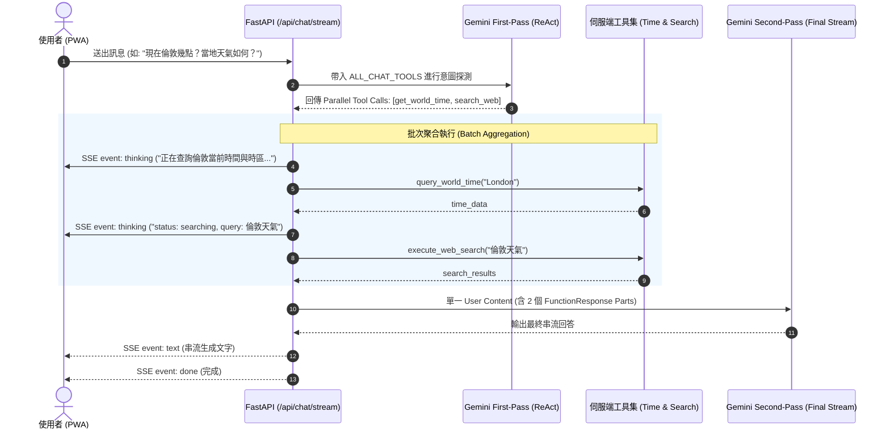

# Tabidachi 技術規格書：平行工具呼叫（Parallel Tooling）閉環與時序常數架構

## 1. Problem Statement & Core Value (問題陳述與核心價值)
- **問題現狀**：
  1. **Google Gemini 400 Bad Request 潛在風險**：在 `backend/main.py` 的 First-Pass ReAct 機制中，原先在匹配到 `get_world_time` 時使用 `break` 提前中斷迴圈。若模型在一次輸出中並行觸發了多個工具（Parallel Function Calling，如同時呼叫 `get_world_time` 與 `search_web`），提前退出會導致其他工具缺少 `FunctionResponse`，在次輪請求發送給 Gemini 時違反 Google GenAI 協定狀態機，拋出 `400 Bad Request: missing function response` 致命錯誤。
  2. **時序模組魔術數字與長天數抽樣限制**：在 `backend/services/temporal_service.py` 中，跨子夜時序計算裸寫 `1440`, `6`, `20`, `60` 等數值，破壞代碼清晰度；且目的地時區推斷硬截斷前 2 天 (`days[:2]`)，在長天數跨城市行程中若前兩天無明確地點，會發生時區誤判回退。
- **核心價值**：
  - 徹底遵循 Google Gemini 官方 Parallel Tool Calling 協定，實現單一 User Content 裝載多個 `FunctionResponse` 的批次聚合閉環。
  - 抽取全模組語意常數，並對全行程景點進行去重抽樣（前 15 處），確保任何長天數複雜行程 100% 精準錨定目的地時區。

---

## 2. User Journey & Core Flow (操作流程與時序圖)



---

## 3. Architecture & Data Model (架構與代碼設計)

### 3.1 `backend/main.py` 批次聚合閉環架構
- **工具掃描**：不再遇到單一工具就中斷，改為掃描整批 `first_pass.function_calls`。
- **回應收集器**：
  ```python
  response_parts = []
  # 1. 處理 get_world_time
  # 2. 處理 search_web
  # 3. 處理 fetch_webpage
  ```
- **單一 User Content 閉環**：
  ```python
  if first_pass.candidates and response_parts:
      contents.append(first_pass.candidates[0].content)
      contents.append(genai.types.Content(
          role="user",
          parts=response_parts
      ))
  ```

### 3.2 `backend/services/temporal_service.py` 模組常數與抽樣擴展
- **常數定義**：
  ```python
  MINUTES_IN_A_DAY: int = 1440
  DEFAULT_EVENT_DURATION_MIN: int = 60
  EARLY_MORNING_HOUR_CUTOFF: int = 6
  LATE_NIGHT_HOUR_THRESHOLD: int = 20
  DESTINATION_SAMPLE_LIMIT: int = 15
  ```
- **全行程去重聚合抽樣**：
  ```python
  all_places = [
      str(it.get("place") or "").strip()
      for day in days
      for it in (day.get("items") or [])
      if it.get("place")
  ]
  unique_places = list(dict.fromkeys(all_places))[:DESTINATION_SAMPLE_LIMIT]
  search_parts.extend(unique_places)
  ```

---

## 4. Edge Cases & Boundary Conditions (邊界防禦)

| 邊界狀況 | 潛在問題 | 本設計防禦邏輯 |
| :--- | :--- | :--- |
| **平行呼叫多個相同工具** | 重複查詢拖垮延遲 | 在迴圈中使用已處理集合去重，避免重複呼叫相同城市時間或網址 |
| **部分工具執行失敗 (Exception)** | 整個 Stream 崩潰 | 每個工具呼叫包裹獨立 `try-except`，失敗時回傳 `{ "error": str(e) }` 作為 FunctionResponse，保證協定對齊 |
| **無任何有效工具結果** | 第二輪無法啟動 | 若 `response_parts` 為空，退回既有純文字 Grounding 注入通道 |
| **長行程地點清單為空** | 產生 None 或空字串 | 容錯 `or ""` 與安全性 fallback 至使用者本地時區 (`client_tz_str`) |

---

## 5. Acceptance Criteria (驗收清單)

- [ ] **AC-1 (Parallel Tooling 協定閉環)**：當 Gemini 同時呼叫 `get_world_time` 與 `search_web` 時，後端在單一 User Content 內回傳兩個對應的 `functionResponse`，絕不拋出 `400 Bad Request`。
- [ ] **AC-2 (細粒度 SSE 思考感知)**：多工具並行執行時，前端依序收到多筆對應工具的 `thinking` 事件，無漏發或無效訊息。
- [ ] **AC-3 (常數解耦)**：`temporal_service.py` 內所有時間運算裸數字（1440, 6, 20, 60）全數由語意常數取代。
- [ ] **AC-4 (長行程目的地抽樣)**：行程在第 3 天以後才出現關鍵城市名稱時（例如前 2 天為空），時區推論依然精準命中。
- [ ] **AC-5 (既有測試零降級)**：`pytest` 全端測試 100% 通過，`tsc --noEmit` 保持 0 錯誤。
