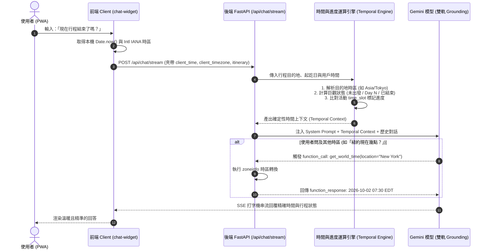

# 規格書：AI 即時時間感知、全週期行程進度與跨時區混合架構 (Real-Time Temporal Awareness & Itinerary Progress Spec)

> **版本**：v1.0.0  
> **狀態**：Draft / Awaiting Approval  
> **最後更新**：2026-10-02  
> **負責角色**：@architect (系統設計師), @dev (全端開發者)  

---

## 1. Problem Statement & Core Value (問題陳述與核心價值)

### 1.1 使用者痛點 (User Problem)
1. **時間維度斷層與時差漂移**：
   - 目前後端執行於雲端容器（GCP Cloud Run），容器內部環境時間為 UTC（比台灣 UTC+8 慢 8 小時，比日本 UTC+9 慢 9 小時）。
   - 後端若無使用者時區資訊，對話中的「現在」、「今天」、「晚上」將發生嚴重的 8~9 小時偏差。
   - 使用者在國外旅遊現場詢問「現在去晴空塔還開著嗎？」或「今天行程結束了嗎？」，AI 因欠缺真實時間與時區感知，容易產生時間幻覺或誤判景點營業狀態。
2. **行程進度盲區 (Itinerary Progress Blindness)**：
   - AI 雖有行程內容上下文，但不知道目前旅行處於哪一個生命週期（尚未出發、旅行第 N 天、抑或已回國結束）。
   - 無法向使用者精準回覆今日的行程是否已全部結束、目前應該正在進行哪個活動，以及距離下一個行程還有多少時間。
3. **純 Tool Call 的效能缺陷**：
   - 若單純將「獲取時間」做成函數工具（Tool Calling），模型每次回答日常問題都必須先發起一次 Function Call 往返，增加 800ms~2000ms 的網路延遲並打斷串流打字體驗，且模型極易遺漏呼叫。

### 1.2 核心價值與指標 (Success Metric)
- **0ms 首字額外延遲 (Zero-Latency First Token)**：採用主動上下文注入（Context Injection），無須額外 Round-Trip，保證串流打字機首字即時輸出。
- **100% 確定性進度標記**：後端直接比對目的地當地時間與行程各活動的 `time_slot`，以程式碼等級的確定性標記 `[進行中]`、`[已過]`、`[待進行]` 與 `[今日行程已結束]`，杜絕模型計算錯誤。
- **雙時區對齊率 100%**：無論使用者在國內規劃海外行程（如台灣看東京），或人在海外旅遊現場（手機自動變換時區），系統均能同時感知「手機時間」與「目的地時間」。
- **靈活世界時間擴充**：保留 `get_world_time` 工具作為輔助軌，滿足使用者詢問「現在紐約幾點？」等跨洲查詢需求。

---

## 2. User Journey & Core Flow (使用者旅程與操作流程)

### 2.1 使用者旅程 (User Scenarios)

#### 場景 A：海外旅遊現場（旅行中）
1. 使用者身在東京，手機時區自動切換為 `Asia/Tokyo`，時間為 20:30。
2. 使用者在 Tabidachi PWA 打開聊天室提問：「我們今天行程結束了嗎？」
3. 前端自動在背景取得手機 ISO 時間戳與 `Asia/Tokyo` 時區，夾帶於串流請求中。
4. 後端解析出當前為旅程「第 2 天（東京市區巡禮）」，比對當天最後一個排程為 18:00~19:30 一蘭拉麵。
5. AI 親切且精準地回覆：「現在東京時間是 20:30，您今天的排定行程已經全部結束囉！🎉 目前您可以回飯店放鬆，或者到附近的居酒屋逛逛～」

#### 場景 B：境內事前規劃（未出發）
1. 使用者在台灣（`Asia/Taipei`，時間 19:30），正在查看下個月（10/20）的京都行程。
2. 使用者提問：「現在去清水寺開著嗎？」
3. 系統識別出該行程距離出發還有 18 天（事前規劃模式），目的地為日本（東京/京都時區 UTC+9）。
4. 後端提供雙時區上下文：手機 19:30、日本京都當地 20:30。
5. AI 精準回答：「您規劃的京都之旅還有 18 天出發喔！以目前日本當地時間 20:30 來說，清水寺日間參拜（通常至 18:00）目前已經閉園囉。如果是 10/20 到訪，建議安排在上午前往...」

#### 場景 C：詢問跨國世界時間（呼叫工具）
1. 使用者在對話中詢問：「那現在倫敦幾點？」
2. 模型判斷目前行程為日本，倫敦屬於外部世界時間，主動呼叫 `get_world_time(location="London")`。
3. 工具即時返回倫敦時間與時差，AI 流暢輸出解答。

### 2.2 核心時序流程 (Sequence Diagram)



---

## 3. Architecture & Data Model (架構與資料模型)

### 3.1 前端傳輸契約 (API Request Contract)

擴充 `backend/models/base.py` 中的 `ChatRequest` 模型：

```python
class ChatRequest(BaseModel):
    """AI 聊天請求"""
    message: str
    history: List[dict] = Field(default_factory=list)
    thought_signatures: Optional[List[dict]] = None
    image: Optional[str] = None
    location: Optional[dict] = None
    current_itinerary: Optional[dict] = None
    focused_day: Optional[int] = None
    
    # 🆕 時間感知擴充欄位 (Temporal Awareness)
    client_time: Optional[str] = Field(
        None, 
        description="前端裝置 ISO-8601 時間戳，如 2026-10-02T19:30:00+08:00"
    )
    client_timezone: Optional[str] = Field(
        None, 
        description="前端裝置 IANA 時區識別碼，如 Asia/Taipei 或 Asia/Tokyo"
    )
```

前端 `frontend/lib/sse-parser.ts` 與 `frontend/components/chat-widget.tsx` 傳送時動態取得：
```typescript
const now = new Date();
const client_time = now.toISOString();
const client_timezone = Intl.DateTimeFormat().resolvedOptions().timeZone || "UTC";
```

### 3.2 時間與進度運算引擎 (Backend Temporal Engine)

在 `backend/services/temporal_service.py` 實作核心運算邏輯：

1. **時區映射與推斷**：
   - 根據行程之 `destination`、`dest_country` 或 `dest_city`，映射出目的地 IANA 時區（如日本 ➔ `Asia/Tokyo`、韓國 ➔ `Asia/Seoul`、泰國 ➔ `Asia/Bangkok`、法國 ➔ `Europe/Paris` 等；若無行程則以 `client_timezone` 為準）。
2. **行程生命週期判斷**：
   - `BEFORE_TRIP`：當前日期 < 出發日期（附帶倒數天數 `countdown_days`）。
   - `IN_TRIP`：出發日期 <= 當前日期 <= 結束日期（附帶當前第幾天 `current_day_number`）。
   - `AFTER_TRIP`：當前日期 > 結束日期（附帶結束已過天數 `days_since_ended`）。
3. **當天活動進度標記 (Activity Progress Tagging)**：
   - 針對當前行程天數（或 Focused Day）內的所有項目：
     - 解析 `time` 或 `time_slot`（支援 `HH:MM`、`HH:MM~HH:MM`）。
     - 比對目的地當前時間：
       - 若活動結束時間 < 當前時間 ➔ 標記 `[已過]`
       - 若活動開始時間 <= 當前時間 <= 活動結束時間 ➔ 標記 `[進行中]`
       - 若活動開始時間 > 當前時間 ➔ 標記 `[待進行]`
     - 若當天所有項目皆已過 ➔ 頂部標註 `【今日排定活動已全部結束】`。

### 3.3 注入 System Prompt 之上下文格式 (Prompt Template)

在 `backend/main.py` 的 `format_itinerary_context` 中渲染：

```markdown
--- SYSTEM CONTEXT: TEMPORAL & ITINERARY NEURAL AWARENESS ---
【即時時間基準】
- 使用者手機時間: 2026-10-02 19:30:15 (時區: Asia/Taipei, UTC+8)
- 目的地當地時間: 2026-10-02 20:30:15 (時區: Asia/Tokyo, UTC+9)
- 時差說明: 目的地比使用者手機快 1 小時

【行程生命週期狀態】
- 行程狀態: 🚀 旅行進行中 (今天是旅程的第 2 天 / 共 5 天)
- 今日排程狀態: 🌙 【今日排定活動已全部結束】(最後一項於 19:30 結束，目前當地時間 20:30)

【今日焦點行程細節 (Day 2)】
  09:00 [P] [已過] 淺草寺
  12:30 [F] [已過] 淺草今半壽喜燒
  15:00 [S] [已過] 秋葉原電器街
  18:00 [F] [已過] 一蘭拉麵上野店
-----------------------------------------------------------
```

### 3.4 輔助世界時間工具 (Auxiliary Tool: `get_world_time`)

在 `backend/services/model_manager.py` 註冊：
```python
GET_WORLD_TIME_DECL = {
    "name": "get_world_time",
    "description": "查詢全球特定城市或時區的當前精確時間與時差。僅當使用者明確詢問行程以外的其他世界城市時間時調用。",
    "parameters": {
        "type": "OBJECT",
        "properties": {
            "query": {
                "type": "STRING",
                "description": "城市名稱、國家或 IANA 時區，例如 'London', 'New York', 'Paris', 'America/New_York'"
            }
        },
        "required": ["query"]
    }
}
```

---

## 4. Edge Cases & Boundary Conditions (邊界條件與異常處理)

1. **使用者關閉或無時區資訊 (Missing / Corrupted Timezone)**：
   - 若前端傳入之 `client_timezone` 為空或無效字串，後端優雅降級為 `Asia/Taipei`（預設繁中主要客群時區），並於日誌記錄。
2. **無明確時間格式的行程項目 (Fuzzy Time Slots)**：
   - 部分活動時間標註為「上午」、「下午」、「晚上」或留空 `?`：
   - 引擎依據常理時段映射（上午 09:00、下午 14:00、晚上 18:00），若完全未填則標記為 `[時間彈性 / 未排定確切時間]`，不強制誤判為已過。
3. **跨日與深夜行程 (Red-eye & Midnight Activities)**：
   - 活動時間跨越午夜（如居酒屋 23:00~01:30），引擎計算時正確比對次日凌晨時間，避免因 `01:30 < 23:00` 產生負值或逆向標記。
4. **無行程上下文的純聊天 (Chat Without Itinerary)**：
   - 當使用者在主頁面閒聊而未選擇任何行程時，時間引擎依然會注入「使用者手機當前時間與時區」，確保 AI 對當前年份、月份、季節、今日星期與當前時段具備 100% 認知。
5. **日光節約時間 (Daylight Saving Time, DST)**：
   - 採用 Python 3.9+ 原生 `zoneinfo.ZoneInfo`，自動處理歐美等國之夏令時間/冬令時間切換，無需硬編碼固定 offset。

---

## 5. Acceptance Criteria (驗收標準清單)

```markdown
- [ ] AC-1 (時間協議注入): 前端發起 `/api/chat/stream` 與 `/api/chat` 時，請求 payload 必攜帶 client_time (ISO) 與 client_timezone (IANA)。
- [ ] AC-2 (無行程時間感知): 在無行程狀態下詢問「現在幾點？」或「今天是幾月幾號？」，AI 能 100% 正確回答使用者的手機當前時間與日期，無年份或時區漂移。
- [ ] AC-3 (旅行中狀態判定): 當行程日期包含當前日期，詢問「現在行程結束了嗎？」，AI 能正確指出今天為第 X 天，並依據當地時間告知活動已結束或正在進行中。
- [ ] AC-4 (未開始與過期狀態): 針對未來行程提問，AI 明確提示「距出發還有 N 天」；針對過期行程提問，提示「此行程已於 X 月 X 日結束」。
- [ ] AC-5 (雙時區提示): 當使用者手機時區（如 Asia/Taipei）與行程目的地時區（如 Asia/Tokyo）不同時，AI 於適當時機說明兩地時差與當地時間。
- [ ] AC-6 (輔助工具調用): 明確詢問「倫敦現在幾點？」時，模型能正確調用 `get_world_time` 並以秒級精確度回傳。
- [ ] AC-7 (型別與單元測試): 通過 `tsc --noEmit` 零錯誤，後端通過新增的 `test_temporal_awareness.py` 單元測試（包含邊界時區與模糊時間比對）。
```
