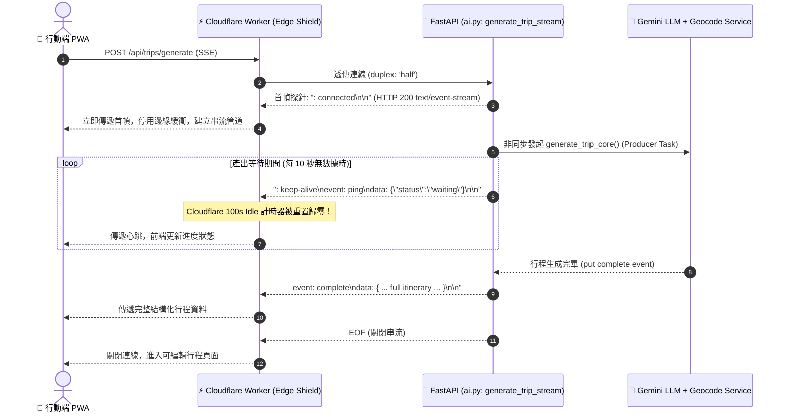

# Cloudflare 100s 超時防衛與 Server-Sent Events (SSE) 串流保活規格書 (SSE Streaming Keep-Alive Spec)

> **規格狀態**: 🟢 Active (生產環境運行中)  
> **關聯程式碼**: [`backend/routers/ai.py`](file:///d:/Project/Tabidachi/travel-pwa/backend/routers/ai.py) (`generate_trip_stream`), [`cloudflare/edge-shield/worker.js`](file:///d:/Project/Tabidachi/travel-pwa/cloudflare/edge-shield/worker.js)  
> **關聯調研**: `cloudflare_sse_100s_keepalive_deep_research.md` (Dify Issue #43324 實證)  
> **標準規範**: `Idea to Spec` 系統架構規格標準  

---

## 1. Problem Statement & Core Value (問題陳述與核心價值)

### 1.1 業務痛點與雲端限制
* **Cloudflare HTTP 524 逾時熔斷**：Cloudflare 代理節點具有嚴格的 100 秒「空閒讀取逾時 (Proxy Read Timeout)」。在生成 5~7 天複雜多景點行程時，Gemini 大模型推理與地理編碼串接常需耗時 35~80 秒。若採傳統單一 JSON HTTP 回應，連線極易在 100 秒時遭 Cloudflare 強制中斷並回傳 524 錯誤。
* **致命邊緣緩衝陷阱 (Edge Buffering Tarpit)**：Cloudflare 為了 WAF 檢查與壓縮，預設會緩衝小於 4KB 的封包。若後端每隔數秒發送微小心跳卻未停用邊緣緩衝，心跳會被扣留在邊緣，終端客戶端仍處於飢餓狀態，連線最終依舊逾時。
* **跨 Chunk 封包截斷 (Chunk Boundary Fragmentation)**：TCP 串流分塊傳輸時，中文字符（UTF-8 佔 3 bytes）或 `\n\n` 邊界可能被切割在不同 Chunk 中，若前端未實作累加緩衝區直接解析，會引發 JSON SyntaxError 崩潰。

### 1.2 核心目標與價值
1. **破除 100s 限制**：每 10 秒發送一次輕量保活心跳，強制重置 Cloudflare 邊緣讀取計時器，連線可平穩維持 3~10 分鐘。
2. **破除邊緣緩衝**：首幀發送 `: connected\n\n` 探針，並注入 `Cache-Control: no-cache, no-transform`，確保封包毫秒級直達終端。
3. **客戶端無損累加解析**：在前端封裝 `buffer += decoder.decode(value, { stream: true })`，杜絕串流字元截斷。

---

## 2. Architecture & Streaming Pipeline (串流保活拓撲)



---

## 3. Implementation Details & Code Contract (實作細節與合約)

### 3.1 後端 SSE 生成器合約
* **程式碼位置**：[`backend/routers/ai.py:L550-L604`](file:///d:/Project/Tabidachi/travel-pwa/backend/routers/ai.py#L550-L604)
* **核心機制**：
  ```python
  # 1. 立即送出探針封包，強制中繼代理人與 Cloudflare 停用緩衝
  yield ": connected\n\n"
  while True:
      try:
          event_type, payload = await asyncio.wait_for(queue.get(), timeout=10.0)
          if event_type is None: break
          yield f"event: {event_type}\ndata: {json.dumps(payload, ensure_ascii=False)}\n\n"
      except asyncio.TimeoutError:
          # 10s 保活心跳：重置 Cloudflare 100s Idle 計時器
          yield ": keep-alive\nevent: ping\ndata: {\"status\":\"waiting\"}\n\n"
  ```
* **關鍵 HTTP 標頭宣告**：
  * `Content-Type`: `text/event-stream`
  * `Cache-Control`: `no-cache, no-transform`（阻止 Cloudflare 壓縮與暫存封包）
  * `Connection`: `keep-alive`
  * `X-Accel-Buffering`: `no`（Nginx 停用緩衝標準）

### 3.2 邊緣 Worker 串流穿透適配
* **程式碼位置**：[`cloudflare/edge-shield/worker.js:L118-L132`](file:///d:/Project/Tabidachi/travel-pwa/cloudflare/edge-shield/worker.js#L118-L132)
* **關鍵特徵**：
  * 對支援 Body 的請求宣告 `initOptions.duplex = 'half'`。
  * 以原生 `ReadableStream` 形式回傳 `new Response(response.body, ...)`，嚴禁調用 `.json()` 或 `.text()` 破壞串流。

### 3.3 客戶端跨 Chunk 累加器保護
* **處理原則**：
  * 採用 `TextDecoder("utf-8")` 搭配 `{ stream: true }` 旗標。
  * 遇到 `\n\n` 雙換行才視為完整事件分割，未結束片段留存在 `buffer` 待下一輪 Chunk 拼接。
  * 在串流讀取結束（`done: true`）時調用 `buffer += decoder.decode()` 清空尾端殘留位元組。

---

## 4. Edge Cases & Boundary Conditions (邊界防禦)

1. **客戶端中途主動離線或關閉分頁**：
   * 當前端斷線，FastAPI 拋出 `asyncio.CancelledError`。
   * 代碼在 [L591-L597](file:///d:/Project/Tabidachi/travel-pwa/backend/routers/ai.py#L591-L597) 嚴格捕捉並調用 `producer_task.cancel()`，立即掐斷背景 Gemini 推理，杜絕無效算力浪費。
2. **行動裝置暫態切換背景 (App Sleep)**：
   * iOS Safari 切換背景會暫停 JS 執行緒，切回前景時可能已錯過數次心跳。串流管道內建 `event: ping`，前端只需維持連線不超時，重新聚焦即可收到最新累積狀態。

---

## 5. Acceptance Criteria (驗收標準)

- [x] **AC-1 (心跳間隔驗證)**：在後端無事件吐出時，每 10 秒必須穩定發送 `: keep-alive\nevent: ping`。
- [x] **AC-2 (超時重置驗證)**：生成耗時超過 120 秒之行程時，Cloudflare 邊緣絕不可拋出 HTTP 524 錯誤。
- [x] **AC-3 (中途取消驗證)**：客戶端觸發 AbortSignal 時，後端 Producer Task 必須在 1 秒內取消完成。
