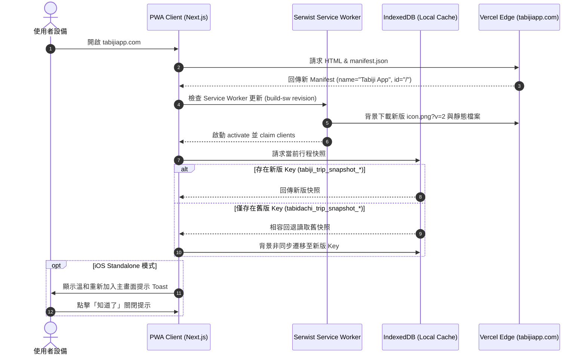

# Tabiji 品牌重構、商標防禦與 PWA 全棧遷移工程規格書 (Idea to Spec)

> **文件狀態**: Draft (Pending Human Sign-off)  
> **建立時間**: 2026-10-09  
> **關聯網域**: `tabijiapp.com`  
> **GitHub 倉庫**: [`tyrantpiper/tabiji`](https://github.com/tyrantpiper/tabiji)  
> **NotebookLM 研究筆記本 ID**: `5928dfd7-3d6a-4705-af24-753a3a4d0a3d`  
> **底層研究報告**: [`docs/research/tabiji-rebranding-trademark-github-pwa-research-2026.md`](file:///d:/Project/Tabidachi/travel-pwa/docs/research/tabiji-rebranding-trademark-github-pwa-research-2026.md)

---

## 1. Problem Statement & Core Value (問題陳述與核心價值)

### 1.1 使用者痛點與背景需求 (Problem Statement)
- 專案已購置專屬頂級網域 `tabijiapp.com`，原專案名稱 `Tabidachi` (travel-pwa) 需全面遷移對齊為 `Tabiji`。
- 全球應用生態已存在商業競品（iOS App Store 同名訂閱制 App《Tabiji - Plan trips with ease》），若盲目採用純泛用詞「Tabiji」發布，將面臨極高之商標侵權訴訟與 App Store 審查下架風險。
- PWA 在 iOS 與 Android 上具有截然不同的底層快取與主畫面安裝機制（Android WebAPK 24-48h 延遲、iOS Web Clip 永不自動更新圖示），需建構精準的快取破壞通道與雙軌離線資料相容架構，杜絕使用者離線行程遺失。

### 1.2 成功指標 (Success Metrics)
1. **商標與品牌安全度**: 100% 採用複合品牌「Tabiji App / Tabiji 旅路」，於 App Store、SEO、Manifest 與 ICANN 網域範疇形成顯著識別區隔。
2. **Git & CI/CD 遷移完整度**: 本地 Remote 成功導向 `tyrantpiper/tabiji.git`，GitHub Actions 與 Vercel 構建零錯誤。
3. **離線存儲零資料遺失率 (0% Data Loss)**: 透過 IndexedDB Fallback Reader，既有 `tabidachi_` 行程草稿與快照 100% 平滑遷移至 `tabiji_`。
4. **PWA 升級平滑度**: Manifest `id` 保持 `"/"` 避免 WebAPK 孤島分裂；iOS Standalone 模式具備溫和換新提示 Banner。

---

## 2. User Journey & Core Flow (使用者旅程與操作流程)

### 2.1 使用者互動與版本遷移流程
1. **現有訪客開啟應用**:
   - 瀏覽器載入 `tabijiapp.com`，Service Worker 檢測到新版 `sw.js`（Revision Hash 刷新）。
   - 背景自動快取新版靜態資產與新圖示。
2. **離線行程資料讀取**:
   - 應用啟動時呼叫 `idb-storage.ts`，相容讀取器先查詢 `tabiji_trip_snapshot_*`，若不存在則無縫退回讀取 `tabidachi_trip_snapshot_*`。
   - 使用者編輯或儲存行程時，資料自動寫入 `tabiji_trip_snapshot_*`，舊 Key 標記廢棄。
3. **iOS 主畫面用戶引導**:
   - 若檢測為 iOS Standalone 模式（`window.navigator.standalone === true`），頂部顯示溫和的品牌升級 Toast：「品牌已升級為 Tabiji，重新加入主畫面即可換上全新圖示」。
   - 用荷點擊「我知道了」後寫入 LocalStorage，永久不再提示。

### 2.2 系統遷移時序圖 (Mermaid Sequence Diagram)



---

## 3. Architecture & Data Model (架構與資料模型)

### 3.1 品牌與元資料 (Brand Identity & Metadata Specification)
| 項目 | 舊設定 (`travel-pwa`) | 新規範 (`tabiji`) |
| :--- | :--- | :--- |
| **網域 (Domain)** | `travel-pwa-five.vercel.app` | **`tabijiapp.com`** (CNAME `cname.vercel-dns.com`) |
| **對外品牌名稱** | `Tabidachi - 旅立ち` | **`Tabiji App - 旅路`** (複合品牌防禦商標) |
| **PWA Short Name**| `Tabidachi` | **`Tabiji App`** |
| **Manifest `id`** | `"/"` | **`"/"` (嚴禁修改，維護 WebAPK 原位升級)** |
| **HTML Title** | `Tabidachi \| Generative AI Travel Companion` | **`Tabiji App \| Generative AI Travel Companion`** |
| **Apple Touch Icon**| `/icon.png` | **`/icon.png?v=2` (快取破壞查詢參數)** |
| **Frontend 套件名**| `ryans-travel-pwa` | **`tabiji-pwa`** |

### 3.2 IndexedDB 相容讀取器模型 (Fallback Reader Architecture)
在 `frontend/lib/idb-storage.ts` 中導入雙軌前綴機制：

```typescript
// 🛡️ Tabiji 雙軌前綴配置
export const SNAPSHOT_PREFIX_NEW = "tabiji_trip_snapshot_";
export const SNAPSHOT_PREFIX_OLD = "tabidachi_trip_snapshot_";

export const TRIPS_LIST_PREFIX_NEW = "tabiji_trips_list_";
export const TRIPS_LIST_PREFIX_OLD = "tabidachi_trips_list_";

export const L0_SYNC_TRIP_PREFIX_NEW = "tabiji_l0_sync_trip_";
export const L0_SYNC_TRIP_PREFIX_OLD = "tabidachi_l0_sync_trip_";

/**
 * 雙軌無損讀取器：優先讀取新前綴，若無則降級讀取舊前綴並自動遷移
 */
export async function getTripSnapshotWithFallback(tripId: string): Promise<Trip | null> {
    const newKey = `${SNAPSHOT_PREFIX_NEW}${tripId}`;
    const oldKey = `${SNAPSHOT_PREFIX_OLD}${tripId}`;
    
    // 1. 優先嘗試新版 Key
    const newData = await idbKeyval.get<Trip>(newKey);
    if (newData) return newData;
    
    // 2. 降級回退舊版 Key
    const oldData = await idbKeyval.get<Trip>(oldKey);
    if (oldData) {
        // 3. 觸發背景非同步自動平滑遷移
        await idbKeyval.set(newKey, oldData);
        return oldData;
    }
    
    return null;
}
```

### 3.3 PWA Icon 替換與規格標準 (Icon Ingestion Specification)
- **素材來源**: 桌面原檔 `D:\User\桌面\icon.jpeg` (實體為 2048x2048 高解析 PNG 畫報)。
- **視覺呈現決策**:
  - 完整保留原版溫暖細膩的奶油白底色 (`#F5F2EB`) 與日輪、提皮箱回首人物、路徑光軌構圖。
  - 透過 Lanczos 高品質多採樣演算法輸出為：
    - `frontend/public/icon.png`: 512x512 32-bit RGBA PNG (主應用圖示 / Apple Touch Icon).
    - `frontend/public/icon-192.png`: 192x192 PNG (PWA 行動端圖示).
    - `frontend/public/favicon.ico`: 瀏覽器分頁圖示.
- **快取破壞通道**:
  - `layout.tsx` 配置 `<link rel="apple-touch-icon" href="/icon.png?v=3">` 擊破 Safari 快取。
  - 觸發 `node frontend/scripts/build-sw.mjs` 自動重新計算 Serwist `sw.js` 之內容 Hash。

### 3.4 藤井風一筆劃「tabiji」啟動動效管線 (Splash Screen Motion Pipeline)
- **素材來源**: 桌面原檔 `D:\User\桌面\animation.jpeg` (實體為 2048x2048 一筆劃白線條構圖與日系復古日落漸層)。
- **滿版背景色調**:
  - 深度復刻右款漸層色碼：左下暖橘微醺 (`#E25248`) ➔ 中央橄欖和風 (`#9D9065` / `#8B906A`) ➔ 右上沉靜莫蘭迪藍綠 (`#3C6F84`)。
  - 使用滿版 CSS Mesh / Linear 漸層渲染，零網路阻塞瞬間展現。
- **時序物理動效規格 (0.0s - 2.0s 完整沉浸播放)**:
  1. **0.0s - 0.8s (AI 光軌勾勒輪廓)**:
     - 畫面中央由一條發光的白色微光線條 (AI 光軌)，以 SVG `pathLength: 0 ➔ 1` 流暢勾勒出藤井風提皮箱回首的隨性輪廓。
     - 筆尖附加 4px 柔和發光光點粒子 (`filter: drop-shadow(0 0 8px rgba(255,255,255,0.9))`) 引導視覺流向。
  2. **0.8s - 1.5s (大衣連寫 tabiji 與紙飛機拍動)**:
     - 線條順著大衣下擺滑落，如同彈奏鋼琴或微風吹拂，流暢連寫出草寫 `tabiji` 字體。
     - 在 1.1s~1.5s 期間，右側紙飛機浮現並帶有輕微拍動翅膀 (Wing-flap micro-rotation) 待命啟航。
  3. **1.5s - 2.0s (紙飛機加速衝出與雙向雲霧擴散轉場)**:
     - 紙飛機向前上方加速劃出優雅弧線飛向右上角視窗外 (`x: +120px, y: -80px, scale: 1.15, opacity: 0`)。
     - 滿版漸層背景與整體容器啟動「雙向雲霧擴散 (Dual-wing fog disperse)」轉場：畫面如同風吹散雲霧般向左右兩側分流淡出 (`scaleX: 1.08, filter: blur(20px), opacity: 0`)，無縫交接給 PWA 主頁面。
- **互動與播放策略**:
  - 完整沉浸播放 2.0 秒（不設輕觸跳過，確保每一次開箱人文治癒感不被打斷）。
  - 同一 Session 僅首次開啟時播映一次，後續訪問直接由 `sessionStorage.getItem('tabiji_splash_shown')` 攔截快速進入主介面。
- **元件架構**:
  - `frontend/components/ui/splash/tabiji-splash-animation.tsx`: 向量動效純淨元件。
  - `frontend/components/ui/splash-screen.tsx`: 生命週期、PWA 獨立模式與轉場容器。

---

## 4. Edge Cases & Boundary Conditions (邊界條件與異常處理)

### 4.1 離線與網路邊界 (Offline & Network)
- **邊界情境**: 使用者於無網路狀態下首次開啟更新後的 App。
- **處理政策**: Service Worker 舊快取仍可提供完整 App Shell 與離線地圖；IndexedDB 雙軌讀取器保證舊快照 100% 讀出，不因更名產生空白畫面。

### 4.2 iOS Web Clip 永不自動更新圖示限制
- **邊界情境**: iOS 用戶已將原 `Tabidachi` 加入主畫面，更新上線後主畫面圖示依然為舊圖。
- **處理政策**:
  - 此為 iOS Web Clip 系統層級之物理限制（iOS Springboard 快照機制）。
  - PWA 內部透過 `useIosPwaUpdateBanner` 元件偵測 iOS Standalone 模式，提示使用者重新加入主畫面；若用戶關閉提示，透過 `localStorage.setItem('tabiji_ios_update_dismissed', 'true')` 避免反覆騷擾。

### 4.3 GitHub 倉庫重新導向與名稱回收陷阱
- **邊界情境**: 未來若在 `tyrantpiper` 帳號下重新建立名為 `travel-pwa` 的倉庫。
- **處理政策**: GitHub 規範明確指出，一旦舊名稱被新專案佔用，所有轉址機制立刻失效。本規格書強制標記：**嚴禁在該帳號下重複使用 `travel-pwa` 作為專案名稱**。

### 4.4 啟動動畫素材格式與跨端邊界
- **邊界情境**: 使用者提供 JPEG 格式之 Icon 或動效素材。
- **處理政策**: 啟動畫面若作為全幅/卡片背景可原生呈現 JPEG；PWA Icon 則由自動轉碼管線輸出為標準 512x512 PNG，杜絕 iOS Safari 對非 PNG 圖示之黑底或渲染異常。

---

## 5. Acceptance Criteria (驗收標準清單)

```markdown
- [ ] AC-1: Git 遠端倉庫與分支驗證
  - Given 本地專案根目錄
  - When 執行 `git remote -v`
  - Then 顯示遠端位址為 `https://github.com/tyrantpiper/tabiji.git`，且 `git fetch origin` 退出碼為 0。

- [ ] AC-2: Web App Manifest 品牌與識別符驗證
  - Given `frontend/public/manifest.json`
  - When 檢查其內容
  - Then `name` 包含 "Tabiji App - 旅路"，`short_name` 為 "Tabiji App"，且 `id` 嚴格維持 `"/"`。

- [ ] AC-3: HTML 標頭與 iOS 快取破壞標籤驗證
  - Given `frontend/app/layout.tsx`
  - When 檢查渲染的 `<head>` 元資料
  - Then 標題顯示 "Tabiji App | Generative AI Travel Companion"，且 Apple Touch Icon 帶有版本標籤 `/icon.png?v=2`。

- [ ] AC-4: IndexedDB 雙軌離線資料無損遷移
  - Given 瀏覽器中僅存在 `tabidachi_trip_snapshot_test-id` 之歷史行程快照
  - When 應用程式透過 `getTripSnapshotWithFallback('test-id')` 讀取
  - Then 正確讀取該行程，並自動於 IndexedDB 寫入 `tabiji_trip_snapshot_test-id`。

- [ ] AC-5: Serwist 服務工作線程自動雜湊驗證
  - Given `frontend/public/icon.png` 發生替換
  - When 執行 `node frontend/scripts/build-sw.mjs`
  - Then `frontend/public/sw.js` 重新生成，且包含 `/icon.png` 的全新 revision 雜湊值。

- [ ] AC-6: 啟動動畫 (SplashScreen) 品牌與插槽解耦驗證
  - Given `frontend/components/ui/splash-screen.tsx`
  - When 檢視其渲染內容
  - Then 標題與 Alt 不再包含 "Tabidachi"，改為 "Tabiji App"，且視覺動效抽離至獨立插槽元件。

- [ ] AC-7: 全站 TypeScript 與 Lint 品質守門
  - Given 所有更名與相容程式碼修改完成
  - When 執行 `npx tsc --noEmit` 與 `npm run lint`
  - Then 0 錯誤、0 警告。
```

---

## 6. 後續實作執行計畫 (Phased Implementation Plan)

- **Phase 1 (核心品牌與相容層)**:
  - 更新 `manifest.json`、`layout.tsx`、`package.json` 與 i18n 語系檔為 `Tabiji App`。
  - 於 `frontend/lib/idb-storage.ts` 與 `idb-swr-provider.tsx` 實作雙軌相容讀取器。
  - 加入 iOS Standalone 溫和提示 Banner。
- **Phase 2 (PWA Icon 圖檔替換通道準備)**:
  - 建立圖檔替換指引，等待使用者提供新圖檔後執行 `build-sw.mjs` 快取破壞。
- **Phase 3 (全棧品質驗證與交付)**:
  - 執行 `npx tsc --noEmit`、單元測試、產出驗收報表。
