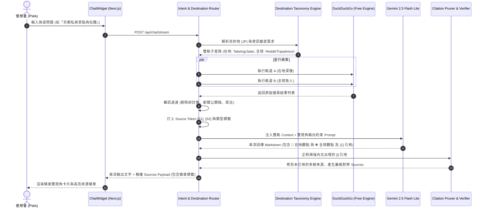

# Tabidachi 全球化與在地化雙軌旅遊搜尋引擎規格書
## (Global & Localized Dual-Tier Travel Grounding Architecture Specification)

> **版本**: 1.0.0  
> **狀態**: 已通過 `/grill-me` 審查，準備實作  
> **關聯技能**: `/Idea to Spec`, `Bug Hunter`, `WebGL & Map Guardian`  
> **研究依據**: NotebookLM 深度調研 (TP-RAG ACL Anthology, RAGRouter arXiv, C-TRS CEUR-WS, Tavily/Perplexity 實務)

---

## 1. 問題陳述與核心價值 (Problem Statement & Core Value)

### 1.1 使用者痛點 (User Pain Points)
1. **視角單一與文化脫節**：
   - 一般旅遊 AI 僅能依賴通用 LLM 內部預訓練知識，搜尋時容易抓取泛政治、學術研討會或過期新聞（如日前發生的「國際警察合作論壇」錯誤引用）。
   - 外國旅客看不懂目的地在地論壇（如台灣 PTT/Dcard、日本 Tabelog/Jalan、韓國 Naver），錯失真正的巷弄美食與最新營運狀態。
   - 在地旅客則往往忽略全球背包客社群（如 Reddit r/travel, r/solotravel）針對文化衝擊、跨國交通避坑、外語友善度的客觀視角。
2. **文字與來源脫節 (Citation Mismatch)**：
   - 搜尋引擎抓回來的 3 個網站與 LLM 最終生成的景點介紹各說各話，導致前端附帶的來源卡片讓使用者感到「掛羊頭賣狗肉」。
3. **商業 API 依賴與成本**：
   - 商業搜尋 API（如 Tavily, Perplexity API）高昂且有額度限制；需在「零外部收費 API (100% Free DDG)」的前提下達到大廠等級的檢索精準度。

### 1.2 核心價值 (Core Value Proposition)
- **全球旅客無痛漫遊**：以使用者提問為起點，自動識別目的地，發起「在地深搜 (Local In-depth)」與「全球旅人 (Global Backpacker)」雙軌檢索。
- **在地真實 ✕ 國際評測**：融合當地觀光局官網、代表性論壇（PTT/Tabelog）與 Reddit 國際討論，並在 UI 明確分區呈现。
- **100% 嚴格引用真理 (Strict Grounding)**：段落嚴格附帶 `[1]`、`[2]` 引號，僅展示內文實際引用的來源，杜絕幻覺與來源脫節。

---

## 2. 使用者旅程與操作流程 (User Journey & Core Flow)

### 2.1 互動流程
1. 使用者在首頁或聊天視窗輸入：「**台北這週末有什麼推薦的隱藏美食或新熱點？**」或「**第一次去京都推薦哪些拉麵？**」
2. 後端 `intent_router` 識別出旅遊檢索意圖（`SEARCH_TRAVEL`），並由 `DestinationTaxonomyEngine` 抽取出目的地實體（如 `Taipei (TW)` 或 `Kyoto (JP)`）。
3. 引擎自動發起雙軌查詢改寫（Dual-Track Query Rewriting）：
   - **軌道 A (在地深度探索)**：`"台北 隱藏美食 私房景點 ptt OR dcard OR 觀光局"`
   - **軌道 B (全球旅人視角)**：`"Taipei hidden food gems travel reddit"`
4. 檢索器（`WebSearchEngine`）以非同步並行執行 DuckDuckGo 檢索，清洗過濾政治/警察/會議等雜訊。
5. 來源正規化管線（Provenance Pipeline）為每筆有效網頁打上 `[S1]`, `[S2]` 標籤與分類徽章（`🏛️ 官方/在地` 或 `💬 全球論壇`）。
6. LLM 根據雙軌上下文，輸出結構化雙視角回答：
   - `📍 在地觀點 (Local)`：在地老饕與觀光局最新動態，標註 `[1]`。
   - `🌐 全球觀點 (Global)`：Reddit 國際旅人推薦與注意事項，標註 `[2]`。
7. 後端執行引用修剪（Citation Pruning），確保前端僅收到文內確實提及的來源卡片。

### 2.2 系統序列圖 (Mermaid Sequence Diagram)



---

## 3. 架構與資料模型 (Architecture & Data Model)

### 3.1 目的地領域分類學映射表 (Destination Taxonomy Matrix)

系統在 `backend/services/destination_taxonomy.py` 維護目的地字典：

```python
DESTINATION_TAXONOMY = {
    "TW": {
        "names": ["台灣", "台北", "台中", "台南", "高雄", "花蓮", "台東", "墾丁", "宜蘭", "Taiwan", "Taipei"],
        "local_keywords": ["ptt", "dcard", "觀光署", "旅遊局", "私房美食", "在地人推薦"],
        "official_domains": ["taiwan.net.tw", "travel.taipei", "taiwanbus.tw"],
        "forum_domains": ["ptt.cc", "dcard.tw", "mobile01.com"],
        "food_review": ["ipeen", "walkerland", "pixnet.net"],
        "global_subreddits": ["r/taiwan", "r/taiwantravel", "r/travel"],
    },
    "JP": {
        "names": ["日本", "東京", "京都", "大阪", "北海道", "沖繩", "福岡", "名古屋", "Japan", "Tokyo", "Kyoto"],
        "local_keywords": ["食べログ", "じゃらん", "観光協会", "おすすめ", "穴場"],
        "official_domains": ["japan.travel", "japan-guide.com", "jnto.go.jp"],
        "forum_domains": ["tabelog.com", "retrip.jp", "jalan.net"],
        "food_review": ["tabelog.com", "retty.me"],
        "global_subreddits": ["r/JapanTravel", "r/Tokyo", "r/japanlife"],
    },
    "KR": {
        "names": ["韓國", "首爾", "釜山", "濟州", "弘大", "明洞", "Korea", "Seoul", "Busan"],
        "local_keywords": ["네이버", "맛집", "관광공사", "在地推薦"],
        "official_domains": ["visitkorea.or.kr", "english.visitseoul.net"],
        "forum_domains": ["blog.naver.com", "creatrip.com"],
        "food_review": ["mangoplate.com", "diningcode.com"],
        "global_subreddits": ["r/koreatravel", "r/seoul"],
    },
    "TH": {
        "names": ["泰國", "曼谷", "清邁", "普吉島", "芭達雅", "Thailand", "Bangkok", "Chiang Mai"],
        "local_keywords": ["pantip", "觀光局", "泰國必吃", "night market"],
        "official_domains": ["tourismthailand.org"],
        "forum_domains": ["pantip.com"],
        "food_review": ["wongnai.com"],
        "global_subreddits": ["r/ThailandTourism", "r/bangkok"],
    },
    "GLOBAL": {
        "default_forums": ["reddit.com", "tripadvisor.com", "wikivoyage.org"],
        "global_subreddits": ["r/travel", "r/solotravel", "r/Shoestring"],
    }
}
```

### 3.2 雙軌查詢重寫器 (Dual-Track Query Rewriter)

輸入原始提問 `q`，重寫器產出兩組輕量聚焦查詢：
1. **Query Local (在地軌道)**：
   - 格式：`{destination} {attraction_or_topic} {local_primary_keywords}`
   - 範例：`"台北 隱藏美食 私房 ptt OR dcard OR 觀光局"`
2. **Query Global (全球軌道)**：
   - 格式：`{destination_en} {topic_en} reddit travel`
   - 範例：`"Taipei hidden gems local food reddit travel"`

### 3.3 來源分類資料結構 (Frontend API Payload)

更新後端回傳的 `sources` 結構，增加 `category` 與 `badge`：

```typescript
export interface GroundingSource {
  title: string;
  url: string;
  snippet: string;
  category: 'official' | 'local_forum' | 'global_forum' | 'review' | 'general';
  badge: {
    text: string;     // 如 "🏛️ 官方觀光局", "🇹🇼 PTT 在地情報", "💬 Reddit 全球旅人"
    color: string;    // Tailwind class
  };
}
```

---

## 4. 邊界條件與異常處理 (Edge Cases & Boundary Conditions)

1. **未知名或冷門目的地**：
   - 若使用者查詢未在 `DESTINATION_TAXONOMY` 字典中的偏遠城鎮（例如：「馬達加斯加穆隆達瓦」），回退至通用雙軌：
     - 在地軌道：`{query} 旅遊攻略 官方景點`
     - 全球軌道：`{query_en} travel guide reddit`
2. **DuckDuckGo 單軌 0 結果或 Rate Limit**：
   - 若特定關鍵字查無結果，檢索器自動執行「寬鬆降級 (Soft Fallback)」：拔除 `OR ptt` 等站點限定詞，以純名詞再度重試。
3. **完全無引用 (No Citation)**：
   - 若模型生成文字未輸出任何 `[1]` 或 `[2]`，系統檢查文字是否實質提及網頁標題或景點名稱；若全然脫節，將 Sources 置空，絕不回傳偽來源。
4. **CJK 多語系繁簡混雜**：
   - 在地論壇關鍵字支援繁體中文（PTT/Dcard）、簡體中文（小紅書/馬蜂窩）、日文平假名/片假名（食べログ/じゃらん）、韓文（네이버）。

---

## 5. 驗收標準 (Acceptance Criteria)

- [ ] **AC-1 (雙軌查詢改寫)**：給定包含台灣/日本目的地的提問，後端能自動拆解出在地關鍵詞查詢與英文 Reddit 查詢，且日誌中清晰可見雙軌 query。
- [ ] **AC-2 (雜訊過濾)**：搜尋結果中包含「警察」、「論壇閉幕」、「研討會」、「基金會」等無關政治/公關內容時，會被自動丟棄，不進入 LLM Prompt。
- [ ] **AC-3 (雙視角排版)**：Gemini 輸出的 Markdown 內明確包含「📍 在地觀點」與「🌐 全球觀點」雙結構，且每個具體推薦附帶 `[1]`, `[2]` 內聯引用。
- [ ] **AC-4 (嚴格 1 對 1 來源對齊)**：底部回傳的 Sources 列表，其 URL 必須 100% 嚴格對應內文 `[i]` 所引用的文檔；未在內文引用的結果一律剔除。
- [ ] **AC-5 (來源分類徽章)**：前端展示的來源卡片具備彩色徽章（如 `🏛️ 觀光局/官網`、`🇹🇼 PTT/在地`、`💬 Reddit 旅人`），使用者一目了然。
