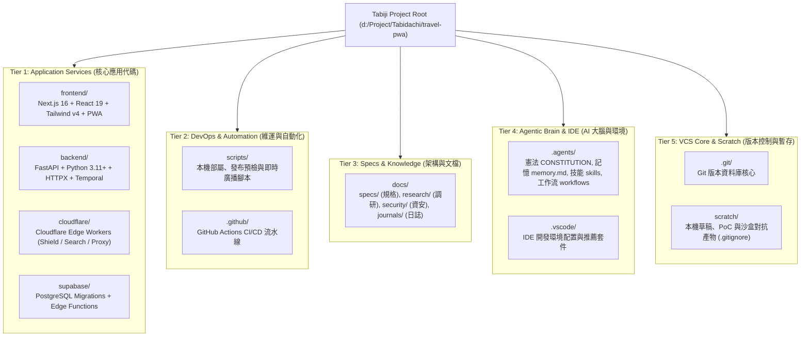

# 📐 Tabiji 全棧工程目錄拓撲白皮書 (Repository Topology Specification)

> **規格代號**: `INFRA-SPEC-007`  
> **層級**: 基礎設施與工程架構 (Infrastructure & DevOps)  
> **狀態**: 🟢 Active (2026-10-10)  
> **目標**: 建立全專案根目錄 14 個核心與維運目錄之 5 大領域層級治理架構，嚴格劃定應用邊界與職責劃分。

---

## 1. 核心原則 (Core Architectural Principles)

1. **部署鏈路零破壞 (Zero-Breakage Deployment)**:
   - `frontend/` (Vercel Root)、`backend/` (Cloud Run Context via `Dockerfile.prod`)、`cloudflare/` (Wrangler Root) 與 `supabase/` (Supabase CLI) 嚴格維持一級目錄拓撲，禁止任意物理嵌套以防止雲端部署管線斷裂。
2. **單一事實來源 (Single Source of Truth)**:
   - 文檔與資安台帳集中於 `docs/`，Agent 治理集中於 `.agents/`，核心代碼與自動化工具嚴格解耦。
3. **無污染本機暫存 (Stray-Free Workspace)**:
   - 任何建置、測試或審查運行之中間產物，統一導向 `scratch/` 或 `.gitignore` 受控目錄，嚴禁散落於專案根層。

---

## 2. 5 大領域層級與目錄對應拓撲 (5-Tier Domain Topology)

---

## 3. 14 大目錄權限矩陣與生命週期 (Directory Responsibility Matrix)

| 目錄路徑 | 領域歸屬 | 主要技術棧 | 職責定義 | Git 追蹤策略 |
| :--- | :--- | :--- | :--- | :--- |
| `frontend/` | 應用服務 | Next.js 16, React 19, TypeScript, Serwist PWA | 提供現代化離線優先 Web/PWA 使用者介面、3D 大圓地圖與即時導航 | 完整追蹤 (排除內部 `node_modules/`, `.next/`) |
| `backend/` | 應用服務 | Python 3.11+, FastAPI, Pydantic v2, HTTPX | 提供高效能 REST API、時序解析、AI 意圖路由與天氣/匯率計算引擎 | 完整追蹤 (排除 `__pycache__/`, `.venv/`) |
| `cloudflare/` | 應用服務 | Wrangler v3+, JavaScript Workers | 提供邊緣防護罩 (Same-Origin Edge Shield) 與 0ms 虛擬快取搜尋代理 | 完整追蹤 (包含各 Worker 之 `wrangler.jsonc`) |
| `supabase/` | 應用服務 | Supabase CLI, Deno, TypeScript | 提供 PostgreSQL 資料庫遷移、RLS 安全策略與伺服端 Edge Functions | 完整追蹤 (排除本機暫存環境金鑰) |
| `scripts/` | 維運工具 | Python 3, PowerShell | 提供開發環境重啟、原子發布預檢與跨進程廣播工具 | 完整追蹤 |
| `.github/` | 維運工具 | YAML (GitHub Workflows) | 定義 PR 門禁檢查、型別驗證與自動化部署流水線 | 完整追蹤 |
| `docs/` | 架構文檔 | Markdown, Mermaid | 全專案架構規格 (`specs/`)、前瞻調研 (`research/`)、資安覆蓋台帳 (`security/`) 與每日日誌 (`journals/`) | 完整追蹤 (資安暫存檔由 `history/` 歸檔) |
| `.agents/` | Agent 大腦 | Markdown, JSON | Antigravity AI 官方工作區大腦：憲法原則、神經記憶庫、8 大技能與 Slash 工作流 | 完整追蹤 (排除內部 session logs) |
| `.vscode/` | IDE 環境 | JSONC | VS Code 工作區編輯器設定、擴充套件推薦 | 完整追蹤 |
| `.git/` | 版本庫 | C, Git Native Objects | 專案分散式版本控制核心與 Commit DAG | 內部原生維護 (嚴禁手動修改) |
| `scratch/` | 本機暫存 | 各種臨時檔案 | 存放 Hunter 假說、沙盒 PoC 腳本與測試中間輸出 | **完全排除** (`.gitignore`) |
| `.agent/` | 廢棄快取 | - | **非標準孤立目錄**（標準為 `.agents/`，已物理清理） | **完全排除** (`.gitignore`) |
| `.pytest_cache/` | 本地快取 | Python pytest | 本地單元測試快取（已物理清理） | **完全排除** (`.gitignore`) |
| `node_modules/` (根層) | 廢棄快取 | - | **根層遺留空殼快取**（實際依賴位於 `frontend/node_modules/`，已物理清理） | **完全排除** (`.gitignore`) |

---

## 4. 暫存與快取防禦治理標準 (Cache & Hygiene Standards)

1. **命名一致性約束**:
   - Agent 相關治理規則一律使用複數 `.agents/`，嚴禁生成單數 `.agent/` 目錄。
2. **測試產物落點標準**:
   - Python 測試暫存必須置於 `.pytest_cache/` 並由 `.gitignore` 全域阻斷。
   - Security Sentinel 暫存一律輸出至 `scratch/`（例如 `scratch/candidates.json`, `scratch/findings.json`），經簽核之正式結果始得寫入 `docs/security/reports/` 與 `docs/security/security-coverage-ledger.json`。
3. **依賴隔離標準**:
   - 前端所有依賴嚴格鎖定於 `frontend/package.json` 與 `frontend/node_modules/`，禁止於根目錄執行未指明路徑之 `npm install`。
