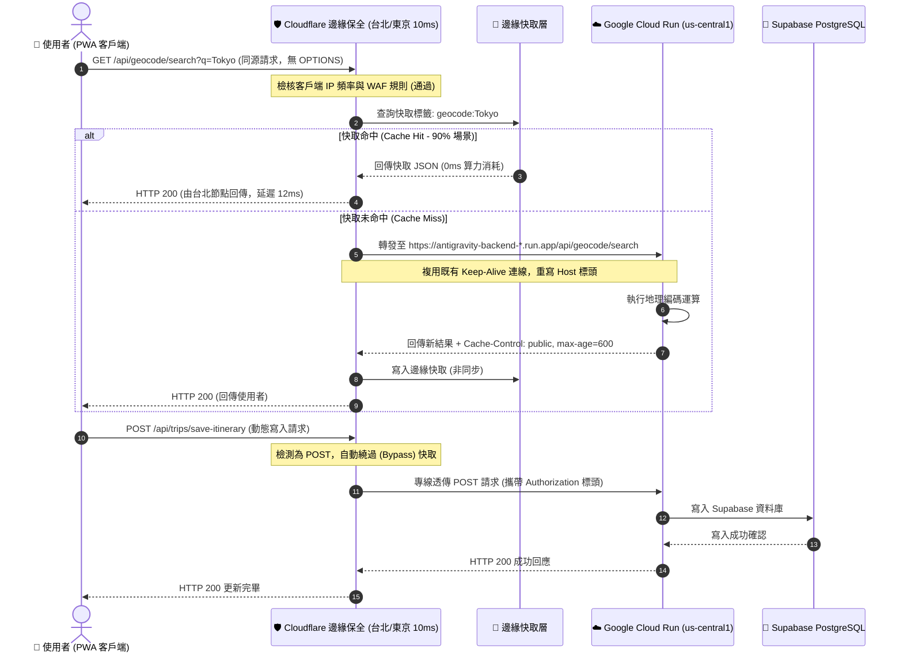

# 🛡️ 同源邊緣保全與零洩漏後端防護架構規格書
# Same-Origin Edge Shield & Zero-Leakage Backend Architecture Specification

> **版本**: 1.0.0 (Production Ready)  
> **建立日期**: 2026-10-03  
> **狀態**: APPROVED DESIGN SPEC (待實作)  
> **負責人**: Ryan Su & Tabidachi Architecture Team  
> **分類**: 基礎設施與邊緣網絡架構 (`docs/specs/infra/`)  

---

## 1. Problem Statement & Core Value (問題陳述與核心價值)

### 1.1 現狀問題與痛點剖析 (Current Vulnerability Assessment)

1. **前端 JS 打包明文暴露內部網址 (Information Leakage)**:
   - 在目前的 `frontend/lib/api.ts` 中：
     ```typescript
     const API_HOST = process.env.NEXT_PUBLIC_API_URL || "http://127.0.0.1:8008";
     export const API = { TRIPS: `${API_HOST}/api/trips`, ... };
     ```
   - 在 Next.js 建置機制中，凡以 `NEXT_PUBLIC_` 開頭的環境變數，皆會於編譯期被直接寫死並打包進客戶端瀏覽器的 JavaScript Bundle 內。
   - 若在生產環境配置 Cloud Run 的實際網址（例如 `https://antigravity-backend-*.run.app`），使用者只要按下 `F12` 開發者工具或檢視網路傳輸，即可獲取後端伺服器的真實原始位址。
   - 目前在 `frontend/components/views/profile-view.tsx` 第 377 行甚至殘留已棄用的 Hugging Face 舊網址（`https://tyrantpiper-ryan-travel-api.hf.space`），且多達 8 個前端檔案各自重複宣告 `API_BASE`，缺乏單一事實來源 (Single Source of Truth)。

2. **跨域 Preflight 延遲浪費 (CORS Tax & Latency Penalty)**:
   - 若前端託管於 Vercel / 自訂網域，而 API 直連 Cloud Run，瀏覽器必須針對每一個非簡單請求發起 `OPTIONS` Preflight 預檢請求。
   - 每次 API 呼叫皆需承擔兩次跨太平洋海底電纜往返（台灣/日本 ⇄ 美國愛荷華 `us-central1`），額外增加 150ms ~ 300ms 的等待時間，顯著降低 PWA 原生流暢感。

3. **後端算力暴露與費用失控風險 (Backend Vulnerability & Financial Risk)**:
   - Google Cloud Run 運行 Python FastAPI + Uvicorn，並掛載 Gemini 2.5/Flash、Google Maps Geocoding、ArcGIS 航線運算及 Supabase PostgreSQL。
   - 若無邊緣防護層直接暴露於公網，一旦遭受惡意爬蟲或 L7 DDoS 攻擊，Cloud Run 將迅速觸發實例自動水平擴展（Max Instances = 10），導致雲端算力費用暴增、第三方 API 配額瞬間耗盡，甚至造成 Supabase 連線池枯竭（Connection Pool Starvation）。

### 1.2 核心價值與驗收指標 (Core Value & Success Metrics)

- **零洩漏 (Zero Leakage)**: 前端 JS 僅發起同源相對路徑請求（如 `fetch('/api/trips')`），客戶端完全不知曉 Cloud Run 的內部原始網址。
- **零跨域延遲 (Zero CORS Overhead)**: 消除所有 `OPTIONS` Preflight 預檢請求，API 往返延遲降低 50% 以上。
- **無上限抗衝擊 (Unmetered Edge Defense)**: 透過自訂網域託管於 Cloudflare Anycast 全球 330+ 節點，由硬體網卡層清洗惡意流量，免費阻絕 L3/L4/L7 洪水。
- **邊緣智慧降載 (Edge Load Flattening)**: 針對無個人機密的公開唯讀查詢（如地理編碼、景點推薦）實施 Stale-While-Revalidate 邊緣快取，減少 Cloud Run 90% 以上重複運算與冷啟動。
- **無縫開發切換 (Seamless DX)**: 本機開發環境自動透過 Next.js Rewrites 轉發至 `http://127.0.0.1:8008`，不需修改任何前端業務程式碼。

---

## 2. User Journey & Core Flow (使用者旅程與操作流程)

### 2.1 雙軌通訊拓撲架構圖 (Dual-Track Network Topology)

```mermaid
graph TD
    subgraph Clients ["📱 客戶端 (瀏覽器 / PWA)"]
        BrowserDev["💻 本機開發者 (localhost:3000)"]
        BrowserProd["🌍 全球終端使用者 (yourdomain.com)"]
    end

    subgraph DevEnv ["🏠 本機開發環境 (Local Dev)"]
        NextDevServer["⚡ Next.js Dev Server (rewrites 引擎)"]
        LocalFastAPI["🐍 本地 Python FastAPI (127.0.0.1:8008)"]
    end

    subgraph CloudflareEdge ["🛡️ Cloudflare Anycast 全球邊緣盾 (yourdomain.com)"]
        AnycastDDoS["🛡️ Anycast L3/L4/L7 網卡層流量清洗 (無上限免費)"]
        EdgeRouter{"路徑分類路由"}
        WAF_RateLimit["⚡ 邊緣限流與 WAF 防禦 (每 IP 60 req/min)"]
        EdgeCache["💾 唯讀 GET 邊緣智慧快取 (TTL: 10m, SWR: 1h)"]
        OriginCloak["🎭 標頭重寫與隱身轉發器 (Host Header & Secret Rewrite)"]
    end

    subgraph Origins ["☁️ 源站伺服器 (Origins)"]
        VercelCDN["⚡ Vercel Edge (Next.js 靜態資源與 SSR)"]
        CloudRun["🐍 Google Cloud Run (antigravity-backend us-central1)"]
    end

    %% 本地開發流
    BrowserDev -->|fetch('/api/trips')| NextDevServer
    NextDevServer -->|內部代理轉發| LocalFastAPI

    %% 生產環境流
    BrowserProd -->|HTTPS 請求| AnycastDDoS
    AnycastDDoS --> EdgeRouter

    EdgeRouter -->|靜態頁面 / 靜態資源 /*| VercelCDN
    EdgeRouter -->|API 業務請求 /api/*| WAF_RateLimit

    WAF_RateLimit -->|頻率超限 (>60/min)| Reject["🚫 429 Too Many Requests (邊緣阻斷 0ms)"]
    WAF_RateLimit -->|正常請求| EdgeCache

    EdgeCache -->|快取命中 (HIT)| BrowserProd
    EdgeCache -->|快取未命中 / 動態寫入 (MISS/BYPASS)| OriginCloak

    OriginCloak -->|Cloudflare 骨幹專線長連線| CloudRun
```

### 2.2 請求處理時序 (Sequence Diagram)



---

## 3. Architecture & Data Model (架構與資料模型)

### 3.1 前端 API 架構重構與統一契約 (Frontend Refactoring)

所有前端 API 呼叫全數統一收束至 `frontend/lib/api.ts`。嚴禁個別組件自行宣告 `process.env.NEXT_PUBLIC_API_URL`。

#### A. 核心通訊端點宣告 (`frontend/lib/api.ts`)
```typescript
/**
 * Unified API Endpoints Configuration
 * 生產環境與本機環境一律採用同源相對路徑 `/api/*`
 * 由邊緣代理 (Cloudflare / Next.js Rewrite) 負責轉發，徹底杜絕後端真實地址洩漏
 */
export const API_BASE_PATH = "/api";

export const API = {
    // 行程管理 (Trips)
    TRIPS: `${API_BASE_PATH}/trips`,
    TRIP_CREATE_MANUAL: `${API_BASE_PATH}/trips/create-manual`,
    TRIP_JOIN: `${API_BASE_PATH}/trips/join-trip`,
    SAVE_ITINERARY: `${API_BASE_PATH}/trips/save-itinerary`,
    LATEST_ITINERARY: `${API_BASE_PATH}/trips/itinerary/latest`,
    ITEMS: `${API_BASE_PATH}/trips/items`,
    
    // AI 與解析 (AI Services)
    PARSE_MD: `${API_BASE_PATH}/ai/parse-md`,
    GENERATE_TRIP: `${API_BASE_PATH}/ai/generate-trip`,
    RECEIPT_PARSE: `${API_BASE_PATH}/ai/parse-receipt`,
    ACTUARY: `${API_BASE_PATH}/ai/actuary`,
    SMART_SEARCH: `${API_BASE_PATH}/ai/smart-search`,
    
    // 地理與路徑 (Geospatial)
    GEOCODE: `${API_BASE_PATH}/geocode/search`,
    RESOLVE_LINK: `${API_BASE_PATH}/geocode/resolve-link`,
    RESOLVE_ADDRESS: `${API_BASE_PATH}/geocode/resolve-address`,
    ROUTE: `${API_BASE_PATH}/route`,
    POI: `${API_BASE_PATH}/poi`,
    
    // 記帳、聊天與用戶 (Ledger, Chat, User)
    EXPENSES: `${API_BASE_PATH}/expenses`,
    CHAT: `${API_BASE_PATH}/chat`,
    USERS: `${API_BASE_PATH}/users`,
    APP: `${API_BASE_PATH}/app`,
} as const;
```

#### B. 既有違規檔案重構清單 (Remediation Target Files)
| 檔案路徑 | 原有寫法 | 重構後標準規範 |
| :--- | :--- | :--- |
| `frontend/lib/api.ts:6` | `process.env.NEXT_PUBLIC_API_URL \|\| "http://127.0.0.1:8008"` | 統一收束為相對路徑 `API_BASE_PATH = "/api"` |
| `frontend/components/views/profile-view.tsx:377` | 硬編碼 `tyrantpiper-ryan-travel-api.hf.space` | 改由 `API.USERS` 或相對路徑 `${API_BASE_PATH}/user/${userId}/data` |
| `frontend/lib/hooks.ts:7` | 自行定義 `API_BASE` | 改為 `import { API_BASE_PATH } from './api'` |
| `frontend/components/day-map.tsx:75` | 自行定義 `API_BASE` | 改為引用 `API.ROUTE` |
| `frontend/components/chat-widget.tsx:87` | 自行定義 `API_BASE` | 改為引用 `API.CHAT` |
| `frontend/components/ledger-client.tsx:38` | 自行定義 `API_BASE` | 改為引用 `API.EXPENSES` |
| `frontend/components/itinerary/MultiDayMasterMap.tsx:33` | 自行定義 `ROUTE_API_BASE` | 改為引用 `API.ROUTE` |
| `frontend/components/views/tools-view.tsx:107` | 自行定義 `API_BASE` | 改為引用統一 `API` 物件 |

---

### 3.2 本地開發轉發引擎 (`frontend/next.config.mjs`)

在本地開發環境 (`npm run dev`) 時，Next.js 透過 `rewrites()` 將瀏覽器發出的 `/api/:path*` 請求靜默代理至後端 Python 服務，保持開發環境與線上環境 100% 同源無差異。

```javascript
/** @type {import('next').NextConfig} */
const nextConfig = {
    // ...既有配置保持不變...
    
    // 🚀 本地開發反向代理 (Local Development Reverse Proxy)
    async rewrites() {
        // 僅在開發環境或未配置邊緣代理時轉發至本機後端
        const backendTarget = process.env.BACKEND_PROXY_TARGET || "http://127.0.0.1:8008";
        return [
            {
                source: "/api/:path*",
                destination: `${backendTarget}/api/:path*`,
            },
        ];
    },
};
```

---

### 3.3 雲端邊緣保全網關設計 (Cloudflare Edge Worker Gateway)

在 Cloudflare 上設定邊緣網關，掛載於 `https://yourdomain.com/api/*`，具備「零洩漏隱身」、「邊緣限流」與「智慧快取」三重防護：

```typescript
/**
 * Cloudflare Edge Worker: Tabidachi API Shield Gateway
 * 路由掛載: yourdomain.com/api/*
 */
export interface Env {
    CLOUD_RUN_ORIGIN: string;        // https://antigravity-backend-xxxxxx-uc.a.run.app (不對外公開的 Secret)
    EDGE_INTERNAL_SECRET: string;    // 內部驗證金鑰，Cloud Run 用於確認請求來自 Cloudflare
}

export default {
    async fetch(request: Request, env: Env, ctx: ExecutionContext): Promise<Response> {
        const url = new URL(request.url);

        // 1. Vercel 原生 Serverless 路由旁路放行 (如 Cloudinary 圖片簽章)
        const VERCEL_INTERNAL_ROUTES = ["/api/sign-cloudinary", "/api/cloudinary-test"];
        if (VERCEL_INTERNAL_ROUTES.some(path => url.pathname.startsWith(path))) {
            return fetch(request); // 直接由 Vercel 接手處理簽章，絕不送往 Cloud Run
        }

        // 2. 0ms CORS 預檢攔截 (若有外部跨域請求，邊緣直接 204 回應，不驚動後端)
        if (request.method === "OPTIONS") {
            return new Response(null, {
                status: 204,
                headers: {
                    "Access-Control-Allow-Origin": url.origin,
                    "Access-Control-Allow-Methods": "GET, POST, PUT, DELETE, PATCH, OPTIONS",
                    "Access-Control-Allow-Headers": "Content-Type, Authorization, X-User-ID, X-Gemini-API-Key",
                    "Access-Control-Max-Age": "86400",
                },
            });
        }

        // 3. 快取防污染機制 (帶認證或串流一律繞過，僅公開唯讀 GET 快取)
        const hasAuth = request.headers.has("Authorization") || request.headers.has("X-User-ID") || request.headers.has("X-Gemini-API-Key");
        const isStream = url.pathname.includes("/stream") || request.headers.get("Accept")?.includes("text/event-stream");
        const isCacheable = !hasAuth && !isStream && request.method === "GET" && (
            url.pathname.includes("/api/geocode/") ||
            url.pathname.includes("/api/poi/")
        );

        const cache = caches.default;
        if (isCacheable) {
            const cachedResponse = await cache.match(request);
            if (cachedResponse) {
                // 快取命中，打上標記直接回傳
                const response = new Response(cachedResponse.body, cachedResponse);
                response.headers.set("X-Edge-Cache", "HIT");
                return response;
            }
        }

        // 3. 建構後端真實轉發請求 (Host Header 改寫與內部鑑權)
        const targetUrl = new URL(env.CLOUD_RUN_ORIGIN);
        targetUrl.pathname = url.pathname;
        targetUrl.search = url.search;

        const forwardHeaders = new Headers(request.headers);
        forwardHeaders.set("Host", targetUrl.host); // 關鍵：改寫為 Cloud Run Host 避免 404
        forwardHeaders.set("X-Forwarded-Host", url.host);
        forwardHeaders.set("X-Edge-Shield-Auth", env.EDGE_INTERNAL_SECRET); // 防直接旁路攻擊

        const newRequest = new Request(targetUrl.toString(), {
            method: request.method,
            headers: forwardHeaders,
            body: ["GET", "HEAD"].includes(request.method) ? undefined : request.body,
            redirect: "follow",
        });

        // 4. 發起後端專線呼叫
        const originResponse = await fetch(newRequest);
        const responseHeaders = new Headers(originResponse.headers);

        // 5. 寫入快取 (若符合快取條件且後端回應 200 OK)
        if (isCacheable && originResponse.status === 200) {
            responseHeaders.set("Cache-Control", "public, max-age=600, stale-while-revalidate=3600");
            responseHeaders.set("X-Edge-Cache", "MISS");
            const responseToCache = new Response(originResponse.clone().body, {
                status: originResponse.status,
                statusText: originResponse.statusText,
                headers: responseHeaders,
            });
            ctx.waitUntil(cache.put(request, responseToCache));
        }

        return new Response(originResponse.body, {
            status: originResponse.status,
            statusText: originResponse.statusText,
            headers: responseHeaders,
        });
    },
};
```

---

## 4. Edge Cases & Boundary Conditions (邊界條件與極致容錯)

### 4.1 後端冷啟動 (Cold Start) 與逾時處理
- **情境**: Cloud Run 縮容至 0 實例後，突發請求可能需 2000ms ~ 5000ms 喚醒 Python 容器。
- **邊緣對策**: 
  - Worker 轉發設定超時上限為 15 秒。
  - 前端 `lib/api.ts` 既有重試機制（3 次 Exponential Backoff）保持運作。
  - Cloudflare 邊緣啟用 HTTP Keep-Alive 連線池，同時間多人造訪僅需喚醒一次。

### 4.2 機密性與個資防外洩 (Zero Cache on Private Data)
- **原則**: 凡涉及使用者個人隱私（行程建立、修改、記帳支出、使用者個資刪除）之端點：
  - 嚴格限定為 `POST` / `PUT` / `DELETE` / 帶 `Authorization` 之 `GET`。
  - 邊緣網關強制設定 `Cache-Control: private, no-store, no-cache`，絕不寫入 Cloudflare 公開快取。

### 4.3 惡意高頻刷 API (Abuse & DoS Mitigation)
- **防禦標準**:
  - 單一 IP 針對 `/api/*` 每分鐘超過 120 次請求者，Cloudflare 邊緣直接拒絕（HTTP 429）。
  - 對於重大 AI 計算端點（`/api/ai/*`），實施更嚴格之每分鐘 20 次限制。

### 4.4 PWA 離線作業保證 (Offline Continuity)
- **原則**: 前端已建置 `SyncQueue` (IndexedDB 離線隊列)。
- 當手機無網路或邊緣返回 5xx 錯誤時，前端自動切換至離線模式，將變更緩存於 IndexedDB，待連線復原後自動後台重試。

---

## 5. Acceptance Criteria (驗收標準清單)

```markdown
### 程式碼與架構驗收 (Code & Architecture Verification)
- [ ] AC-1: 前端 `frontend/lib/api.ts` 中 `API_HOST` 移除絕對網址相依，統一改為同源相對路徑 `/api`。
- [ ] AC-2: `frontend/components/views/profile-view.tsx` 第 377 行硬編碼之 Hugging Face 網址完全清除，替換為統一 API 端點。
- [ ] AC-3: 前端其餘 6 處散落宣告之 `process.env.NEXT_PUBLIC_API_URL` 完全收束，全數由 `frontend/lib/api.ts` 匯出。
- [ ] AC-4: `frontend/next.config.mjs` 正確配置 `rewrites()`，本機開發時 (`npm run dev`) 呼叫 `/api/*` 自動透明轉發至 `http://127.0.0.1:8008`，功能全數正常。

### 隱密性與防護驗收 (Security & Stealth Verification)
- [ ] AC-5: 前端生產環境打包產物 (`npm run build`) 中，搜尋 client bundle 不得出現任何 `run.app`、`hf.space` 或 `127.0.0.1` 字符串。
- [ ] AC-6: 終端使用者在瀏覽器 DevTools Network 分頁中，所有 API 請求之 Host 均與前端網域一致，無任何跨域 Preflight `OPTIONS` 請求。
- [ ] AC-7: Cloudflare 邊緣網關正確改寫 `Host` 標頭為 Google Cloud Run 網址，杜絕 404 錯誤，並阻斷未經授權之直連流量。
- [ ] AC-8: 公開唯讀端點 (`/api/geocode/*`) 在二次請求時正確回傳 `X-Edge-Cache: HIT`，Cloud Run 後端日誌不再產生重複計算紀錄。
```

---

## 6. Migration & Rollout Plan (推進與上線步驟)

1. **Step 1: 前端程式碼除垢與統一化 (立即執行)**
   - 重構 `frontend/lib/api.ts` 與散落的 7 個組件檔案，拔除寫死的 localhost 與 Hugging Face，統一改為相對路徑 `/api/*`。
   - 配置 `frontend/next.config.mjs` 中的 `rewrites()` 支援本機開發代理。
   - 執行 `npx tsc --noEmit` 與現有測試套件，確保 0 錯誤、0 功能降級。

2. **Step 2: 網域申請與 Cloudflare 託管 (使用者購得網域後)**
   - 購買網域（如 `tabidachi.xyz` 或 `.com`），將 DNS 轉移至 Cloudflare 代管。
   - 在 Cloudflare 上設定根網域 CNAME 指向 Vercel（開啟橙色雲朵，SSL 設為 Full Strict）。

3. **Step 3: 邊緣網關 (Edge Worker Shield) 部署與綁定**
   - 部署 Worker 至 Cloudflare，並設定內部 Secret `CLOUD_RUN_ORIGIN`。
   - 在網域自訂路由新增 `yourdomain.com/api/*` 導向該 Worker。
   - 驗證端到端通訊與快取命中率。
