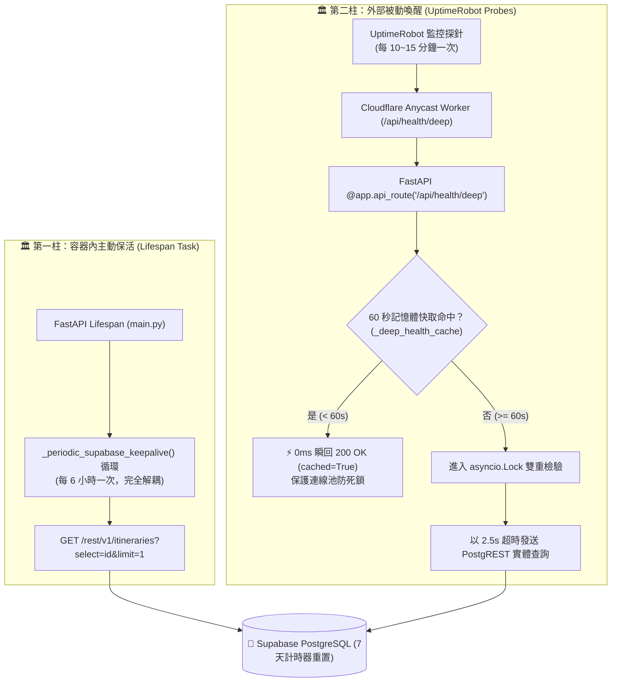

# Supabase Free Tier 7 天防休眠與雙柱保活架構規格書 (Supabase Keep-Alive Architecture Spec)

> **規格狀態**: 🟢 Active (生產環境運行中)  
> **關聯程式碼**: [`backend/main.py`](file:///d:/Project/Tabidachi/travel-pwa/backend/main.py) (`_periodic_supabase_keepalive`, `health_check_deep`)  
> **關聯測試**: [`backend/tests/test_health_resilience.py`](file:///d:/Project/Tabidachi/travel-pwa/backend/tests/test_health_resilience.py)  
> **標準規範**: `Idea to Spec` 系統架構規格標準  

---

## 1. Problem Statement & Core Value (問題陳述與核心價值)

### 1.1 業務痛點與官方政策剖析
* **Supabase 官方休眠規則 (Platform Policy)**：Free Tier 專案在連續 7 天 (168 小時) 內若無足夠的用戶資料庫活動 (User Database Activity)，專案實例將自動進入 **Paused (暫停)** 狀態。所有 HTTP/REST API 將返回連線拒絕或 503，造成使用者行程無法讀取。
* **致命偽保活陷阱 (The `/auth/v1/health` Trap)**：社群常見的 Uptime 探針常打 `/auth/v1/health`，但該端點**僅命中獨立微服務 GoTrue，完全不與底層 PostgreSQL 建立對話**，計時器不會被重置，7 天一到資料庫照常被封存。
* **高頻探針引發的連線池死鎖 (Connection Pool Exhaustion)**：若外部探針高頻率（如每分鐘）直接打向資料庫，且在多執行緒中混用同步 SDK，極易引發 `httpcore` 連線池死鎖與 GFE 504 崩潰。

### 1.2 核心目標與價值
1. **100% 確定性防休眠**：發起穿透至 PostgREST 引擎的實體 SQL 查詢（`/rest/v1/itineraries?select=id&limit=1`），實打實重置官方 7 天計時器。
2. **雙柱互鎖防禦 (Two-Pillar Defense)**：容器內 Lifespan 獨立循環（柱一）✕ 外部 UptimeRobot 邊緣深度探針（柱二），抵禦 Cloud Run Scale-to-Zero 與瞬斷。
3. **60s 純記憶體防抖與 2.5s 硬熔斷**：多節點外部探測下 0ms 記憶體秒回，兼顧連線池安全與 0 成本營運。

---

## 2. Architecture & Execution Flow (雙柱防禦拓撲)

---

## 3. Implementation Details & Code Contract (實作細節與合約)

### 3.1 第一柱：Lifespan 獨立非同步循環
* **程式碼位置**：[`backend/main.py:L89-L104`](file:///d:/Project/Tabidachi/travel-pwa/backend/main.py#L89-L104)
* **執行特徵**：
  * 在服務啟動時由 `lifespan` 註冊為背景 Task，與所有使用者的 HTTP 請求生命週期完全隔離。
  * 每 6 小時（21,600 秒）執行一次，使用獨立 `httpx.AsyncClient(timeout=10.0)`。
  * 即使發生錯誤，以 `except Exception: pass` 保證背景循環永不崩潰退出。

### 3.2 第二柱：深度探針與記憶體防抖鎖
* **程式碼位置**：[`backend/main.py:L340-L415`](file:///d:/Project/Tabidachi/travel-pwa/backend/main.py#L340-L415)
* **端點路徑**：`GET/HEAD /health/deep` 與 `/api/health/deep`
* **防抖與熔斷合約**：
  * **無鎖快速通道**：`(now - last_checked) < 60.0` 直接由全域字典 `_deep_health_cache` 回傳 0ms 記憶體快照。
  * **雙重核驗鎖 (`_get_health_lock`)**：過期時僅允許 1 筆請求穿透至 Supabase，其餘並發請求排隊並在獲鎖後直接命中二次快取。
  * **硬熔斷時間**：連線 Supabase 限制 `timeout=2.5s`，避免慢查詢拖垮整個健康檢查佇列。

### 3.3 UptimeRobot 外部配置標準
* **探針目標一**：`https://tabijiapp.com/api/health/deep`
* **探針目標二**：`https://travel-pwa-five.vercel.app/api/health/deep`
* **探測頻率**：10 ~ 15 分鐘（嚴格小於 Cloud Run 15 分鐘閒置回收門檻，同時達成 99% 常駐保溫）。

---

## 4. Edge Cases & Boundary Conditions (邊界防禦)

1. **Cloud Run 縮容至零 (min-instances = 0)**：
   * 當無人訪問且第一柱背景任務隨容器銷毀暫停時，第二柱外部 UptimeRobot 探針打入 `/api/health/deep` 會立即冷啟動容器並實體觸摸資料庫，確保計時器刷新。
2. **多節點併發探測 (UptimeRobot Global Nodes)**：
   * UptimeRobot 同時由美西、美東、歐洲發起探測時，由 60 秒防抖鎖阻擋，只有首個節點打入 Supabase，其餘節點 0ms 瞬回，DB 負載降低 95% 以上。
3. **Supabase 臨時維護或連線逾時**：
   * 逾時 2.5 秒時回傳 504 Degraded，並將失敗狀態快取 30 秒（`last_checked = time.time() - 30.0`），給予資料庫恢復緩衝期，不引發驚群效應。

---

## 5. Acceptance Criteria (驗收標準)

- [x] **AC-1 (實體 SQL 穿透)**：每次穿透檢查必須命中 `/rest/v1/itineraries`，杜絕任何不觸及資料庫的假性健康檢查。
- [x] **AC-2 (防抖時間窗)**：連續兩次間隔 < 60s 的 `/api/health/deep` 請求，第二次必須返回 `"cached": true` 且耗時 < 5ms。
- [x] **AC-3 (單元測試覆蓋)**：[`backend/tests/test_health_resilience.py`](file:///d:/Project/Tabidachi/travel-pwa/backend/tests/test_health_resilience.py) 測試套件 100% 通過。
