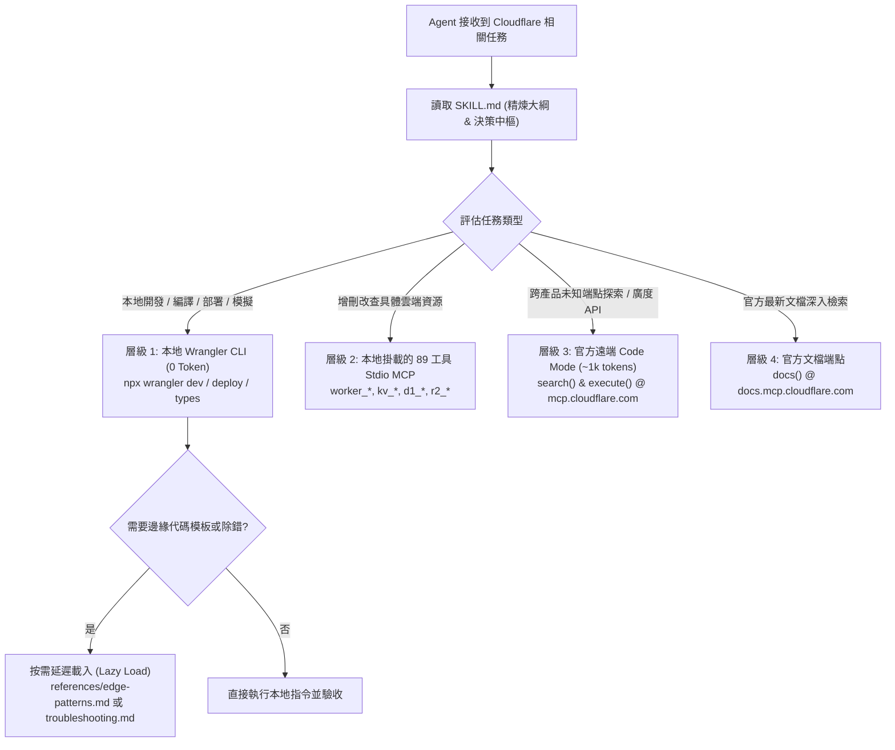

# 📐 Specification: Cloudflare Edge & Wrangler Master 技能大師級重構

> **文件狀態**：🎯 Draft / Awaiting Approval  
> **目標路徑**：`.agents/skills/cloudflare-wrangler/`  
> **關聯技能**：`/Idea to Spec`, `/grill-me`, `/Cloudflare Edge & Wrangler Master`  
> **參考來源**：  
> - 官方 GitHub: [`cloudflare/mcp`](https://github.com/cloudflare/mcp) (Code Mode, `mcp.cloudflare.com`)  
> - 官方 GitHub: [`cloudflare/mcp-server-cloudflare`](https://github.com/cloudflare/mcp-server-cloudflare) (Domain-Specific & Local Stdio)  
> - 本地專案: `cloudflare/search-proxy/` (`worker.js`, `wrangler.jsonc`)

---

## 1. Problem Statement & Core Value (問題陳述與核心價值)

### 1.1 現狀問題
既有的 `cloudflare-wrangler/SKILL.md` 僅有 73 行，存在以下關鍵缺陷：
1. **官方架構分工未清**：未釐清 2026 年 Cloudflare 官方雙倉庫分工（`cloudflare/mcp` Code Mode ~1k tokens vs `cloudflare/mcp-server-cloudflare` 領域特定服務與本機 89 工具 Stdio），容易導致 Agent 誤用高 Token 開銷模式（如 `?codemode=false` 灌入 244k tokens）。
2. **缺乏四級分流決策樹**：未提供 Agent 在面對具體任務時，應優先調用本地命令列（Wrangler CLI）、本機 Stdio MCP、抑或遠端 Code Mode 的確定性決策樹。
3. **邊緣範式缺少具體實作**：除了現役的搜尋代理外，未收錄 Tabidachi 未來所需的 R2 景點圖床 CORS 洗白、KV 邊緣頻率限制、Workers AI 備援等可即用代碼模板。
4. **違背 Token 延遲載入規範**：未建立 `references/` 子目錄，若將所有代碼模板硬塞入單一檔案會引發上下文污染；若過度精簡又失去指南意義。

### 1.2 核心價值
將該技能打造成兼具「極致 Token 效益（延遲載入架構）」與「權威實戰確定性（對齊 Cloudflare 官方 2026 標準與 GitHub 倉庫）」的大師級技能指南，確保任何 AI Agent 調用此技能時能 100% 精準執行邊緣運算與 MCP 調度。

---

## 2. User Journey & Core Flow (Agent 調度流程與決策樹)



---

## 3. Architecture & File Layout (檔案組織架構)

遵循專案憲法與 Token 最佳化規範，採模組化與按需載入（On-Demand References）架構：

```
.agents/skills/cloudflare-wrangler/
├── SKILL.md                          # [調度中樞] YAML 元資料、核心定位、四級決策樹、Wrangler CLI 精速查表
└── references/
    ├── mcp-ecosystem.md              # [深入規格] Code Mode 語法、官方領域特定端點清單、本機 Stdio 參數規格
    ├── edge-patterns.md              # [邊緣實作] 4 套生產級 Edge Worker 代碼模板 (搜尋代理、R2 CORS、KV 防刷、AI 備援)
    └── troubleshooting.md            # [診斷避坑] 10 大實戰踩坑矩陣 (S3 HMAC、Tarpit 超時、Stdio 參數覆寫等)
```

### 3.1 核心模組職責劃分

1. **`SKILL.md` (主手冊，控制在 ~120 行)**：
   - YAML frontmatter（完整觸發詞）。
   - 官方雙軌與本地三態架構定位。
   - **四級調用決策樹**（什麼時候用什麼工具）。
   - **Wrangler v3+ 常用指令速查**（強調 `wrangler.jsonc` 規範、Miniflare 本地模擬、Secret 管理）。
   - 延遲載入索引（明確引導 Agent 在何時讀取 `references/` 下的哪份檔案）。

2. **`references/mcp-ecosystem.md`**：
   - 深入剖析 `https://mcp.cloudflare.com/mcp` (Code Mode)：`docs`, `search`, `execute` 代碼撰寫規範與 GraphQL API 呼叫。
   - 警告條款：嚴禁無理由開啟 `?codemode=false`（避免 244k tokens 灌爆上下文）。
   - 15 個官方領域特定 MCP 端點總表（`docs`, `bindings`, `browser`, `ai-gateway`, `containers` 等）。
   - 本機 Stdio `@cloudflare/mcp-server-cloudflare` 參數不變性（`run <account-id>` 必備防護）。

3. **`references/edge-patterns.md`**：
   - **Pattern 1: 4-Tier 雙通道抗阻斷搜尋代理**（Tabidachi 現役：Promise.all 競速、Wikipedia 全文檢索、DDG Lite 1.5s AbortSignal）。
   - **Pattern 2: R2 景點圖床 CORS 洗白與快取代理**（解決 Safari 7-10MB Opaque 配額與第三方防盜鏈）。
   - **Pattern 3: Workers KV 邊緣滑動窗口頻率限制**（輕量防爬蟲保護 Cloud Run 後端）。
   - **Pattern 4: Workers AI / AI Gateway 邊緣彈性備援**（主模型超額時 0ms 切換邊緣開源模型）。

4. **`references/troubleshooting.md`**：
   - 收錄專案踩坑歷史與官方已知問題（R2 S3 HMAC vs REST Token、Tarpit ReadTimeout、Worker 內部缺 AbortSignal、CI 未 Mock Tier 2、Stdio Account ID 覆寫為 undefined）。

---

## 4. Edge Cases & Boundary Conditions (邊界防線)

1. **Token 爆炸防衛**：
   - 嚴格禁止 Agent 在向 `mcp.cloudflare.com` 發起請求時附加 `?codemode=false`，除非使用者明確要求全量列出 2,594 個工具。
2. **本機 Stdio 參數防護**：
   - 在 `mcp_config.json` 或命令列啟動本機 MCP 時，必須包含 `["-y", "@cloudflare/mcp-server-cloudflare", "run", "<account_id>"]`，防止套件內部覆寫 `accountId: undefined` 引發的 OAuth 報錯。
3. **連線 Tarpit 熔斷**：
   - 所有在 Worker 內部對外部發起的 fetch 請求，必須掛載 `signal: AbortSignal.timeout(N)`，杜絕慢速阻斷掛死連線。
4. **安全金鑰零硬編碼**：
   - 敏感憑證一律使用 `npx wrangler secret put` 或 Cloudflare Dashboard 注入，代碼中僅透過 `env.SECRET_NAME` 存取。

---

## 5. Acceptance Criteria (驗收標準)

- [ ] **AC-1 (官方準確度)**：完全對齊 `cloudflare/mcp` 與 `cloudflare/mcp-server-cloudflare` 最新官方規範，端點 URL、Token 機制與參數格式 100% 正確。
- [ ] **AC-2 (結構模組化)**：`SKILL.md` 保持精煉調度，3 份詳細文檔歸入 `references/`，符合 L0 憲法延遲載入標準。
- [ ] **AC-3 (Wrangler v3+ 規範)**：全面採用 `wrangler.jsonc` 配置標準，收錄完整本機調試與部署命令。
- [ ] **AC-4 (代碼模板健壯性)**：收錄的 4 大邊緣代碼模板語法乾淨、無未定義變數、包含完整錯誤攔截與 CORS/AbortSignal 防護。
- [ ] **AC-5 (全棧驗證通過)**：更新後通過全棧 Quality Gate（`tsc`, `eslint`, `vitest`, `pytest` 保持 0 錯誤）。
