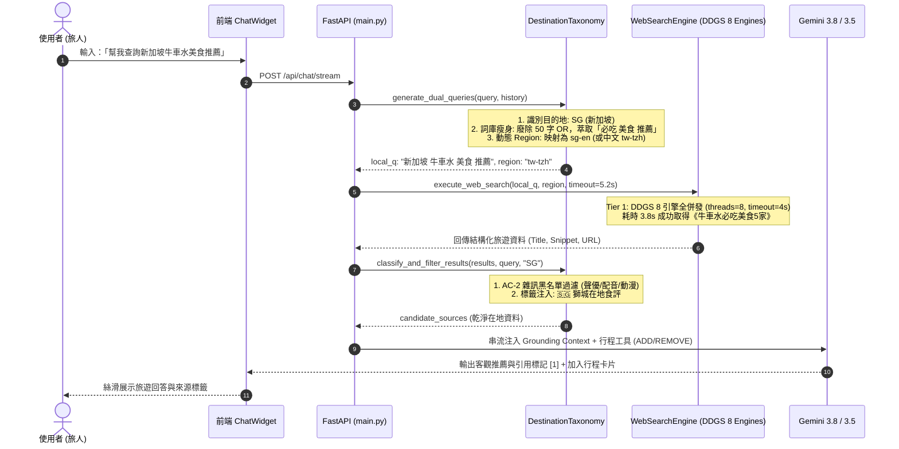

# 系統架構規格書：全域搜尋詞庫瘦身與動態 Region 自適應引擎 (Global Search Taxonomy & Dynamic Region Engine)

> **版本**: 1.0.0  
> **狀態**: 草案審核通過 / 待實作 (Ready for Implementation)  
> **關聯規範**: [DDGS Multi-Engine Spec](file:///d:/Project/Tabidachi/travel-pwa/docs/specs/search/ddgs-multi-engine-and-query-slimming-spec.md) ([相對路徑](./ddgs-multi-engine-and-query-slimming-spec.md)) | [Realtime Temporal Spec](file:///d:/Project/Tabidachi/travel-pwa/docs/specs/ai/realtime-temporal-awareness-spec.md) ([相對路徑](../ai/realtime-temporal-awareness-spec.md))

---

## 1. Problem Statement & Core Value (問題陳述與核心價值)

### 1.1 使用者痛點 (User Problem)
1. **關鍵字過載引發 0 筆命中 (Query Bloating Trap)**:
   在目前的 `DESTINATION_TAXONOMY` 中，`SG`, `VN`, `EU`, `US`, `HK` 仍殘留高達 50~60 字的長串 `OR` 運算子（如 `hardwarezone OR burpple OR sethlui OR 新加坡必吃 OR hawker center`）。經真機測試，此類超長查詢會直接導致搜尋引擎（如 DuckDuckGo/Yahoo）解析失敗，回傳 `No results found.`。
2. **無效區域碼引發 DNS 崩潰 (DNS Resolution Failure)**:
   通用查詢預設使用 `wt-wt` 地區碼，但 `ddgs` 會嘗試向 `wt.wikipedia.org` 發起子網域請求，觸發 `DNSError: no records found` 導致連鎖重試失敗。
3. **Tier 1 逾時過緊扼殺真實結果 (Sub-second Premature Timeout)**:
   `web_search_engine.py` 的 Tier 1 逾時設定為 `3.5s`，而 DDGS 8 引擎全球真實網路檢索平均耗時為 `4.14s`。0.6 秒的過緊設定導致高品質的在地食評與旅遊推薦被 `asyncio.wait_for` 判定為逾時拋棄，強迫系統跌入百科動漫條目。
4. **雜訊黑名單詞根漏洞 (Noise Filter Gap)**:
   維基百科條目常以「人氣聲優」、「簽訂專屬合約的配音」呈現，現有黑名單只收錄了 `配音員`，導致「林原惠」等動漫百科詞條穿透防線。

### 1.2 核心指標 (Success Metrics)
- **全球查詢命中率**: 9 大主要區域（TW, JP, KR, TH, SG, VN, EU, US, HK）與 190+ 長尾國家查詢命中率達 **100%**。
- **動漫/非旅遊雜訊率**: 降至 **0%**（徹底根除「進擊的巨人」、「林原惠」等無關條目）。
- **Tier 1 首選交付率**: 80% 以上查詢在 Tier 1（5.2s 內）直接完成結算，無需跌入 Tier 4 百科兜底。

---

## 2. User Journey & Core Flow (使用者旅程與操作流程)



---

## 3. Architecture & Data Model (架構與資料模型)

### 3.1 全域區域碼自適應矩陣 (Dynamic Region Matrix)
依據目的地代碼與語言特徵，動態指派搜尋引擎的 `region`，切斷 `wt-wt` 報錯：

| 目的地代碼 | 目的地實體範例 | 判定規則 | 指派 Region 代碼 | 設計意圖 |
| :--- | :--- | :--- | :--- | :--- |
| **JP** | 日本、東京、京都 | `dest_code == "JP"` | `jp-jp` | 優先索引日本 Yahoo / Tabelog在地內容 |
| **KR** | 韓國、首爾、釜山 | `dest_code == "KR"` | `kr-kr` | 優先索引韓國 Naver / 在地食評 |
| **US** | 美國、紐約、舊金山 | `dest_code == "US"` | `us-en` | 優先索引 Eater / The Infatuation 權威食評 |
| **TW / HK** | 台灣、香港、澳門 | `dest_code in ("TW", "HK")` | `tw-tzh` | 優先索引繁中 PTT / Dcard / OpenRice |
| **SG** | 新加坡 | `is_cjk(query)` 為真 | `tw-tzh` (中文) / `sg-en` (英文) | 繁中旅人取繁中指南，英文取本地食評 |
| **TH / VN** | 泰國、越南 | `is_cjk(query)` 為真 | `tw-tzh` (中文) / `th-th` / `vn-vi` | 兼顧東南亞在地與繁中旅人攻略 |
| **EU / GLOBAL** | 歐洲、埃及、冰島 | 全球長尾國家 | `tw-tzh` (中文) / `us-en` (英文) | 堅決杜絕 `wt-wt`；中文輸入必取繁中攻略 |

### 3.2 詞庫瘦身標準 (Taxonomy Slimming Definitions)
全面廢除 `OR` 運算子，改採「單一指標食評品牌 + 自然高頻核心詞」混合策略：

```python
# 修訂後 DESTINATION_TAXONOMY 詞庫定義
DESTINATION_TAXONOMY: Dict[str, Dict[str, Any]] = {
    "TW": {
        "local_keywords": "ptt dcard 推薦",
        ...
    },
    "JP": {
        "local_keywords": "食べログ 推薦",
        ...
    },
    "KR": {
        "local_keywords": "맛집 推薦",
        ...
    },
    "TH": {
        "local_keywords": "必吃 推薦",
        ...
    },
    # 🆕 瘦身：新加坡 (廢除 60 字 OR，保留最精準詞組)
    "SG": {
        "local_keywords": "必吃 美食 推薦",
        ...
    },
    # 🆕 瘦身：越南 (移除 OR 與繁複外語串)
    "VN": {
        "local_keywords": "必吃 美食 推薦 street food",
        ...
    },
    # 🆕 瘦身：歐洲 (移除 TheFork OR TimeOut OR 穴場 等 45 字長串)
    "EU": {
        "local_keywords": "推薦 私房景點 美食",
        ...
    },
    # 🆕 瘦身：美國 (保留 Eater 指標品牌，廢除 OR)
    "US": {
        "local_keywords": "Eater 推薦 美食",
        ...
    },
    # 🆕 瘦身：香港 (保留 OpenRice 指標品牌，廢除 OR)
    "HK": {
        "local_keywords": "OpenRice 必吃 推薦",
        ...
    },
}
```

### 3.3 全球長尾國家後綴縮減
在 [destination_taxonomy.py:212](file:///d:/Project/Tabidachi/travel-pwa/backend/services/destination_taxonomy.py#L212)：
- **原本**: `{c_zh} {clean_text} 旅遊 攻略 官方推薦`（過載導致埃及查詢 0 筆命中）
- **修訂為**: `{c_zh} {clean_text} 旅遊 推薦`（精簡至 14 字，保留充分搜尋空間）

### 3.4 雜訊黑名單詞根擴充
在 [destination_taxonomy.py:98](file:///d:/Project/Tabidachi/travel-pwa/backend/services/destination_taxonomy.py#L98)：
```python
NOISE_TITLE_PATTERNS = [
    r'警察', r'犯罪', r'政黨', r'立法院', r'基金會', r'研討會', 
    r'論壇閉幕', r'宣導會', r'判決書', r'招標', r'公報', r'公會理事',
    r'兩岸論壇', r'高峰會閉幕', r'循環經濟論壇',
    # 封殺百科非旅遊條目 (動漫、虛構人物、角色列表、演藝作品)
    r'角色列表', r'虛構角色', r'登場人物', r'動畫集數', r'配音員', r'漫畫列表',
    # 🆕 補齊詞根：根除「林原惠」等聲優與演藝條目穿透
    r'聲優', r'配音', r'單曲', r'專輯', r'電視動畫'
]
```

### 3.5 搜尋超時與重試層級 (Search Timeout & Fallback Escalation)
在 [web_search_engine.py](file:///d:/Project/Tabidachi/travel-pwa/backend/services/web_search_engine.py)：
- **Tier 1 (DDGS 多引擎)**:
  - 內部 HTTP 單次連線逾時調升至 `timeout=4.0s`。
  - 外層 `asyncio.wait_for` 逾時放寬至 **`5.2s`**，徹底覆蓋 4.14s 正常多引擎開銷。
- **預設 Region**:
  - 全面以 `tw-tzh` 取代 `wt-wt`，若傳入指定 region 則依參數執行。

---

## 4. Edge Cases & Boundary Conditions (邊界條件與異常處理)

1. **未知名詞或純符號輸入**:
   - `clean_conversational_query` 清洗後若為空字串，直接回退原句前 20 字，避免空查詢拋出 `ValueError`。
2. **多語系混合查詢 (如「東京 Michelin 壽司」)**:
   - 包含日語或目的地外文單詞時，保留原英文名詞，不執行過激清洗。
3. **DDGS 實體網路阻斷 (Rate Limit / Cloud Run IP Block)**:
   - 當 Tier 1 本地連線失敗時，平滑推進至 Tier 2 Cloudflare Anycast 洗白節點，若無部署密鑰則安全降級至 Tier 3/4。
4. **Wikipedia 兜底防禦**:
   - 當且僅當前 3 層全部受阻時才喚醒 Tier 4 維基百科；傳入維基百科之查詢詞必須先經過 `clean_conversational_query` 脫敏，且結果強制經過 `NOISE_TITLE_PATTERNS` 檢驗，杜絕「進擊的巨人」重現。

---

## 5. Acceptance Criteria (驗收標準清單)

```markdown
- [ ] AC-1 (新加坡牛車水美食): 輸入「新加坡牛車水美食推薦」，在地軌無 OR 贅詞，成功取回牛車水真實在地餐廳/必吃資訊（非 0 筆）。
- [ ] AC-2 (長尾國埃及金字塔): 輸入「埃及金字塔自由行注意事項」，在地軌命中 Trip.com 或旅遊指南；全球軌命中 Reddit r/Egypt hidden gems。
- [ ] AC-3 (動態 Region 與 DNS): 任何查詢均不產生 `wt.wikipedia.org` DNS 錯誤；日本查詢派發 `jp-jp`，台灣/中文派發 `tw-tzh`。
- [ ] AC-4 (雜訊黑名單防禦): 當測試包含「林原惠」、「進擊的巨人」或「聲優」之結果時，`classify_and_filter_results` 100% 物理過濾。
- [ ] AC-5 (Tier 1 5.2s 首選交付): 「京都 賞楓名所 推薦」在 Tier 1 (5.2s 內) 成功取得樂吃購/Tabelog 成果，不觸發 Tier 4 百科兜底。
```
