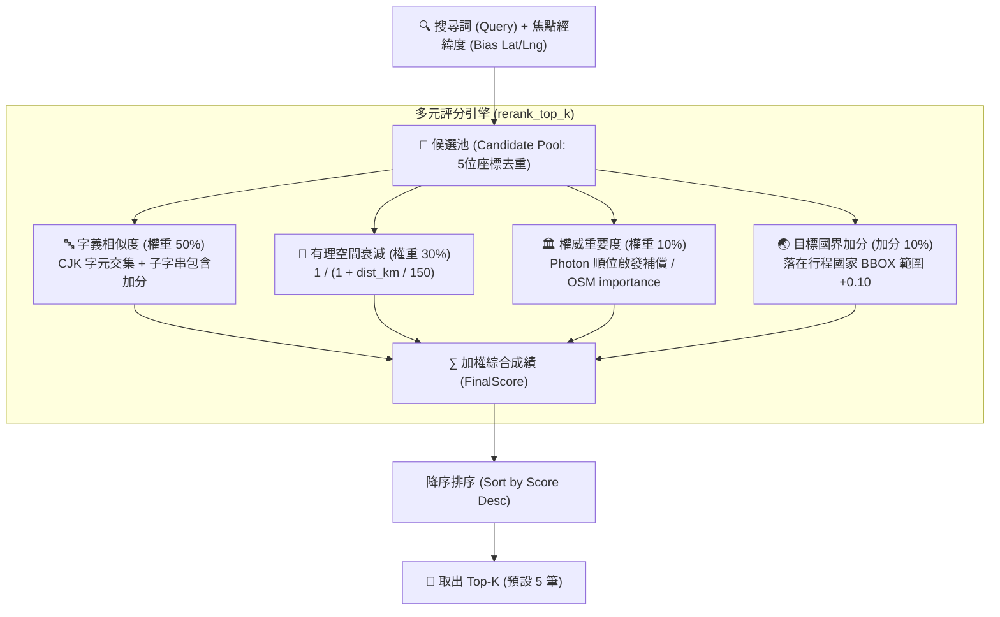

# 地理編碼多元加權 Top-K 智慧重排演算法規格書 (Multi-Factor Top-K Geocode Rerank Spec)

> **規格狀態**: 🟢 Active (生產環境運行中)  
> **關聯程式碼**: [`backend/services/geocode_service.py`](file:///d:/Project/Tabidachi/travel-pwa/backend/services/geocode_service.py) (`rerank_top_k`, `smart_geocode_logic`)  
> **關聯測試**: [`backend/tests/test_geocode_rerank.py`](file:///d:/Project/Tabidachi/travel-pwa/backend/tests/test_geocode_rerank.py) (9/9 通過)  
> **標準規範**: `Idea to Spec` 系統架構規格標準  

---

## 1. Problem Statement & Core Value (問題陳述與核心價值)

### 1.1 開源地理編碼痛點
* **Photon / Nominatim CJK 語意缺陷**：Photon 1.0 (OpenSearch 3.x) 為了輕量化移除了語言專屬索引，對漢字緊密複合詞（如「台中一中」、「清水寺」、「合歡山」）缺乏精準的斷詞能力。
* **同名地名偏航 (Homonym Disambiguation)**：亞洲地區同名地名極多（例如「大安」、「中山」在台北與中國福建皆有大量實體）。若僅依賴文字相似度，極易發生跨國偏航；若僅依賴嚴格距離過濾，又會將跨國出發地（如在日本行程中搜尋「桃園機場」）全數抹殺。
* **高斯衰減斷崖問題 (Gaussian Cliff Trap)**：傳統常態分佈衰減在超過指定半徑（如 50km）後分數瞬間趨近於 0，導致相鄰縣市的著名大景點（如在東京搜尋近郊「箱根溫泉」）被過度懲罰。

### 1.2 核心目標與價值
1. **多元加權統一裁決**：匯流所有候選來源（Photon 投機並行、Nominatim 中文優先、Overpass 備援），透過統一數學模型排序。
2. **有理空間衰減模型**：以 $\frac{1}{1 + \text{dist}/150}$ 取代高斯斷崖，在 150km 內給予平滑寬容度，兼顧同城優先與鄰近大城市召回。
3. **出發地機場與跨國保全**：採用寬容化優雅降級（Graceful Fallback），保障出發地機場在跨國搜尋中不被暴力抹除。

---

## 2. Mathematical Scoring Model (多元加權數學模型)

每個候選景點的最終排序得分 $\text{FinalScore} \in [0.0, 1.0]$ 由四大維度加權合成：

$$\text{FinalScore} = 0.50 \times S_{\text{text}} + 0.30 \times S_{\text{prox}} + 0.10 \times S_{\text{imp}} + S_{\text{country}}$$



### 2.1 維度一：字義相似度 $S_{\text{text}}$ (50%)
* 實作於 `cjk_text_similarity(query, candidate_name)`。
* 完全匹配得 1.0；子字串包含（如「桃園機場」包含於「臺灣桃園國際機場」）給予 $\ge 0.85$ 基礎分；其餘計算 CJK 字符交集比例 (Jaccard-like)。

### 2.2 維度二：有理空間衰減 $S_{\text{prox}}$ (30%)
* 實作於 `proximity_decay(dist_km)`：
  $$S_{\text{prox}} = \frac{1}{1 + \frac{\text{dist\_km}}{150}}$$
* 距離 0km 得分 1.0；距離 150km 得分 0.5；距離 1500km 仍保有約 0.09 分，確保全球極權威景點不被清零。若無傳入參考坐標則預設回傳 0.5 中立分。

### 2.3 維度三：權威重要度 $S_{\text{imp}}$ (10%)
* 若資料源包含 `importance`（如 Nominatim），正規化至 $[0.0, 1.0]$。
* 若缺省（如 Photon），採用順位遞減啟發補償：
  $$S_{\text{imp}} = \max(0.1, 0.7 - \text{idx} \times 0.1)$$

### 2.4 維度四：目標國加分 $S_{\text{country}}$ (加分 10%)
* 若景點座標落在 `COUNTRY_BOUNDS[target_country]` 之邊界盒內（外擴 0.1 度），直接賦予 $+0.10$ 的地緣紅利。

---

## 3. Implementation Details & Integration (實作細節與整合)

* **演算法實作**：[`backend/services/geocode_service.py:L1682-L1748`](file:///d:/Project/Tabidachi/travel-pwa/backend/services/geocode_service.py#L1682-L1748)
* **搜尋管線整合**：[`backend/services/geocode_service.py:L2120-L2137`](file:///d:/Project/Tabidachi/travel-pwa/backend/services/geocode_service.py#L2120-L2137)
  ```python
  # 1. 座標 5 位小數去重 (約 1 公尺精度)
  seen = set()
  unique = []
  for r in all_results:
      key = (round(r["lat"], 5), round(r["lng"], 5))
      if key not in seen:
          seen.add(key)
          unique.append(r)

  # 2. 多元加權智慧重排
  ranked = rerank_top_k(
      unique, 
      query, 
      bias_lat=lat, 
      bias_lng=lng, 
      target_country=country_code, 
      limit=limit
  )
  ```

---

## 4. Edge Cases & Boundary Conditions (邊界防禦)

1. **換日線穿透與畸形 BBOX 防禦 (`sanitize_bbox`)**：
   * 實作於 [L1620-L1650](file:///d:/Project/Tabidachi/travel-pwa/backend/services/geocode_service.py#L1620-L1650)。檢驗 `minLon <= maxLon` 與 `minLat <= maxLat`，若穿越 180° 換日線或格式異常立即回退為 `None`，杜絕 Photon HTTP 400 報錯。
2. **同名地名消歧義 (Homonym Disambiguation)**：
   * 在台北焦點下搜尋「大安」，台北市大安區因空間衰減分高排在第 1 名，其餘遠距大安排於後方；反之在台中焦點下，台中市大安區自動置頂。
3. **跨國出發地機場保全**：
   * 在東京行程搜尋「桃園國際機場」，雖然空間衰減分較低，但字義相似度極高（1.0），綜合分數依然高於東京本地低相關小店，成功保留出發地機場。

---

## 5. Acceptance Criteria (驗收標準)

- [x] **AC-1 (數學權重單調性)**：同等字義匹配下，距離中心點越近之候選項目，得分必須嚴格單調遞增。
- [x] **AC-2 (換日線拓撲防禦)**：傳入 `179.0,-20.0,-179.0,-15.0` 等穿越換日線之 BBOX，`sanitize_bbox` 必須安全回傳 `None`。
- [x] **AC-3 (單元測試覆蓋)**：[`backend/tests/test_geocode_rerank.py`](file:///d:/Project/Tabidachi/travel-pwa/backend/tests/test_geocode_rerank.py) 9 項測試全數綠燈通過。
