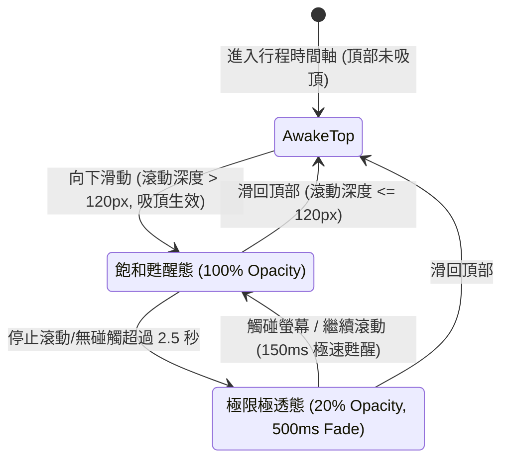

# 🌬️ 規格設計書：全域懸浮與智慧吸頂之極致呼吸降敏 (Idle Dimming & Breathing Spec)

> **版本**: 1.0.0  
> **建立日期**: 2026-10-07  
> **狀態**: 已完成決策對齊 (Grill-Me Aligned)  

---

## 1. Problem Statement & Core Value (問題陳述與核心價值)

### 1.1 使用者痛點
- **視野壓迫**：固定或浮動於畫面中的導航控制項（右下角浮動地圖膠囊、頂部吸頂天數列）在靜止閱讀行程時會持續佔據寶貴的螢幕面積，視覺干擾底層的景點名稱、預約備忘或街景縮圖。
- **操作即時性要求**：使用者一旦欲切換天數或跳轉地圖，必須零延遲獲得清晰明瞭的操作反饋。

### 1.2 成功衡量指標 (Success Metrics)
- **視覺降噪率**：閒置 2.5 秒後，控制項進入 20% 極透狀態，底層時間軸內容穿透度達 80%。
- **喚醒響應度**：滾動或點擊瞬間 150ms 內甦醒至 100% 不透明度，0 操作延遲。

---

## 2. User Journey & Core Flow (使用者旅程與操作流程)



---

## 3. Architecture & Interaction Model (架構與互動模型)

### 3.1 核心 Hook: `useIdleBreathing`
抽取統一的呼吸降敏狀態機，避免組件重複撰寫計時器邏輯：
```typescript
interface UseIdleBreathingOptions {
    idleTimeoutMs?: number // 預設 2500ms
    enabled?: boolean      // 控制是否啟用降敏 (例如未吸頂時關閉)
}

export function useIdleBreathing(scrollerEl: HTMLElement | null, options?: UseIdleBreathingOptions) {
    const [isIdle, setIsIdle] = useState(false)
    const [isInteracting, setIsInteracting] = useState(false)
    // 監聽滾動中、pointerDown、hover 喚醒
    // 輸出 isDimmed: isIdle && !isInteracting && enabled
}
```

### 3.2 目標 1：浮動式地圖膠囊 (`FloatingMapCapsule.tsx`)
- **樣式過渡**：
  ```css
  transition-all duration-500 ease-in-out
  /* 甦醒態 */
  opacity-100 scale-100 backdrop-blur-md
  /* 降敏極透態 */
  opacity-20 scale-95 backdrop-blur-xs
  ```
- **喚醒回饋**：滑鼠 Hover 或手指 TouchStart 立即喚醒至 100%。

### 3.3 目標 2：智慧吸頂天數列 (`ItineraryHeader.tsx`)
- **條件式啟用**：僅當滾動深度超過 120px（即頂部 Hero 區已滾出，天數列處於 `Sticky` 吸附狀態）時，才啟動 2.5 秒無操作閒置計時器。
- **樣式過渡**：
  - 吸頂容器本體：`transition-opacity duration-500`。
  - 降敏態：`opacity-20 hover:opacity-100`，手指碰觸吸頂列或滾動立即極速甦醒。

---

## 4. Edge Cases & Boundary Conditions (邊界條件與異常處理)

| 情境 | 潛在問題 | 防禦機制 |
| :--- | :--- | :--- |
| **頂部常態檢視** | 剛進頁面未滾動時天數列變淡造成困擾 | 鎖定 `isSticky` 判定：只有吸頂時才允許降敏，頂部常態保持 100% 飽和 |
| **手勢點擊穿透** | 降敏為 20% 時點擊是否會失效？ | 維持 `pointer-events-auto`，點擊即觸發動作並自動喚醒 |
| **快速連續滾動** | 頻繁觸發計時器銷毀與重建模擬崩潰 | 滾動事件掛載 `{ passive: true }`，內部計時器以 `clearTimeout` 單一引用調度 |
| **React Compiler** | 在 effect 內同步調用 setState 報錯 | 使用 `requestAnimationFrame` 或非同步微任務排程狀態更新 |

---

## 5. Acceptance Criteria (驗收標準清單)

- [ ] **AC-1 (Sticky Dimming)**: 在時間軸向下滾動使天數列吸頂後，停止操作 2.5 秒，天數吸頂列平滑淡化至 20% 透明度。
- [ ] **AC-2 (Floating Capsule Dimming)**: 右下角浮動地圖膠囊浮現後，停止操作 2.5 秒，膠囊平滑淡化至 20% 透明度。
- [ ] **AC-3 (Instant Wake)**: 手指觸控螢幕、滾動頁面或滑鼠懸浮時，吸頂列與膠囊於 150ms 內極速恢復 100% 飽和高亮。
- [ ] **AC-4 (Top Parity)**: 當滾動位置回歸頁面頂部時，天數列始終維持 100% 飽和，不發生誤淡化。
- [ ] **AC-5 (Quality Gate)**: `npx tsc --noEmit` 0 錯誤、`npm run lint` 0 警告、Vitest 單元測試 100% 通過。
