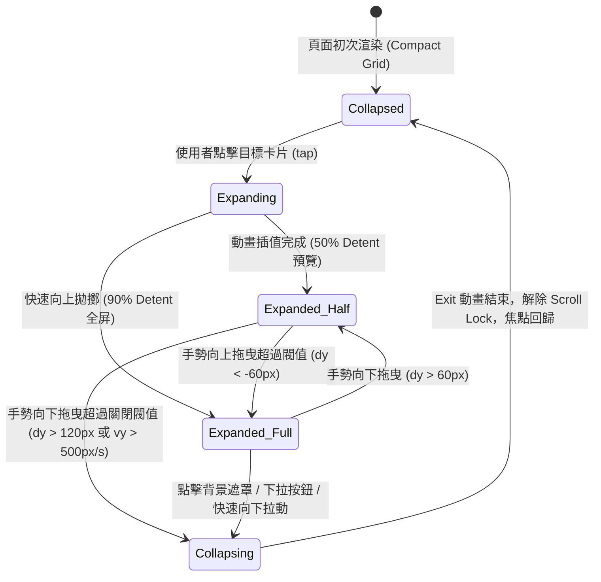

# 📱 iOS Expandable Card & Bottom Sheet Architecture 2026 深度技術研究報告

> **報告屬性**: NotebookLM 獨立研究素材包 / 系統架構決策專用  
> **關聯專案**: Tabidachi PWA (`frontend/components/views/itinerary-view.tsx`)  
> **研究目標**: 行程介面 5 大區塊（AI 深度審核報告、每日重點提醒、預估花費、交通票券、行前清單）之 iOS 級空間壓縮、微型摘要卡片（Glanceable Metrics Capsule）與手勢下拉收起（Swipe-to-Dismiss Bottom Sheet）架構全鏈路考證。

---

## 1. 核心技術流程 (Core Execution Flow)

### 1.1 狀態機與生命週期模型 (Finite State Machine)



### 1.2 核心組件拓撲架構 (Component Topology)

1. **`ItinerarySummaryHub` (壓縮態入口網格)**:
   - 採用 **Apple Health / iOS 18 摘要式 Bento Grid** 佈局，將原先佔用大量垂直捲動空間的 5 大區塊抽象為微型摘要膠囊：
     - `AI Review Metric`: 環形評分進度（如 `94` 分）+ 關鍵警訊 Tag。
     - `Daily Tips Metric`: 當日核心備忘（如「晴時多雲，溫差大」）單行截斷。
     - `Estimated Cost Metric`: 當日預估總額與幣別（如 `¥18,400`）。
     - `Transit Pass Metric`: 交通票券持有與推薦（如「JR Pass 涵蓋」）。
     - `Checklist Metric`: 待辦進度指示（如「5/7 完成」環形微指標）。
   - 點擊任一膠囊時，將全域狀態 `activeSectionSheet: 'ai_review' | 'tips' | 'costs' | 'tickets' | 'checklist' | null` 激活。

2. **`IOSBottomSheet` (手勢底抽容器)**:
   - **底層驅動**: 基於 `framer-motion` 12 (`motion/react`) 物理彈簧與手勢系統。
   - **層級隔離**: 使用 React 19 `createPortal` 掛載至獨立的 `#sheet-portal` 節點，防止對 MapLibre WebGL Canvas 造成重排 (Reflow)。
   - **手勢把手 (Drag Pill)**: 頂部居中 `w-10 h-1 rounded-full bg-muted-foreground/30` 觸控區域，支援 `drag="y"` 與 `dragConstraints={{ top: 0 }}`。

---

## 2. 網路大神爭議點與避坑指南 (Technical Controversies & Pitfalls)

### 2.1 爭議一：Vaul vs 自研 Framer Motion Drag Sheet（React 19 致命陷阱）

- **官方宣稱 (Vaul & Shadcn Drawer)**:
  - Vaul 宣稱支援無障礙、iOS 原生慣性阻尼、多檔位 Detents，為 Shadcn/ui 官方推薦之 Drawer 底層。
- **GitHub 原始碼層級爆雷 (Issue #656, #653, #525)**:
  - **Issue #656 (`Body scroll lock is never released when a drawer closes`)**:
    - 在 React 19.x 環境下，Vaul 依賴的 `@radix-ui/react-dialog` 與 `react-remove-scroll` 在 Drawer 退出動畫結束後，`useLockAttribute` 的清理函式不會被正常觸發。
    - **後果**: 關閉 Drawer 後，`document.body` 上的 `data-scroll-locked="1"` 永久殘留，`body { overflow: hidden }` 無法移除，整個網頁徹底凍結無法滑動，必須強制重新整理！
  - **Issue #653**: `Overlay` 元件在 React 19 下若切換 `modal` 屬性會拋出 `Rendered fewer hooks than expected` 致命崩潰。
- **工程避坑指南 (Tabidachi 決策)**:
  - **嚴禁在 Next.js 16 + React 19 專案中盲目引入未修復的 Vaul 1.1.2**。
  - **採用 Tabidachi 專屬 iOS 物理手勢底抽 (Framer Motion 12 原生實作)**：
    - 直接透過 `framer-motion` 的 `AnimatePresence` 控制生命週期。
    - 使用標準自定義 Hook `useBodyScrollLock`，在 Sheet 卸載時於 `useEffect` cleanup 嚴格重置 `document.body.style.overflow = ''`，達到 100% 確定性的滾動釋放。

### 2.2 爭議二：子容器內部滾動 (Nested Scroll) 與手勢下拉關閉的事件競爭

- **問題核心**:
  - 當行前清單或審核報告內容很長時，Drawer 內部存在自己的 `overflow-y-auto` 滾動容器。
  - 使用者在滾動清單時，向下滾動手指會同時被外層 `drag="y"` 攔截，造成使用者想看清單頂部時，整個 Drawer 突然被意外關閉。
- **大神實戰解決方案**:
  - **方案 A (Touch Delegation 頂部把手隔離)**: 僅在頂部 Header 與 Drag Handle 區域綁定 `framer-motion` 的 drag 屬性；內容區域為純粹原生滾動，徹底杜絕手勢衝突。
  - **方案 B (Scroll Boundary Detection)**: 監聽子容器的 `onScroll` 事件，僅當 `contentElement.scrollTop === 0` 且手勢向下位移超過一定閥值時才允許啟用 Sheet 的下壓手勢；若正在向上滾動或 `scrollTop > 0` 則將 drag 暫停。
  - **推薦實踐**: 採用方案 A + 方案 B 雙重防護。頂部 Header（標題 + 把手）始終具備高靈敏度向下關閉能力；內部可滾動區域在 `scrollTop <= 0` 時支援自然彈性阻尼。

### 2.3 爭議三：iOS PWA Standalone 模式下的 Touch Target Offset (Issue #435, #344)

- **現象**:
  - iOS 18 Safari 在加入主畫面 (PWA Standalone) 模式下，若使用非標準的 fixed 定位，開啟 drawer 會導致背景頁面滾動位置重置為 0，且觸摸目標位置發生垂直偏移 (Touch Targets Offset)。
- **防禦手段**:
  - 避免在開啟 Sheet 時對背景頁面套用 `position: fixed`。
  - 使用 `overflow: hidden; touch-action: none;` 鎖定背景，並在開啟前記錄 `window.scrollY`，關閉後精準校正。

### 2.4 爭議四：MapLibre WebGL Canvas 重繪與 GPU 掉幀

- **效能瓶頸**:
  - Tabidachi 行程頁面底層具備 MapLibre 3D 地圖與航線渲染。若底抽展開/收起時引起 DOM Layout Reflow（例如動態計算父容器高度或改變 Flex 結構），WebGL 畫布將觸發昂貴的重新合成。
- **最佳實踐 (Zero-Reflow Pipeline)**:
  - 底抽所有過渡位移一律使用 `transform: translate3d(0, y, 0)`。
  - 嚴格標記 CSS `will-change: transform` 與 `transform-gpu`。
  - 背景遮罩使用純 CSS `backdrop-filter: blur(16px)` 與純色透明度漸變，不改變 DOM 樹佈局尺寸。

---

## 3. GitHub 原始碼層級驗證 (Source-Level Verification)

### 3.1 手勢物理參數推導 (Framer Motion 12)

```typescript
// 符應 Apple iOS 物理彈簧曲線與手勢阻尼規格
export const IOS_SHEET_SPRING = {
  type: "spring",
  damping: 32,      // 防止劇烈回彈震盪
  stiffness: 380,   // 保證快速跟手響應
  mass: 0.8,        // 輕量慣性反饋
} as const;

export const SHEET_DRAG_CONSTRAINTS = {
  top: 0,
  bottom: 0,
};

// 判定關閉的物理閥值 (距離閥值 + 速度閥值)
export const shouldDismissSheet = (offsetY: number, velocityY: number): boolean => {
  return offsetY > 150 || velocityY > 600;
};
```

### 3.2 摘要微卡片 (Glanceable Summary Card) 架構

5 個區塊的壓縮佈局由原本的直列長瀑布流，重構為現代 iOS 模組化佈局：
1. **AI 深度審核 (`EditableDailyAIReview`)**:
   - 壓縮態：呈現雷達式或圓環評分標籤（例如「92 優秀」），顯示 1 條最關鍵警示摘要。
   - 展開態：完整 5 大審核維度（時間、預算、路線、體力、文化）檢視與重新審核操作。
2. **每日重點提醒 (`EditableDailyTips` - Notes)**:
   - 壓縮態：氣溫/雨具/必備物單行快覽。
   - 展開態：富文本編輯器與多條注意事項清單。
3. **預估花費 (`EditableDailyTips` - Costs)**:
   - 壓縮態：當日累積金額膠囊，例如 `¥12,800`，伴隨微型進度條。
   - 展開態：各項目細項拆解（食/住/行/門票）與貨幣轉換。
4. **交通票券 (`EditableDailyTips` - Tickets)**:
   - 壓縮態：票券圖標 + 推薦券種數量。
   - 展開態：票券有效區間、購買連結與路線適用性分析。
5. **行前清單 (`EditableDailyChecklist`)**:
   - 壓縮態：完成進度膠囊（如 `3/5`），微型圓環進度。
   - 展開態：可勾選、新增、刪除的完整清單面板。

---

## 4. 結論與實施架構建議

1. **架構模式**: 採用 **獨立 Portal 式 iOS Detented Bottom Sheet + 緊湊型 Bento 摘要模組**。
2. **技術選型**: 放棄有 React 19 相容性 Bug 的 Vaul，採用專案既有經充分考驗之 **`framer-motion` 12 + Radix Dialog 語意無障礙**。
3. **無障礙與鍵盤導航**: 完整支援 ESC 鍵關閉、觸控向下猛拉（Fling）關閉、ARIA 屬性標記（`role="dialog"` 與 `aria-modal="true"`）。
