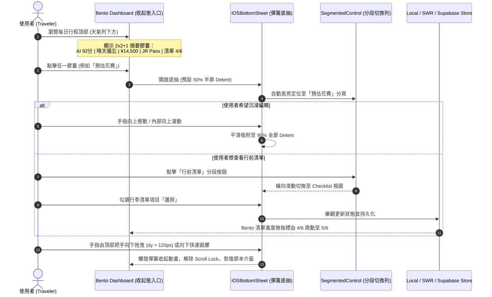

# 📱 iOS 級行程五大區塊空間壓縮與彈簧底抽 (Expandable Itinerary Dashboard) 規格規範書

> **文件狀態**: Complete & Ready for Implementation Plan  
> **關聯專案**: Tabidachi PWA (`frontend/components/views/itinerary-view.tsx`)  
> **關聯研究**: [ios-expandable-itinerary-sections-research.md](file:///d:/Project/Tabidachi/travel-pwa/docs/specs/ui-motion/ios-expandable-itinerary-sections-research.md)  
> **設計決策來源**: `/Idea to Spec` + `/grill-me` 互動決策樹對齊

---

## 1. 問題陳述與設計目標 (Problem Statement & Goals)

### 1.1 現狀痛點剖析 (Current UX Friction)
1. **直列瀑布流嚴重擠佔螢幕空間 (Screen Real-Estate Congestion)**:
   - 現有行程介面依序垂直排列：`EditableDailyAIReview` ➔ `EditableDailyTips` (含提醒、花費、票券) ➔ `EditableDailyChecklist`。
   - 在行動端（Mobile PWA）上，這 5 個板塊佔據超過 1.5 ~ 2 個完整螢幕高度，使用者每次進入當天行程都必須長時間向下滑動才能看到核心的「景點時間軸清單 (Timeline POIs)」。
2. **缺乏即時概覽價值 (Lack of Glanceability)**:
   - 使用者無法一眼獲知當天關鍵指標（如：AI 審核健康度幾分？當日預估總額多少？待辦清單還有幾項未完成？），必須逐項瀏覽。
3. **欠缺 iOS 原生層次與流體手勢美感 (Missing iOS Polish & Gestures)**:
   - 缺乏 Apple Health / Apple Maps 現代 iOS 級卡片層次、毛玻璃物理材質（Liquid Glass）與流暢的下拉收起手勢。

### 1.2 設計目標 (Design Objectives)
- **空間極致壓縮 (Space Efficiency)**: 將原本直列佔用超過 800px 高度的 5 大區塊，精煉重塑為高度僅約 160px 的 **Apple Health 風格 2x2 + 1 滿版 Bento 摘要膠囊看板**。
- **iOS 級彈簧底抽 (Detented Spring Bottom Sheet)**:
  - 支援 **50% 半屏快覽 (Half Detent)** 與 **90% 全屏沉浸 (Full Detent)** 雙檔位吸附。
  - 支援符合直覺的「向下滑動收起 (Swipe-to-Dismiss)」，手勢跟手阻尼與快速拋擲（Fling）關閉。
- **底抽內建分段控制列 (In-Sheet Segmented Control)**:
  - 展開底抽頂部提供 iOS 液態玻璃風格分段選擇列，可一鍵無縫橫向切換 5 大模組，無需反覆開關抽屜。
- **雙向樂觀響應 (Optimistic UI & Dynamic Pulse)**:
  - 底抽內部任何勾選、修改即時持久化，外層 Bento 膠囊上的微指標數值即時平滑跳動。
- **極致工程穩定性 (Zero-Regression & React 19 Immune)**:
  - 徹底避開 Vaul 1.1.2 在 React 19 下的 Body Scroll Lock 永久殘留 Bug (GitHub Issue #656)。
  - 採用專案既有經考驗之 `framer-motion` 12 + 獨立 Portal 渲染，隔離 MapLibre WebGL 畫布重排。

---

## 2. 使用者旅程與狀態機 (User Journey & State Machine)



---

## 3. 模組視覺佈局與架構規格 (Component Architecture)

### 3.1 佈局拓撲：收起態 Bento Dashboard (`ItineraryDashboardHub`)

位置：`itinerary-view.tsx` 中置於即時天氣預報列正下方、行程時間軸列表正上方。

```
+-----------------------------------------------------------------------+
|  [即時天氣列：晴天 22°C / 降雨率 10%]                                  |
+-----------------------------------------------------------------------+
|  DAILY DASHBOARD (Bento Grid 2x2 + 1 滿版)                            |
|  +---------------------------------+  +----------------------------+  |
|  | [🤖 AI 深度審核]                 |  | [💰 預估花費]              |  |
|  |  評分環: 92/100 (極佳)          |  |  當日總額: ¥14,500         |  |
|  |  警訊: 傍晚景點可能人潮擁擠     |  |  微型佔比進度條            |  |
|  +---------------------------------+  +----------------------------+  |
|  | [🎫 交通票券]                   |  | [✅ 行前清單]              |  |
|  |  票券狀態: JR Pass 涵蓋         |  |  進度指示: 4/6 完成        |  |
|  |  持有 2 張電子憑證              |  |  微型進度環                |  |
|  +---------------------------------+  +----------------------------+  |
|  | [💡 每日重點提醒 (滿版橫條)]                                      |  |
|  |  注意事項: 穿著好走的鞋子、攜帶雨具備用、日落前抵達觀景台         |  |
|  +-----------------------------------------------------------------+  |
+-----------------------------------------------------------------------+
|  [行程景點時間軸清單 (DayTimeline POIs)]                              |
```

- **卡片視覺材質 (Liquid Glass)**:
  - 深色/淺色模式自適應：`bg-white/80 dark:bg-card/70 backdrop-blur-xl border border-white/20 dark:border-white/10 shadow-sm hover:shadow-md transition-all active:scale-[0.98]`。
  - 點擊反饋：iOS 級物理壓感縮放微動效。

### 3.2 展開態架構：`IOSBottomSheet`

1. **容器特性**:
   - 掛載節點：`#sheet-portal`（獨立於主畫面 DOM 樹，杜絕 MapLibre WebGL 畫布重繪）。
   - 遮罩層：`fixed inset-0 bg-black/40 backdrop-blur-md z-90`。
   - 內容面板：`fixed inset-x-0 bottom-0 z-100 rounded-t-[28px] bg-background/95 backdrop-blur-2xl border-t border-white/20 dark:border-white/10 shadow-2xl`。
2. **頂部結構**:
   - **iOS Drag Pill**: `w-10 h-1.5 rounded-full bg-muted-foreground/30 mx-auto my-2.5`。
   - **Segmented Control (分段控制列)**:
     - 包含 5 個 Tab：`AI 審核` | `重點提醒` | `預估花費` | `交通票券` | `行前清單`。
     - 具備液態毛玻璃背景與 active tab 滑動指示器（`framer-motion layoutId="activeTabPill"`）。
   - **關閉按鈕**: 右上角微型圓形關閉按鈕（`w-7 h-7 rounded-full bg-muted/60`），兼顧無障礙與鍵盤 ESC 退出。
3. **內部可滾動區域**:
   - `overflow-y-auto max-h-[calc(90vh-110px)] px-4 py-2 overscroll-contain`。
   - 完整載入原本的 5 大組件：
     - `EditableDailyAIReview`
     - `EditableDailyTips` (Notes 區塊)
     - `EditableDailyTips` (Costs 區塊)
     - `EditableDailyTips` (Tickets 區塊)
     - `EditableDailyChecklist`

---

## 4. 手勢物理與極限防禦機制 (Gestures & Edge Case Defenses)

### 4.1 手勢物理參數 (Spring Physics)
```typescript
export const SHEET_SPRING_CONFIG = {
  type: "spring",
  stiffness: 380,   // 保證快速跟手響應
  damping: 32,      // 防止劇烈回彈震盪
  mass: 0.8,        // 輕盈慣性體感
};

export const DISMISS_THRESHOLDS = {
  offsetY: 120,     // 向下拉動超過 120px 觸發關閉
  velocityY: 500,    // 向下快速甩動超過 500px/s 觸發關閉
};
```

### 4.2 巢狀滾動手勢衝突防護 (Nested Scroll Competition Defense)
- **把手隔離 (Touch Delegation)**:
  - 頂部把手與 Header 區域始終綁定 `drag="y"` 與 `dragConstraints={{ top: 0 }}`，提供 100% 靈敏度的向下拖曳收起。
- **內容邊界檢測 (Scroll Boundary)**:
  - 內部滾動容器設定 `overscroll-behavior-y: contain`。
  - 當內部容器 `scrollTop > 0` 時，阻止外層拖曳手勢觸發；僅當 `scrollTop <= 0` 且手勢向下時才允許連動底抽下壓。

### 4.3 React 19 滾動鎖定防禦 (Zero-Leak Body Scroll Lock)
- 棄用有已知 Bug 的第三方套件，撰寫確定性釋放 Hook：
```typescript
export function useBodyScrollLock(isLocked: boolean) {
  useEffect(() => {
    if (!isLocked) return;
    const originalOverflow = document.body.style.overflow;
    document.body.style.overflow = "hidden";
    return () => {
      document.body.style.overflow = originalOverflow;
    };
  }, [isLocked]);
}
```

---

## 5. 驗收標準與測試用例 (Acceptance Criteria & Test Matrix)

| 編號 | 驗收維度 | 測試用例與預期結果 |
|---|---|---|
| **AC-1** | 空間壓縮 | 進入當日行程，Bento 摘要網格高度 $\le 180\text{px}$，時間軸景點於首屏即可見，無需大量垂直滑動。 |
| **AC-2** | 點擊展開 | 點擊「預估花費」卡片，底抽以 60fps 彈簧平滑滑出至 50% 半屏高度，頂部 Segmented Control 自動定焦在「預估花費」。 |
| **AC-3** | 內部切換 | 在展開底抽中點擊「行前清單」Tab，視圖平滑滑動切換至清單內容，抽屜不關閉。 |
| **AC-4** | 手勢收起 | 手指拉動頂部把手向下滑動 $>120\text{px}$ 或向下快速甩動，底抽平滑收起回原本 Bento 介面。 |
| **AC-5** | 樂觀同步 | 在底抽勾選清單項目後向下滑動關閉，外層 Bento 膠囊上的進度指標（如「4/6」變為「5/6」）即時跳動同步。 |
| **AC-6** | 滾動釋放 | 關閉底抽後，主行程頁面與時間軸可正常自由上下滑動，`document.body.style.overflow` 乾淨釋放，無殘留鎖死。 |
| **AC-7** | WebGL 隔離 | 底抽展開與拖曳收起過程中，背景 MapLibre 3D 地圖畫布維持 60fps，無重排或卡頓。 |
