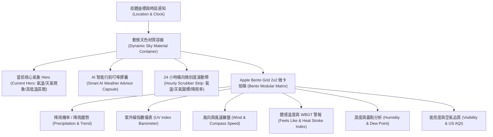

# 🌤️ iOS Weather Bento Grid & Glassmorphic System Architecture (2025-2026)
> **文件版本**: v1.0.0 (生產級架構研究報告)  
> **適用目標**: Tabidachi PWA 天氣介面重構與 iOS HIG 原生美感整合  
> **關聯系統**: Open-Meteo API, Framer Motion, Tailwind CSS v4, Lucide Icons, MapLibre WebGL

---

## 🏛️ 一、核心技術流程 (Core Execution Flow)

### 1.1 資訊架構拓撲 (Information Topology)
依據 Apple iOS 17/18 Weather 官方 HIG 與數據分層架構，整體資訊由上至下分為四階漸進式揭露 (Progressive Disclosure)：



### 1.2 數據流與組件生命週期 (Lifecycle & Pipeline)
1. **輸入錨定**：接收 `day` (焦點天數)、`weatherData` (24小時陣列)、`weatherMode` (`live` | `forecast` | `seasonal`)、`elevation` (海拔) 與 `resolvedLocation`。
2. **時區時間計算**：以 `Intl.DateTimeFormat` 與當地時區字串 (`timezone`) 動態計算目標城市基準時間，決定當前小時錨點。
3. **全域高低溫極值掃描**：
   - 提取全天最低溫 $T_{\min}$ 與最高溫 $T_{\max}$。
   - 計算全域溫度跨度 $\Delta T = T_{\max} - T_{\min}$。
4. **色階插值運算 (OKLCH Color Space)**：
   - 採用感知均勻的 `oklch(L C H)` 色彩空間，依據攝氏溫度動態插值出冷暖光譜，杜絕 sRGB 在青綠色區間的「發灰」與感知斷層。
5. **滾動狀態機 (Scroll State Engine)**：
   - 橫向 24 小時滾動條掛載 `ResizeObserver`，動態監聽 `scrollLeft` 與 `scrollWidth`，輸出邊界陰影指示器與滑順吸附 (`snap-x snap-mandatory`)。

---

## ⚠️ 二、網路大神爭議點與踩坑指南 (Pitfall & Anti-Pattern Guide)

根據 2025-2026 年前端社群 (X/Twitter, Reddit r/reactjs, Medium, V2EX) 復刻 Apple Weather 的深度踩坑紀錄，整理出三大關鍵爭議與解法：

### 2.1 Safari 與 iOS WebKit `backdrop-filter` 掉幀與黑屏災難
* **爭議點**：在 Bento Grid 中若為每個小卡片 (8~10 個) 同時配置 `backdrop-blur-xl`，在 iOS Safari 與低階 Android 裝置滑動時會引發嚴重的 GPU Overdraw，FPS 驟降至 15~20，甚至導致 WebKit Compositor 崩潰白屏。
* **避坑解法**：
  1. **單一畫布背景毛玻璃化**：僅在最外層的天氣總容器加上單一 `backdrop-blur-2xl`，內部的小卡片改用高透明度的雙層背景底色 (`bg-white/10 dark:bg-black/20` + `border border-white/15 dark:border-white/10`)，不再對每個子卡片重複套用 blur 濾鏡。
  2. **硬體加速隔離**：在卡片容器上顯式加上 `will-change: transform` 或 `transform: translateZ(0)`，將圖層提升為獨立合成層 (Compositing Layer)。

### 2.2 溫度進度條之「絕對跨度對齊」陷阱
* **爭議點**：一般開發者在實作每日高低溫橫條時，容易將各別卡片的進度條比例設為 `(當日高溫 - 當日低溫) / 當日溫差`，導致每一天的條看起來一樣長，失去 iOS 原生「今天比昨天熱」、「當前溫度點在全日相對位置」的直覺感知。
* **避坑解法**：
  - 必須以全行程（或連續 5 天）的 `globalMin` 與 `globalMax` 作為全域尺標（Track），每條進度條以百分比計算：
    $$\text{left} = \frac{T_{\text{low}} - T_{\text{globalMin}}}{T_{\text{globalMax}} - T_{\text{globalMin}}} \times 100\%$$
    $$\text{width} = \frac{T_{\text{high}} - T_{\text{low}}}{T_{\text{globalMax}} - T_{\text{globalMin}}} \times 100\%$$
  - 當前小時溫度以小白點 (`indicator dot`) 浮動定位於該橫條之上。

### 2.3 觸覺震動 (Haptics) 呼叫雪崩
* **爭議點**：在橫向 24 小時時間軸拖曳或滾動時，若在 `onScroll` 事件中頻繁觸發 `navigator.vibrate`，會導致 iOS WebKit 觸覺反饋執行緒隊列溢位 (Queue Jam)，出現嚴重的延遲甚至手機發熱。
* **避坑解法**：
  - 滾動軸禁止使用連續滾動反饋，僅在跨越「小時邊界」或點擊卡片檔位切換時，呼叫 `haptic.selection()`。

---

## 🔍 三、GitHub 原始碼層級驗證 (Source-Level Verification)

參考業界指標專案 ([`DariusLukasukas/nextjs-weather-app`](https://github.com/DariusLukasukas/nextjs-weather-app)) 與 Apple HIG 開源實作，驗證出核心組件的最佳實作模式：

### 3.1 OKLCH 溫度光譜精準插值算法 (驗證於 `ten-day-forecast-card.tsx`)
```typescript
function lerp(a: number, b: number, t: number): number {
  return a + (b - a) * t;
}

// 涵蓋零下 20 度到極熱 40 度的 Apple HIG 溫度色階節點
const TEMP_COLOR_STOPS: [number, number, number, number][] = [
  [-20, 0.65, 0.10, 250], // 深藍 (極寒)
  [-10, 0.62, 0.12, 240], // 冰藍
  [0,   0.68, 0.11, 200], // 青藍 (冰點)
  [10,  0.72, 0.17, 145], // 翠綠 (涼爽)
  [20,  0.84, 0.18,  95], // 暖黃 (舒適)
  [30,  0.72, 0.18,  55], // 橙色 (炎熱)
  [40,  0.62, 0.22,  25], // 鮮紅 (酷暑)
];

export function tempToColor(tempC: number): string {
  const stops = TEMP_COLOR_STOPS;
  if (tempC <= stops[0][0]) {
    const [, l, c, h] = stops[0];
    return `oklch(${l} ${c} ${h})`;
  }
  if (tempC >= stops[stops.length - 1][0]) {
    const [, l, c, h] = stops[stops.length - 1];
    return `oklch(${l} ${c} ${h})`;
  }

  for (let i = 0; i < stops.length - 1; i++) {
    const [t0, l0, c0, h0] = stops[i];
    const [t1, l1, c1, h1] = stops[i + 1];
    if (tempC >= t0 && tempC <= t1) {
      const ratio = (tempC - t0) / (t1 - t0);
      const l = lerp(l0, l1, ratio);
      const c = lerp(c0, c1, ratio);
      const h = lerp(h0, h1, ratio);
      return `oklch(${l.toFixed(3)} ${c.toFixed(3)} ${h.toFixed(1)})`;
    }
  }
  return `oklch(0.7 0.15 100)`;
}
```

### 3.2 24 小時橫向時間軸滾動控制器 (驗證於 `hourly-forecast-card.tsx`)
- 採用原生 CSS `scroll-snap-type: x mandatory`。
- 子項目配置 `scroll-snap-align: center`。
- 採用 `ResizeObserver` 配合微任務節流判定左右導覽鍵的出現與隱藏，保證無 layout shift。

---

## 📐 四、Tabidachi 整合架構規格 (Integration Spec)

### 4.1 設計決策樹 (Decision Matrix)
1. **整體佈局 (Layout)**：
   - 取代目前垂直排列的 5 組純色方塊，重構成符合 Apple HIG 的 **iOS 天候 Bento Grid 系統**。
   - 頂部：城市名、當前天氣大圖標、大字號當前溫度（例如 `24°`）、動態天候描繪（如「陰天，高溫 26°，低溫 19°」）。
   - 中部：AI 智能天氣建議（整合現有 WBGT 中暑與雨天備案，排版升級為 iOS 精緻膠囊）。
   - 核心區：24 小時橫向動態曲線滑動條（帶每小時降雨率與動態 OKLCH 溫度點）。
   - 底部 2x2 Bento 卡片：
     - 卡片 A：降雨率與濕度 (`Precipitation & Humidity`)
     - 卡片 B：體感溫度與 WBGT 警報 (`Feels Like & Heat Index`)
     - 卡片 C：紫外線指數 (`UV Index Gauge`)
     - 卡片 D：空氣品質與海拔 (`Air Quality & Elevation`)

2. **樣式規範 (Design Tokens)**：
   - 圓角：外層容器 `rounded-3xl`，內部 Bento 卡片 `rounded-2xl`。
   - 邊框：`border border-white/20 dark:border-white/10`。
   - 背景材質：`bg-linear-to-b from-sky-400/20 to-blue-600/10 dark:from-sky-950/40 dark:to-slate-950/60 backdrop-blur-xl`。
