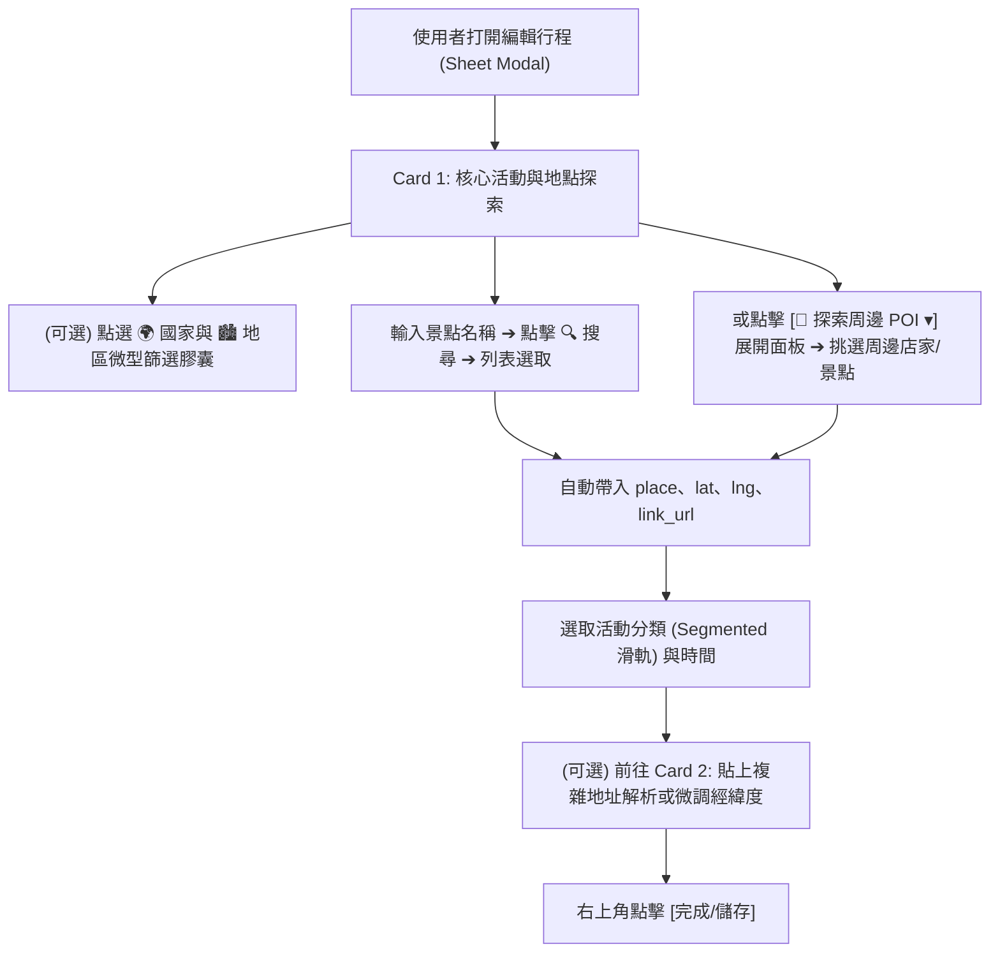

# 規格書：地點探索一體化搜尋漏斗 (Location Search Funnel Spec)

> **版本**: 1.0.0  
> **核心目標**: 將「國家/地區篩選」、「地點名稱搜尋」與「附近 POI 探索」重整為 Card 1 內的一體化搜尋漏斗，建立直覺連貫的 iOS Inset Grouped 心智模型。  
> **關聯組件**: [`ActivityEditModal.tsx`](file:///d:/Project/Tabidachi/travel-pwa/frontend/components/itinerary/ActivityEditModal.tsx)、[`POISearch.tsx`](file:///d:/Project/Tabidachi/travel-pwa/frontend/components/poi-search.tsx)

---

## 一、問題陳述與核心價值 (Problem Statement & Core Value)

### 1.1 使用者痛點 (User Problem)
在原有設計中：
- 「國家與區域篩選」被放在 Card 2 的進階折疊面板深處，但它實質上是 Card 1「地點搜尋輸入框」的查詢過濾條件（傳入 `geocodeApi.search({ country, region })`）。使用者若想限定區域搜尋，必須跨卡片往下滑動、展開折疊選取國家，再往上滑回 Card 1 點擊搜尋，操作動線割裂。
- 「附近 POI 搜尋」同樣被隔離在 Card 2，但 POI 的本質就是「選取或發現地點」，點擊後會直接將地點名稱填入 `place`。將其與「地點名稱輸入」拆散破壞了搜尋探索的一致性。

### 1.2 核心價值 (Core Value)
- **搜尋漏斗一體化 (Integrated Funnel)**：從「限定國家/區域」➔「輸入地點名稱搜尋」或「就地探索周邊 POI」➔「選定地點帶入座標」，全流程在同一個卡片區塊內閉環完成。
- **角色職責清晰化**：
  - **Card 1 (主要資訊與地點探索)**：負責「活動名稱、區域篩選、地點搜尋、周邊 POI、活動分類、出發時間」。
  - **Card 2 (精準定位與導航)**：專注於「高精地址解析 (Address Engine)、導航網址 (Navigation Link)、經緯度微調 (Lat/Lng) 與清除預覽」。

---

## 二、使用者旅程與操作流程 (User Journey & Core Flow)



---

## 三、Card 1 拓撲結構重組 (Card 1 Information Topology)

```html
[Card 1: 核心活動與地點探索]
├── Row 1: 🌍 國家 ✕ 🏙️ 地區 雙欄微型篩選列 (Country & Region Mini Filter)
├── Row 2: 📍 地點名稱 (place Input) + 🔍 搜尋按鈕
│   └── (條件展開) 搜尋候選結果清單 (placeSearchResults)
├── Row 3: 📍 探索周邊 POI 膠囊折疊按鈕 (Collapsible POI Button)
│   └── (條件展開) 6 大周邊分類 (百貨/美食/超商/超市/藥局/熱門) + POI 清單
├── Row 4: 🎯 活動分類 橫向 Segmented 膠囊滑軌 (6大類)
└── Row 5: ⏰ 出發時間 (Time Pill)
```

---

## 四、邊界條件與異常防護 (Edge Cases & Safety)

1. **無座標時的 POI 搜尋防護 (Missing Coords Guard)**:
   - 若 `editItem.lat/lng` 與 `dailyLoc.lat/lng` 皆為空，點擊「探索周邊 POI」時呈現提示：「💡 先輸入地點或透過當日座標探索周邊」，不拋出異常。
2. **選取 POI 時的欄位自動填入完整性**:
   - 保持現有邏輯：帶入 `place = poi.name`、`lat = poi.lat`、`lng = poi.lng`、`isManualCoords = true`，若無現有網址則帶入 Google Maps 搜尋連結或 `poi.website`，並自動帶入 `opening_hours`。
3. **Mantis 雙重指標防禦 (SEC-ACT-001)**:
   - 保持 `activeItemIdRef` 與 `editItemRef`，防止任何非同步搜尋在活動切換時覆寫錯誤項目。
4. **iOS 16px 字體防縮放鐵律**:
   - 國家與地區下拉選單、地點輸入框在行動端維持 `text-[16px] sm:text-xs`，避免 Page Zoom。

---

## 五、驗收標準 (Acceptance Criteria)

- [ ] **AC-1**: 在 Card 1 內切換「國家」與「地區」後，直接在同一卡片點擊「🔍 搜尋」，地理編碼請求正確帶入對應 `country` 與 `region` 參數。
- [ ] **AC-2**: 點擊「📍 探索周邊 POI」按鈕，能就地展開 `POISearch` 視圖；再次點擊能平滑收合，不影響其他欄位。
- [ ] **AC-3**: 在展開的 POI 列表中點選任意店家，Card 1 的地點名稱即時更新為該店家，並同步寫入經緯度座標與營業時間。
- [ ] **AC-4**: Card 2 僅保留地址解析引擎、導航網址與經緯度手動微調，無重複的國家篩選與 POI 元件。
- [ ] **AC-5**: 全套 TypeScript 型別檢查 (`npx tsc --noEmit`) 與 Vitest 測試套件 100% 通過零錯誤。
