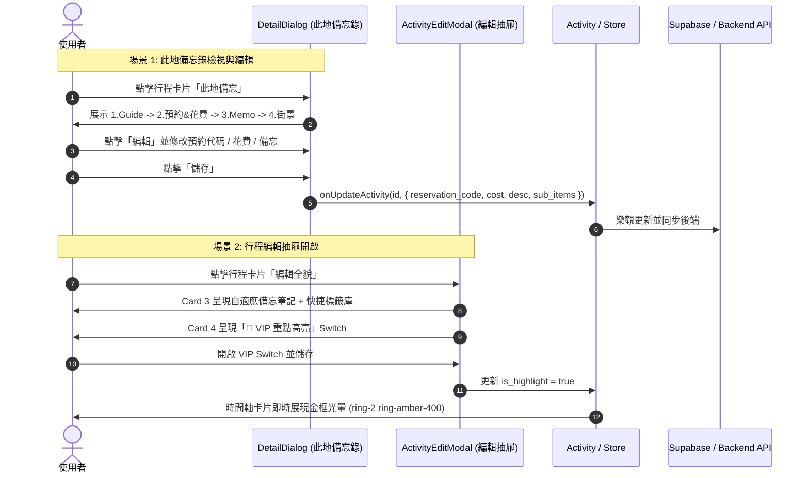

# 規格書：此地備忘錄架構重組與行程偏好升級規格 (Memo & VIP Settings Spec)

> **版本**: 1.0.0  
> **目標**: 
> 1. 將「此地備忘錄 (`DetailDialog`)」排版嚴格重整為指定之四層架構（1. Info ➔ 2. 預約花費 ➔ 3. Memo&Links ➔ 4. 街景預覽最底）。
> 2. 將「預約代碼與預估花費」移至此地備忘錄，支援就地檢視、一鍵複製與即時編輯儲存；`ActivityEditModal` 完全移除以簡化表單。
> 3. `ActivityEditModal` Card 3 備忘筆記自適應高度、標籤升級為 iOS 質感膠囊與常用推薦庫。
> 4. `ActivityEditModal` Card 4 正式啟用解鎖「🌟 VIP 重點高亮」Switch。
> **關聯組件**: [`timeline-card.tsx`](file:///d:/Project/Tabidachi/travel-pwa/frontend/components/timeline-card.tsx)、[`ActivityEditModal.tsx`](file:///d:/Project/Tabidachi/travel-pwa/frontend/components/itinerary/ActivityEditModal.tsx)

---

## 一、問題陳述與核心價值 (Problem Statement & Core Value)

### 1.1 使用者痛點 (User Problem)
1. **備忘資訊動線割裂**：
   - 預約代碼 (PNR) 與預計花費原本深埋在「編輯行程 (ActivityEditModal)」的表單深處。使用者抵達景點或報到時，點開「此地備忘」卻無法方便編輯或查驗預約代號。
2. **此地備忘錄排版優先級顛倒**：
   - 原版將「街景預覽」放置在第 2 區塊，佔據大片垂直空間；而真正高頻率查閱的「Memo & Links」與「預約資訊」卻被擠壓至下方或未完整呈現。
3. **備忘與標籤互動粗糙**：
   - `ActivityEditModal` 備忘筆記為固定 2 行 Textarea，文字稍多即產生內部滾動；標籤採用刺眼的紅框，缺少快捷標籤庫與流暢交互。
4. **VIP 必去景點標記未開放**：
   - 時間軸卡片雖然具備 `is_highlight` 的尊爵金框發光渲染邏輯，但在編輯表單中該開關一直被註解擱置，使用者無法將特定行程標記為 VIP 重點。

### 1.2 成功衡量指標 (Success Metrics)
- 點開「此地備忘錄」，資訊依序為：① 景點攻略 ➔ ② 預約代號與費用 ➔ ③ 私密備忘與連結 ➔ ④ 街景預覽，視覺層次分明。
- 預約代號支援一鍵複製與就地編輯；編輯儲存後立即同步至 Supabase / IndexedDB。
- 啟用「VIP 重點高亮」開關後，時間軸卡片即時展現金色光暈邊框。

---

## 二、此地備忘錄 (`DetailDialog`) 排版拓撲

```html
[DetailDialog: 此地備忘錄]
├── 1. INFO & GUIDE (景點攻略 / 簡介 - 唯讀展示)
├── 2. RESERVATION & COST (預約代碼與預估花費)
│    ├── 唯讀狀態: 雙欄精緻卡片 (預約碼附一鍵複製 + 幣別金額；為空時提供「+ 新增」入口)
│    └── 編輯狀態: 雙欄 Input 即時修改
├── 3. MEMO & LINKS (私密備忘與外部連結)
│    ├── 唯讀狀態: RichDisplay 渲染 + 外部連結清單 Table
│    └── 編輯狀態: RichTextarea + 連結編輯器
└── 4. STREET VIEW (街景預覽 - 移至最底部)
     └── Mapillary 街景座標、一鍵複製與抓取街景按鈕
```

---

## 三、行程編輯抽屜 (`ActivityEditModal.tsx`) 重構細節

### 3.1 Card 3: 備忘筆記與標籤系統 (Details & Tags)
- **表單瘦身**：徹底移除「預約代碼」與「預估花費」輸入框，精簡表單長度。
- **自適應高度備忘筆記 (Auto-expanding Textarea)**：
  - 隨輸入文字自動撐高，設定最小高度 `min-h-[80px]`，支援平滑輸入不抖動。
- **標籤交互升級 (iOS Pill Tags & Quick Chips)**：
  - 移除紅色硬編碼樣式，改用 iOS 質感 Indigo/Slate 微型膠囊。
  - 新增「常用推薦標籤庫」：
    - `["必去 🌟", "美食 🍽️", "需預約 🎫", "拍照打卡 📸", "雨天備案 ☔", "伴手禮 🛍️"]`
  - 點擊推薦膠囊一鍵新增，點擊已選標籤平滑移除，輸入框支援 Enter 鍵快速提交。

### 3.2 Card 4: 偏好設定解鎖 (Preferences & Controls)
- 正式解鎖啟用 **「🌟 VIP 重點高亮」** Radix Switch：
  - 標題：`🌟 重點高亮行程 (VIP)`
  - 說明：`在時間軸以發光金框凸顯，適合必去景點`
  - 樣式：選中態呈現 Amber/Gold 琥珀金光澤與平滑動畫。

---

## 四、資料流與狀態同步 (Data Flow & State Sync)



---

## 五、邊界條件與異常防護 (Edge Cases & Safety)

1. **花費數值防呆與 NaN 防護**:
   - 在此地備忘錄中輸入金額時，防禦非數字字元輸入，若清空則儲存為 `undefined` 或 `0`，杜絕 NaN 傳遞至後端。
2. **預約代碼一鍵複製防護**:
   - 複製至剪貼簿時調用 `navigator.clipboard.writeText` 並捕獲非 Secure Context (HTTP/舊瀏覽器) 異常，適度降級。
3. **Mantis 雙重指標與併發更新**:
   - 在 `DetailDialog` 編輯儲存時，同步傳入最新 activity 快照，避免與背景輪詢相互覆蓋。

---

## 六、驗收標準清單 (Acceptance Criteria)

- [ ] **AC-1 (此地備忘錄排版順序)**：點開「此地備忘錄」彈窗，由上至下依序為：① INFO & GUIDE、② 預約代碼與預估花費、③ MEMO & LINKS、④ 街景預覽。
- [ ] **AC-2 (此地備忘就地編輯)**：在此地備忘錄點擊「編輯」，可直接修改預約代碼與預估花費，點擊儲存後立即更新且生效。
- [ ] **AC-3 (EditModal 表單瘦身)**：`ActivityEditModal.tsx` 完全移除預約代號與預計花費兩輸入框，釋放表單空間。
- [ ] **AC-4 (自適應備忘筆記與標籤升級)**：EditModal 備忘筆記根據內容高度自適應延展；標籤支援點選常用快捷標籤即時新增與 Enter 鍵提交。
- [ ] **AC-5 (VIP 重點高亮開關生效)**：在 EditModal Card 4 開啟「🌟 VIP 重點高亮」並儲存後，時間軸該卡片立即具備發光金框與陰影。
- [ ] **AC-6 (品質關卡)**：`npx tsc --noEmit` 0 errors，ESLint 0 errors，Vitest 309 單元測試 100% 通過。
