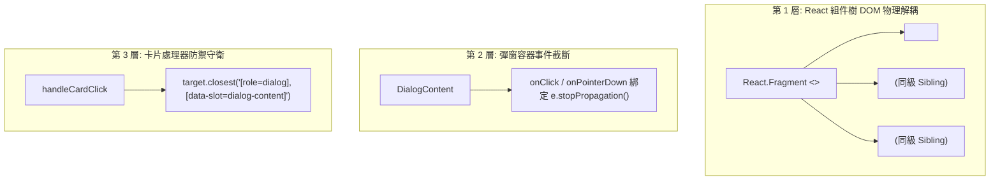

# 規格書：彈窗點擊事件穿透防禦與 React Portal 隔離規格 (Modal Click-Through Isolation Spec)

> **版本**: 1.0.0  
> **關聯組件**: [`timeline-card.tsx`](file:///d:/Project/Tabidachi/travel-pwa/frontend/components/timeline-card.tsx)  
> **目標**: 根除點擊此地備忘錄 (`DetailDialog`) 與全螢幕圖片預覽 (`PhotoGalleryPreview`) 時，點擊事件冒泡至卡片容器引發背景地圖跳轉 (`tabidachi-focus-map-activity`) 的穿透 Bug。

---

## 一、問題陳述與根因分析 (Problem Statement & Root Cause)

### 1.1 缺陷現象 (User Symptom)
- 使用者點開行程卡片上的「此地備忘錄」，在彈窗內部點擊任意非按鈕區域（如攻略文字、備忘空白處、標題列、街景座標列），背景地圖突然跳轉平移，聚焦至該卡片座標。

### 1.2 底層成因分析 (Root Cause)
1. **React Synthetic Event Bubbling 穿透 React Portal**：
   - 儘管 Radix UI `DialogPortal` 在 DOM 物理結構上掛載於 `document.body`，但在 React 虛擬 DOM 樹中，`<DetailDialog>` 與 `<Dialog open={showPhotoPreview}>` 仍是 `
` 的 JSX 子節點。
   - React 遵循組件樹階層進行合成事件冒泡（Synthetic Event Bubbling）。因此，彈窗內的任何點擊事件均會向上冒泡至卡片的 `onClick` 處理器。
2. **`handleCardClick` 過濾白名單未包含彈窗元素**：
   - 卡片點擊處理器僅防禦性檢查了 `button, [role="menuitem"], input, a, table, [data-drag-handle]`。
   - 點擊彈窗內的 `div`, `p`, `h2`, `span` 等非表單元素時，條件判斷未被攔截，直接執行 `window.dispatchEvent(new CustomEvent('tabidachi-focus-map-activity', ...))`，造成背景地圖瞬時跳轉。

---

## 二、三層物理阻斷防禦架構 (Triple-Layer Isolation Architecture)

### 防禦 1 (結構解耦)：
將 `DetailDialog` 與圖片預覽 `Dialog` 自卡片點擊容器 `div` 移出，包裝於頂層 `<>` (Fragment)，使彈窗在 React 組件樹中成為卡片容器的同級兄弟節點（Sibling），徹底切斷 React 合成事件向上冒泡之路徑。

### 防禦 2 (彈窗截斷)：
在 `DetailDialog` 與圖片預覽的 `DialogContent` 宣告 `onClick={(e) => e.stopPropagation()}` 與 `onPointerDown={(e) => e.stopPropagation()}`，杜絕任何游標或觸控事件外溢。

### 防禦 3 (處理器過濾)：
在 `handleCardClick` 守衛名單中加入 `[role="dialog"]` 與 `[data-slot="dialog-content"]`，雙保險防禦未來任何子彈窗事件。

---

## 三、驗收標準清單 (Acceptance Criteria)

- [ ] **AC-1 (備忘點擊不穿透)**：點開此地備忘錄，點擊彈窗內任意空白處、文字區塊、標題或街景座標，背景地圖絕對不發生平移或跳轉。
- [ ] **AC-2 (圖片預覽不穿透)**：點開圖片預覽，點擊圖片或黑色遮罩區域，背景地圖絕對不發生跳轉。
- [ ] **AC-3 (卡片原生點擊正常)**：在未開啟彈窗時，直接點擊時間軸卡片本體空白處，仍能正常觸發地圖平移聚焦。
- [ ] **AC-4 (靜態型別與測試綠燈)**：`tsc --noEmit` 保持 0 錯誤，全站 41 個測試套件 100% 通過。
