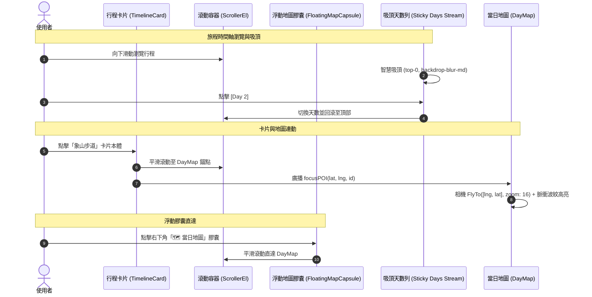

# 🗺️ 規格設計書：天數吸頂 (Sticky Blur) 與地圖雙向聚焦 (Click-to-Focus)

> **版本**: 1.0.0  
> **建立日期**: 2026-10-07  
> **狀態**: 已完成決策對齊 (Grill-Me Aligned)，待實作  

---

## 1. Problem Statement & Core Value (問題陳述與核心價值)

### 1.1 使用者痛點
1. **天數切換繁瑣**：行程卡片滾動至中段或底部時，頂部天數切換導航列已滾出視窗，使用者欲切換天數必須長距離往上滑動。
2. **地圖空間脫節**：時間軸卡片與底部的當日路徑地圖（`DayMap`）缺乏連動，點擊卡片無法快速於地圖看見該地點的地理相對位置；欲看地圖需手動長滾到底部。

### 1.2 成功衡量指標 (Success Metrics)
- **切換摩擦力**：在任意滾動深度下，均可立即點擊切換天數，操作路徑縮短至 1 次點擊。
- **時空連動體驗**：卡片點擊能在 300ms 內平滑平移視窗至地圖，並觸發 MapLibre 相機平滑飛越 (`FlyTo`) 與標記高亮，0 卡頓。

---

## 2. User Journey & Core Flow (使用者旅程與操作流程)



---

## 3. Architecture & Interaction Model (架構與互動模型)

### 3.1 方向 B：天數切換列智慧吸頂 (`ItineraryHeader.tsx`)
- **範圍限定**：僅「天數切換膠囊列 (`Days Stream`)」實作智慧吸頂，旅程標題與大導航隨滾動自然隱藏，最大化保留縱向螢幕閱讀面積。
- **樣式設定**：
  ```css
  sticky top-0 z-30 bg-white/85 dark:bg-slate-900/85 backdrop-blur-md border-b border-slate-200/80 dark:border-slate-800/80 py-2.5 px-6 shadow-xs
  ```
- **過渡動效**：支援 LayoutId 平滑彈簧指示標籤 (`spring`, `stiffness: 500`)。

### 3.2 方向 C：卡片 ➔ 地圖連動聚焦 (`TimelineCard` + `DayMap`)
- **職責分離**：
  - **卡片本體點擊 (`onClick`)**：觸發 `onFocusOnMap(activity)`。
    - 滾動容器平滑滑動至地圖區域（`dayMapRef.current?.scrollIntoView({ behavior: 'smooth' })`）。
    - 呼叫 `DayMap` 暴露之 `flyToActivity(activity.id, [activity.lng, activity.lat])` 方法。
  - **「導航」按鈕點擊**：維持 `openGoogleMap`，彈出/喚起外部 Google 地圖導航 App。
- **右下角浮動地圖膠囊 (`FloatingMapCapsule.tsx`)**：
  - 當滾動深度超過 200px 且未到底部地圖時，於右下角浮現（iOS 膠囊造型：`fixed bottom-6 right-5 z-20`）。
  - 點擊後平滑滾動至 `DayMap`；位於地圖時轉為「⬆️ 回到行程」膠囊。

---

## 4. Edge Cases & Boundary Conditions (邊界條件與異常處理)

| 情境 | 異常表現 | 應對與防禦方案 |
| :--- | :--- | :--- |
| **無經緯度景點** | 景點 `lat` 或 `lng` 為 `null` / `undefined` | 點擊卡片時跳過 `FlyTo`，僅平滑滾動至地圖並 Toast 提示「該行程無精確座標」 |
| **快速連續點擊** | 使用者快速連點多張卡片造成動畫衝突 | 加入 200ms 防抖 (Debounce) 或取消前次相機過渡 |
| **離線模式** | 無向量地圖底圖連線 | MapLibre 快取離線圖資正常聚焦，無白屏降級 |
| **螢幕翻轉/小螢幕** | 手機橫屏或高度低於 500px | 吸頂列限制高度，浮動膠囊自動收縮為純圖標模式 |

---

## 5. Acceptance Criteria (驗收標準清單)

- [ ] **AC-1 (Sticky Header)**: 向下滑動時間軸超過 120px 時，天數膠囊列平滑吸附於頂部，背景呈現毛玻璃模糊效果，點擊任一天數正常切換。
- [ ] **AC-2 (Card Click-to-Focus)**: 點擊具備經緯度的行程卡片本體，頁面平滑滾動至當日地圖，地圖相機平滑平移並放大至該 Pin。
- [ ] **AC-3 (Navigation Separation)**: 點擊卡片上之「導航」按鈕，獨立開啟 Google 地圖外連，不觸發下方地圖跳轉。
- [ ] **AC-4 (Map Capsule Anchor)**: 滾動時間軸時右下角顯示浮動地圖膠囊，點擊後直達地圖；位於地圖時提供一鍵回頂切換。
- [ ] **AC-5 (Quality Gate)**: `npx tsc --noEmit` 0 錯誤、`eslint` 0 警告、Vitest 單元測試 100% 通過。
